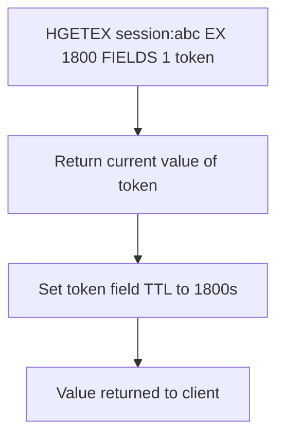

# How to Use HGETEX in Redis to Get Hash Fields with Expiration

Author: [nawazdhandala](https://www.github.com/nawazdhandala)

Tags: Redis, HGETEX, Hash, Expiration, TTL, Field, Command

Description: Learn how to use the Redis HGETEX command (Redis 7.4+) to retrieve hash field values and simultaneously update or remove their expiration in a single atomic operation.

---

## How HGETEX Works

`HGETEX` retrieves the values of one or more hash fields and simultaneously modifies their TTL - all atomically. It is the hash-field equivalent of the string command `GETEX`. You can use it to:

- Retrieve a field and set (or reset) its TTL
- Retrieve a field and remove its TTL (make it permanent)
- Retrieve a field without changing its TTL (same as `HMGET`)

`HGETEX` was introduced in Redis 7.4.



## Syntax

```redis
HGETEX key [EX seconds | PX milliseconds | EXAT unix-time-seconds | PXAT unix-time-milliseconds | PERSIST] FIELDS numfields field [field ...]
```

- `EX seconds` - set field TTL in seconds
- `PX milliseconds` - set field TTL in milliseconds
- `EXAT unix-time-seconds` - set TTL as Unix timestamp (seconds)
- `PXAT unix-time-milliseconds` - set TTL as Unix timestamp (milliseconds)
- `PERSIST` - remove the field's TTL (make it permanent)
- No expiry option - retrieve without changing TTL (equivalent to HMGET)

Returns an array of field values (nil for non-existent fields).

## Examples

### HGETEX without expiry option (same as HMGET)

```redis
HSET user:1 name "Alice" email "alice@example.com" token "abc123"
HGETEX user:1 FIELDS 2 name email
```

```text
(integer) 3
1) "Alice"
2) "alice@example.com"
```

### Sliding expiration on access (EX)

Retrieve a session field and reset its TTL to 1800 seconds on each access.

```redis
HSET session:abc user_id "42" payload "data"
HEXPIRE session:abc 900 FIELDS 1 payload
HGETEX session:abc EX 1800 FIELDS 1 payload
HTTL session:abc FIELDS 1 payload
```

```text
(integer) 2
1) (integer) 1
1) "data"
1) (integer) 1800
```

The TTL was reset to 1800 on read.

### Set field TTL in milliseconds (PX)

```redis
HSET rate:user:42 window_count "5"
HGETEX rate:user:42 PX 500 FIELDS 1 window_count
HPTTL rate:user:42 FIELDS 1 window_count
```

```text
(integer) 1
1) "5"
1) (integer) 499
```

### Set expiry at absolute Unix timestamp (EXAT)

```redis
HSET promo:user:7 voucher "SAVE20" credits "50"
HGETEX promo:user:7 EXAT 1751328000 FIELDS 1 voucher
HTTL promo:user:7 FIELDS 1 voucher
```

```text
(integer) 2
1) "SAVE20"
1) (integer) <seconds until 2026-07-01>
```

### Remove field TTL with PERSIST

Retrieve a field and simultaneously make it permanent.

```redis
HSET user:1 token "temp123"
HEXPIRE user:1 300 FIELDS 1 token
HTTL user:1 FIELDS 1 token
HGETEX user:1 PERSIST FIELDS 1 token
HTTL user:1 FIELDS 1 token
```

```text
(integer) 1
1) (integer) 1
1) (integer) 300
1) "temp123"
1) (integer) -1
```

After `HGETEX PERSIST`, the field has no TTL (-1).

### Get multiple fields with expiry update

Retrieve multiple fields and reset all their TTLs in one call.

```redis
HSET session:xyz user_id "99" token "t1" cache "fragment"
HEXPIRE session:xyz 600 FIELDS 2 token cache
HGETEX session:xyz EX 1800 FIELDS 3 user_id token cache
HTTL session:xyz FIELDS 3 user_id token cache
```

```text
(integer) 3
1) (integer) 1
1) "99"
2) "t1"
3) "fragment"
1) (integer) -1
2) (integer) 1800
3) (integer) 1800
```

`user_id` had no TTL set, so its TTL remains -1. `token` and `cache` were updated to 1800s.

### Non-existent fields return nil

```redis
HGETEX user:1 EX 3600 FIELDS 2 name nonexistent_field
```

```text
1) "Alice"
2) (nil)
```

## HGETEX vs HMGET

| Command | Returns values | Modifies TTL |
|---------|---------------|--------------|
| `HMGET key FIELDS ...` | Yes | No |
| `HGETEX key [EX/PX/PERSIST] FIELDS ...` | Yes | Yes (optionally) |

## Use Cases

- Sliding session expiration: reset TTL each time a session field is accessed
- Token refresh: retrieve and extend the life of an auth token in one call
- Cache access patterns: reset cache TTL when the value is served
- Promote a temporary field to permanent on first successful use
- Sub-second rate limit windows: read count and reset millisecond TTL atomically

## Summary

`HGETEX` (Redis 7.4+) combines hash field retrieval with TTL modification in one atomic operation. It is the per-field equivalent of `GETEX` for string keys. Use it for sliding expiration patterns, token refreshes, and cache access with TTL reset. The `PERSIST` option makes fields permanent on read, and omitting an expiry option makes it behave identically to `HMGET`.
