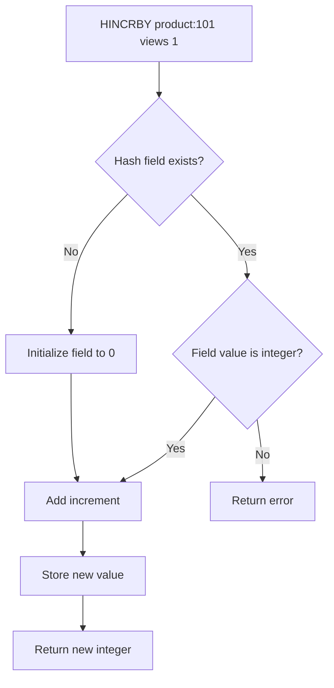

# How to Use HINCRBY in Redis to Increment Hash Field Values

Author: [nawazdhandala](https://www.github.com/nawazdhandala)

Tags: Redis, HINCRBY, Hash, Counter, Atomic, Increment, Command

Description: Learn how to use the Redis HINCRBY command to atomically increment integer values stored in hash fields, ideal for per-object counters and analytics.

---

## How HINCRBY Works

`HINCRBY` atomically increments the integer value of a hash field by a given amount. If the field does not exist, it is initialized to 0 before applying the increment. If the hash key does not exist, it is created automatically. The command returns the new value after incrementing.

Because the operation is atomic, it is safe for concurrent use across multiple clients without external locking.



## Syntax

```redis
HINCRBY key field increment
```

- `increment` - a signed 64-bit integer (positive to increment, negative to decrement)
- Returns the new integer value of the field

## Examples

### Basic increment

Track page views for a product.

```redis
HINCRBY product:101 views 1
HINCRBY product:101 views 1
HINCRBY product:101 views 1
HGET product:101 views
```

```text
(integer) 1
(integer) 2
(integer) 3
"3"
```

### Auto-initialization

When the field does not exist, it starts from 0.

```redis
DEL stats:user:42
HINCRBY stats:user:42 logins 1
HINCRBY stats:user:42 logins 1
HGET stats:user:42 logins
```

```text
(integer) 0
(integer) 1
(integer) 2
"2"
```

### Increment by more than 1

Add 50 points to a game score in one call.

```redis
HSET game:player:7 score 100 level 3
HINCRBY game:player:7 score 50
HGET game:player:7 score
```

```text
(integer) 2
(integer) 150
"150"
```

### Decrement with negative increment

Subtract credits when a user makes a purchase.

```redis
HSET account:user:1 credits 500
HINCRBY account:user:1 credits -75
HGET account:user:1 credits
```

```text
(integer) 1
(integer) 425
"425"
```

### Multiple counters in one hash

Track different metrics for a single resource.

```redis
HINCRBY page:home views 1
HINCRBY page:home clicks 3
HINCRBY page:home shares 1
HGETALL page:home
```

```text
(integer) 1
(integer) 3
(integer) 1
1) "views"
2) "1"
3) "clicks"
4) "3"
5) "shares"
6) "1"
```

### Rate limiting per user

Track API call counts per user in a hash alongside other metadata.

```redis
HSET api:user:99 name "Bob" plan "free"
HINCRBY api:user:99 calls_today 1
HINCRBY api:user:99 calls_today 1
HGET api:user:99 calls_today
```

```text
(integer) 2
(integer) 1
(integer) 2
"2"
```

### Error on non-integer field value

```redis
HSET user:1 name "Alice"
HINCRBY user:1 name 1
```

```text
(integer) 1
(error) ERR hash value is not an integer
```

## HINCRBY vs INCRBY

| Command | Scope | Use when |
|---------|-------|----------|
| `INCRBY key increment` | Top-level string key | Single counter per key |
| `HINCRBY key field increment` | Field within a hash | Multiple counters grouped under one key |

Using a hash groups related counters together and is more memory-efficient than creating separate string keys for each counter.

## Use Cases

- Page or product view counters per item
- Per-user API call counting
- Game score and experience point tracking
- E-commerce: purchase count, cart item quantity
- Analytics: clicks, conversions, downloads per resource
- Leaderboards where each player has multiple metrics

## Summary

`HINCRBY` provides atomic integer increment/decrement for hash fields, auto-initializing missing fields to 0. It is the hash-native equivalent of `INCRBY` and is ideal when you want to group multiple related counters under a single Redis key. Use negative increments for decrements, and pair it with `HGETALL` to read all counters in one round-trip.
