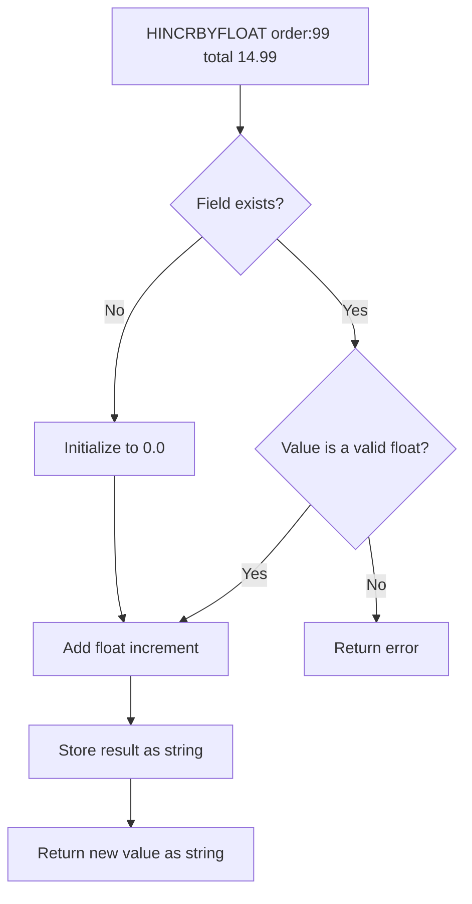

# How to Use HINCRBYFLOAT in Redis for Float Hash Increments

Author: [nawazdhandala](https://www.github.com/nawazdhandala)

Tags: Redis, HINCRBYFLOAT, Hash, Float, Counter, Atomic, Command

Description: Learn how to use the Redis HINCRBYFLOAT command to atomically increment floating-point values stored in hash fields for financial totals, sensor data, and analytics.

---

## How HINCRBYFLOAT Works

`HINCRBYFLOAT` atomically adds a floating-point increment to a hash field value. If the field does not exist, it is initialized to 0 before the increment. If the hash key does not exist, it is created automatically. The command returns the new value as a bulk string.

It is the hash-field equivalent of `INCRBYFLOAT`, and uses the same double-precision IEEE 754 arithmetic.



## Syntax

```redis
HINCRBYFLOAT key field increment
```

- `increment` - a floating-point number (positive or negative, supports scientific notation)
- Returns the new field value as a bulk string

## Examples

### Basic float increment

Accumulate the total cost of items in a shopping cart.

```redis
DEL cart:user:42
HINCRBYFLOAT cart:user:42 total 14.99
HINCRBYFLOAT cart:user:42 total 9.99
HINCRBYFLOAT cart:user:42 total 4.99
HGET cart:user:42 total
```

```text
"14.99"
"24.98"
"29.97"
"29.97"
```

### Auto-initialization

Starting from a non-existent field initializes to 0.

```redis
DEL metrics:server:1
HINCRBYFLOAT metrics:server:1 cpu_usage 23.5
HINCRBYFLOAT metrics:server:1 cpu_usage 31.2
HGET metrics:server:1 cpu_usage
```

```text
"23.5"
"54.7"
"54.7"
```

### Negative increment (decrement)

Reduce a balance by a fractional amount.

```redis
HSET wallet:user:7 balance 100.00
HINCRBYFLOAT wallet:user:7 balance -15.75
HGET wallet:user:7 balance
```

```text
(integer) 1
"84.25"
"84.25"
```

### Multiple float fields in one hash

Track different float metrics for a resource.

```redis
HINCRBYFLOAT sensor:room1 temp_sum 22.3
HINCRBYFLOAT sensor:room1 temp_sum 22.8
HINCRBY sensor:room1 readings 1
HINCRBY sensor:room1 readings 1
HGETALL sensor:room1
```

```text
"22.3"
"45.1"
(integer) 1
(integer) 2
1) "temp_sum"
2) "45.1"
3) "readings"
4) "2"
```

Average temperature = 45.1 / 2 = 22.55

### Scientific notation

Redis accepts scientific notation for the increment.

```redis
HSET data:experiment value "1.5e2"
HINCRBYFLOAT data:experiment value 5.0e1
HGET data:experiment value
```

```text
(integer) 1
"200"
"200"
```

### Error on non-numeric field

```redis
HSET user:1 name "Alice"
HINCRBYFLOAT user:1 name 1.0
```

```text
(integer) 1
(error) ERR hash value is not a float
```

## Precision considerations

Like `INCRBYFLOAT`, `HINCRBYFLOAT` uses double-precision floating-point arithmetic. For financial applications requiring exact decimal precision, store amounts as integer cents and use `HINCRBY` instead.

```redis
HSET order:99 total_cents 0
HINCRBY order:99 total_cents 1499
HINCRBY order:99 total_cents 999
HGET order:99 total_cents
```

```text
(integer) 1
(integer) 1499
(integer) 2498
"2498"
```

Divide by 100 in application code: $24.98.

## HINCRBYFLOAT vs INCRBYFLOAT

| Command | Scope | Use when |
|---------|-------|----------|
| `INCRBYFLOAT key increment` | Top-level string key | Single float counter per key |
| `HINCRBYFLOAT key field increment` | Field within a hash | Multiple float values grouped under one key |

## Use Cases

- Shopping cart running totals (line item prices)
- Revenue and financial metric aggregation per account
- IoT sensor data accumulation (temperature sum, power consumption)
- A/B test metric collection (conversion rates per variant)
- Billing and usage metering (GB transferred, API cost)

## Summary

`HINCRBYFLOAT` provides atomic floating-point increment/decrement for hash fields, auto-initializing missing fields to 0. It is ideal for accumulating financial totals, sensor readings, and analytics metrics within a hash. For precision-sensitive financial data, use integer storage with `HINCRBY` and handle decimal conversion in application code.
