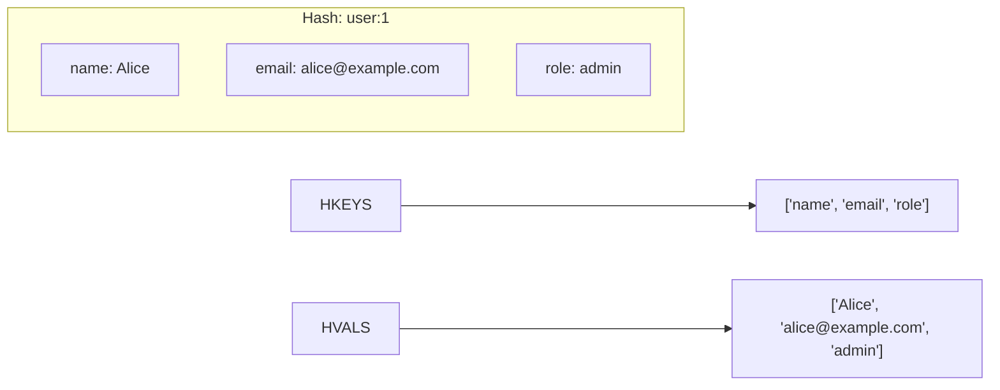

# How to Use HKEYS and HVALS in Redis to List Hash Fields and Values

Author: [nawazdhandala](https://www.github.com/nawazdhandala)

Tags: Redis, HKEYS, HVALS, Hash, Field, Command, Introspection

Description: Learn how to use Redis HKEYS and HVALS to retrieve only the field names or only the values of a hash, for schema inspection and selective data processing.

---

## How HKEYS and HVALS Work

`HKEYS` returns an array of all field names in a hash. `HVALS` returns an array of all field values. Unlike `HGETALL`, which returns field-value pairs interleaved, these commands let you work with just one side of the hash. Both return an empty array if the key does not exist.



## Syntax

```redis
HKEYS key
HVALS key
```

Both commands take a single key argument and return an array. They return an empty array (not an error) if the key does not exist.

## Examples

### HKEYS - get all field names

```redis
HSET user:1 name "Alice" email "alice@example.com" role "admin" age "30"
HKEYS user:1
```

```text
(integer) 4
1) "name"
2) "email"
3) "role"
4) "age"
```

### HVALS - get all field values

```redis
HVALS user:1
```

```text
1) "Alice"
2) "alice@example.com"
3) "admin"
4) "30"
```

### Non-existent key returns empty array

```redis
HKEYS nonexistent_key
HVALS nonexistent_key
```

```text
(empty array)
(empty array)
```

### Schema inspection

Use `HKEYS` to check which fields are present in a stored record.

```redis
HSET product:101 name "Laptop" price "999" stock "50" sku "LP-001"
HKEYS product:101
```

```text
(integer) 4
1) "name"
2) "price"
3) "stock"
4) "sku"
```

### Extracting all values for bulk processing

Use `HVALS` to get all values without the field names when you know the structure.

```redis
HSET config:limits max_retries "3" timeout "30" max_connections "100"
HVALS config:limits
```

```text
(integer) 3
1) "3"
2) "30"
3) "100"
```

### Combining HKEYS and HVALS

For small hashes you can use both together to reconstruct a key-value map manually, though `HGETALL` is simpler for that purpose.

```redis
HKEYS user:1
HVALS user:1
```

```text
1) "name"
2) "email"
3) "role"
4) "age"
1) "Alice"
2) "alice@example.com"
3) "admin"
4) "30"
```

### Using HKEYS to verify required fields

Check whether a hash contains a required set of fields.

```bash
required_fields=("name" "email" "role")
existing=$(redis-cli HKEYS user:1)
for field in "${required_fields[@]}"; do
  echo "$existing" | grep -q "^$field$" && echo "$field: present" || echo "$field: MISSING"
done
```

```text
name: present
email: present
role: present
```

## HKEYS / HVALS vs alternatives

| Command | Returns | Complexity |
|---------|---------|------------|
| `HKEYS key` | All field names | O(N) |
| `HVALS key` | All field values | O(N) |
| `HGETALL key` | All field-value pairs | O(N) |
| `HLEN key` | Number of fields | O(1) |
| `HMGET key f1 f2...` | Specific field values | O(N fields requested) |

For large hashes, prefer `HSCAN` over `HKEYS`/`HVALS` to avoid blocking Redis.

## Use Cases

- Schema validation: check which fields a hash contains
- Bulk export: extract all values for batch processing
- Dynamic rendering: iterate over field names to build a UI form
- Audit/diff: compare field sets across multiple hash keys
- Config introspection: list available configuration options

## Summary

`HKEYS` returns an array of all field names in a hash; `HVALS` returns all field values. They are useful when you need only one half of the hash contents - for schema inspection, bulk value extraction, or dynamic field iteration. Both are O(N) and return empty arrays for non-existent keys. For large hashes, use `HSCAN` to avoid blocking Redis with a single large O(N) read.
