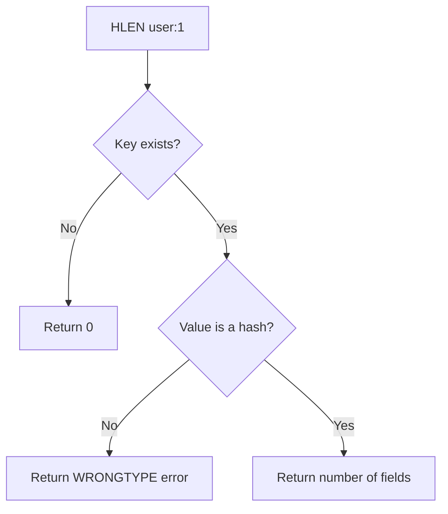

# How to Use HLEN in Redis to Count Hash Fields

Author: [nawazdhandala](https://www.github.com/nawazdhandala)

Tags: Redis, HLEN, Hash, Count, Field, Command

Description: Learn how to use the Redis HLEN command to count the number of fields in a hash, useful for size validation, pagination decisions, and capacity management.

---

## How HLEN Works

`HLEN` returns the number of fields stored in a hash at a given key. If the key does not exist, it returns 0. If the key holds a non-hash value, it returns a WRONGTYPE error. `HLEN` is an O(1) operation - Redis stores the field count as part of the hash metadata and does not need to enumerate all fields.



## Syntax

```redis
HLEN key
```

Returns an integer: the number of fields in the hash, or 0 if the key does not exist.

## Examples

### Basic field count

```redis
HSET user:1 name "Alice" email "alice@example.com" role "admin" age "30"
HLEN user:1
```

```text
(integer) 4
(integer) 4
```

### HLEN on a non-existent key

Returns 0 without an error.

```redis
HLEN nonexistent_key
```

```text
(integer) 0
```

### Track hash growth

Monitor the number of fields as you add data incrementally.

```redis
DEL profile:user:7
HLEN profile:user:7
HSET profile:user:7 name "Bob"
HLEN profile:user:7
HSET profile:user:7 email "bob@example.com" city "Boston"
HLEN profile:user:7
```

```text
(integer) 0
(integer) 0
(integer) 1
(integer) 1
(integer) 2
(integer) 3
```

### Check if a hash is empty

Use `HLEN` to detect whether any fields have been set.

```redis
DEL empty_hash
HLEN empty_hash
```

```text
(integer) 0
(integer) 0
```

After adding one field:

```redis
HSET empty_hash field1 "value1"
HLEN empty_hash
```

```text
(integer) 1
(integer) 1
```

### Validate required field count

Ensure a stored record has at least the minimum number of required fields before processing.

```redis
HSET order:99 product_id "101" quantity "2" price "19.99" status "pending"
HLEN order:99
```

```text
(integer) 4
(integer) 4
```

A value of 4 confirms all required fields are present.

### Capacity check before HSCAN pagination

Check the total field count before deciding whether to use `HGETALL` or `HSCAN`.

```redis
HLEN large_hash
```

```text
(integer) 10000
```

If the count exceeds your threshold, use `HSCAN` to iterate in pages rather than loading all fields at once with `HGETALL`.

### Monitoring hash sizes across keys

Use HLEN to compare the sizes of related hashes.

```redis
HLEN user:1
HLEN user:2
HLEN user:3
```

```text
(integer) 5
(integer) 3
(integer) 7
```

## HLEN vs related commands

| Command | Returns | Complexity |
|---------|---------|------------|
| `HLEN key` | Field count (integer) | O(1) |
| `HKEYS key` | All field names | O(N) |
| `HVALS key` | All field values | O(N) |
| `HGETALL key` | All field-value pairs | O(N) |

`HLEN` is the most efficient way to check the size of a hash without loading any field data.

## Use Cases

- Validate that a stored object has all required fields
- Decide whether to use `HGETALL` or `HSCAN` based on hash size
- Monitor hash growth in logging and debugging
- Implement soft limits (e.g., max 50 items in a user's preferences hash)
- Pagination: use field count to calculate total pages

## Summary

`HLEN` is a lightweight O(1) command that returns the number of fields in a Redis hash. It is useful for size validation, capacity checks, and deciding between `HGETALL` and `HSCAN`. It returns 0 for non-existent keys and errors on non-hash types. Use it before potentially expensive O(N) hash reads to avoid blocking Redis with oversized responses.
