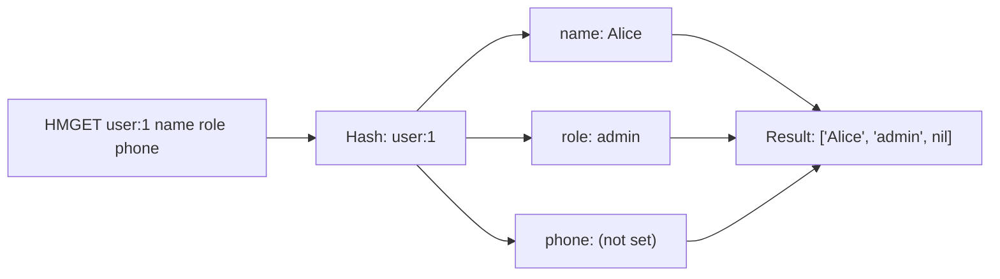

# How to Use HMGET in Redis to Get Multiple Hash Fields

Author: [nawazdhandala](https://www.github.com/nawazdhandala)

Tags: Redis, HMGET, Hash, Field, Bulk, Command, Performance

Description: Learn how to use the Redis HMGET command to retrieve multiple specific hash fields in a single round-trip, reducing latency compared to multiple HGET calls.

---

## How HMGET Works

`HMGET` retrieves the values of multiple fields from a hash in a single command. It returns an array of values in the same order as the requested fields. If a field does not exist, the corresponding element in the result is nil. If the key does not exist at all, all elements in the result are nil.



## Syntax

```redis
HMGET key field [field ...]
```

Returns an array of bulk strings, one per requested field (nil for missing fields). The array length always equals the number of fields requested.

## Examples

### Basic HMGET

Fetch two specific fields from a user hash.

```redis
HSET user:1 name "Alice" email "alice@example.com" role "admin" age "30"
HMGET user:1 name role
```

```text
(integer) 4
1) "Alice"
2) "admin"
```

### Missing fields return nil

```redis
HMGET user:1 name phone fax
```

```text
1) "Alice"
2) (nil)
3) (nil)
```

### HMGET on non-existent key

All results are nil.

```redis
HMGET nonexistent_key field1 field2 field3
```

```text
1) (nil)
2) (nil)
3) (nil)
```

### Fetch specific config values

Load only the fields your application needs at startup.

```redis
HSET config:app timeout "30" retries "3" debug "false" log_level "info" max_conn "100"
HMGET config:app timeout retries log_level
```

```text
(integer) 5
1) "30"
2) "3"
3) "info"
```

### Selective profile loading

Load only the fields needed for a UI rendering, rather than the full object.

```redis
HSET user:42 name "Bob" email "bob@example.com" role "editor" avatar_url "https://..." bio "..." created_at "2024-01-01"
HMGET user:42 name role avatar_url
```

```text
(integer) 6
1) "Bob"
2) "editor"
3) "https://..."
```

### Using HMGET for multi-field validation

Fetch required fields and check for nil to detect incomplete records.

```redis
HSET order:55 product_id "101" quantity "2"
HMGET order:55 product_id quantity price status
```

```text
1) "101"
2) "2"
3) (nil)
4) (nil)
```

`price` and `status` are missing - the order is incomplete.

### HMGET vs repeated HGET

| Approach | Round trips | Network overhead |
|----------|-------------|-----------------|
| 3 separate `HGET` calls | 3 | High |
| 1 `HMGET` for 3 fields | 1 | Low |

## HMGET vs HGETALL

| Command | Returns | Use when |
|---------|---------|----------|
| `HMGET key f1 f2...` | Only the requested fields | You know which fields you need |
| `HGETALL key` | All fields and values | You need the complete object |

`HMGET` is more network-efficient when the hash has many fields but you only need a subset.

## Use Cases

- Loading specific user profile attributes for rendering
- Fetching a subset of configuration values at startup
- Validating the presence of required fields in a stored record
- Reading frequently accessed fields without loading the entire hash
- Batching field reads across different hashes using a pipeline with HMGET calls

## Summary

`HMGET` retrieves multiple named fields from a hash in a single round-trip. It returns values in the same order as the requested fields, with nil for any missing fields. Use it instead of multiple `HGET` calls to reduce network latency, and prefer it over `HGETALL` when you only need a specific subset of a large hash.
