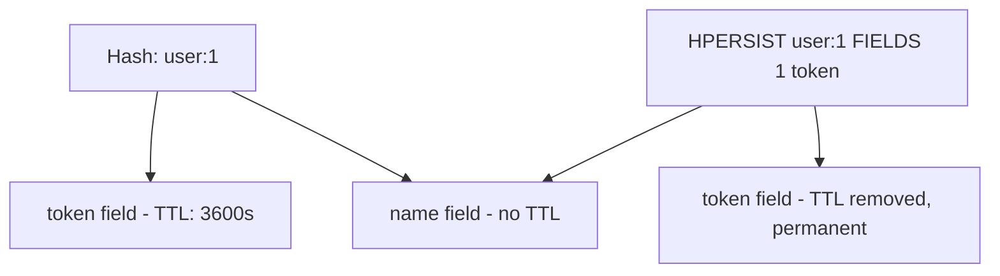

# How to Use HPERSIST in Redis to Remove Per-Field Expiration

Author: [nawazdhandala](https://www.github.com/nawazdhandala)

Tags: Redis, HPERSIST, Hash, TTL, Expiration, PERSIST, Command

Description: Learn how to use the Redis HPERSIST command (Redis 7.4+) to remove the expiration from specific hash fields, making them permanent while other fields retain their TTLs.

---

## How HPERSIST Works

`HPERSIST` removes the expiration (TTL) from one or more fields in a hash, making those fields permanent. It is the field-level equivalent of the key-level `PERSIST` command. If a field has no TTL, `HPERSIST` has no effect on it. If the field or key does not exist, it returns an appropriate status code.

`HPERSIST` was introduced in Redis 7.4 alongside the other hash field expiration commands (`HEXPIRE`, `HPEXPIRE`, `HTTL`, `HPTTL`, `HEXPIREAT`, `HPEXPIREAT`).



## Syntax

```redis
HPERSIST key FIELDS numfields field [field ...]
```

- `FIELDS numfields` - specify how many fields follow, then list the field names
- Returns an array of integers, one per field:
  - `1` - the field's expiry was removed successfully
  - `-1` - the field exists but has no associated expiry (nothing to remove)
  - `-2` - the field does not exist in the hash

## Examples

### Basic HPERSIST

Remove the TTL from a `token` field.

```redis
HSET user:1 name "Alice" token "abc123"
HEXPIRE user:1 3600 FIELDS 1 token
HTTL user:1 FIELDS 1 token
HPERSIST user:1 FIELDS 1 token
HTTL user:1 FIELDS 1 token
```

```text
(integer) 2
1) (integer) 1
1) (integer) 3600
1) (integer) 1
1) (integer) -1
```

After `HPERSIST`, `HTTL` returns -1, indicating the field has no TTL (permanent).

### HPERSIST on a field with no TTL

Returns -1 (already has no expiry).

```redis
HSET user:1 name "Alice"
HPERSIST user:1 FIELDS 1 name
```

```text
(integer) 1
1) (integer) -1
```

### HPERSIST on a non-existent field

Returns -2.

```redis
HPERSIST user:1 FIELDS 1 nonexistent_field
```

```text
1) (integer) -2
```

### Remove TTL from multiple fields

Persist several fields at once.

```redis
HSET session:abc user_id "42" role "admin" temp_data "xyz" cache_key "abc"
HEXPIRE session:abc 600 FIELDS 2 temp_data cache_key
HTTL session:abc FIELDS 2 temp_data cache_key
HPERSIST session:abc FIELDS 2 temp_data cache_key
HTTL session:abc FIELDS 2 temp_data cache_key
```

```text
(integer) 4
1) (integer) 1
2) (integer) 1
1) (integer) 600
2) (integer) 600
1) (integer) 1
2) (integer) 1
1) (integer) -1
2) (integer) -1
```

### Promote a temporary field to permanent

A field was created as temporary during a process, then promoted to permanent once the process completes.

```redis
HSET job:99 status "running" worker_id "w-1" temp_lock "processing" created_at "1743379200"
HEXPIRE job:99 300 FIELDS 1 temp_lock
HPERSIST job:99 FIELDS 1 temp_lock
HSET job:99 status "completed"
HTTL job:99 FIELDS 1 temp_lock
```

```text
(integer) 4
1) (integer) 1
1) (integer) 1
(integer) 0
1) (integer) -1
```

## Return value reference

| Return value | Meaning |
|-------------|---------|
| `1` | Expiry was successfully removed |
| `-1` | Field exists but has no expiry (already permanent) |
| `-2` | Field does not exist |

## Complementary commands

| Command | Purpose |
|---------|---------|
| `HEXPIRE key seconds FIELDS n f...` | Set field TTL in seconds |
| `HPEXPIRE key ms FIELDS n f...` | Set field TTL in milliseconds |
| `HTTL key FIELDS n f...` | Get remaining TTL in seconds |
| `HPTTL key FIELDS n f...` | Get remaining TTL in milliseconds |
| `HPERSIST key FIELDS n f...` | Remove field TTL (this command) |

## Use Cases

- Promoting a temporary hash field to permanent after a workflow completes
- Removing TTLs from fields that were set with expiry during batch imports
- Keeping certain fields of a session hash indefinitely while others expire
- Cancelling a scheduled deletion of a field without affecting the rest of the hash
- Conditional field lifetime management based on user actions (e.g., "remember me")

## Summary

`HPERSIST` removes the expiration from specific hash fields, making them permanent. It returns 1 on success, -1 if the field had no TTL, and -2 if the field does not exist. It is the per-field equivalent of the key-level `PERSIST` command and is part of the Redis 7.4+ hash field expiration feature set. Use it when a field's lifecycle changes and it should no longer be automatically deleted.
