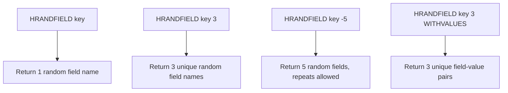

# How to Use HRANDFIELD in Redis for Random Hash Field Selection

Author: [nawazdhandala](https://www.github.com/nawazdhandala)

Tags: Redis, HRANDFIELD, Hash, Random, Field, Command, Sampling

Description: Learn how to use the Redis HRANDFIELD command to select random fields from a hash, with options to return values and control uniqueness, for sampling and randomization use cases.

---

## How HRANDFIELD Works

`HRANDFIELD` returns one or more random field names (and optionally their values) from a hash. It was introduced in Redis 6.2. Without a count argument, it returns a single random field name. With a positive count, it returns that many unique fields. With a negative count, it may return the same field multiple times (sampling with replacement).



## Syntax

```redis
HRANDFIELD key [count [WITHVALUES]]
```

- No count: returns a single random field name (or nil if hash is empty)
- Positive count: returns up to `count` unique field names (may return fewer if hash has fewer fields)
- Negative count: returns exactly `|count|` field names, with possible repetition
- `WITHVALUES`: include the value alongside each field name in the response

## Examples

### Single random field

```redis
HSET quiz:1 q1 "What is 2+2?" q2 "Capital of France?" q3 "First planet from Sun?" q4 "Speed of light?"
HRANDFIELD quiz:1
```

```text
(integer) 4
"q3"
```

The returned field will vary on each call.

### Multiple unique random fields (positive count)

Pick 2 unique questions randomly from the quiz hash.

```redis
HRANDFIELD quiz:1 2
```

```text
1) "q1"
2) "q4"
```

### More than available fields

If the count exceeds the number of fields, all fields are returned (no duplicates).

```redis
HRANDFIELD quiz:1 10
```

```text
1) "q1"
2) "q2"
3) "q3"
4) "q4"
```

### Negative count (sampling with replacement)

Get 6 random fields from a 4-field hash - duplicates are possible.

```redis
HRANDFIELD quiz:1 -6
```

```text
1) "q2"
2) "q1"
3) "q3"
4) "q2"
5) "q4"
6) "q1"
```

### HRANDFIELD with WITHVALUES

Return field-value pairs for the randomly selected fields.

```redis
HSET products sku:101 "Laptop" sku:102 "Mouse" sku:103 "Keyboard" sku:104 "Monitor"
HRANDFIELD products 2 WITHVALUES
```

```text
1) "sku:103"
2) "Keyboard"
3) "sku:101"
4) "Laptop"
```

### Single field with WITHVALUES

```redis
HRANDFIELD products 1 WITHVALUES
```

```text
1) "sku:102"
2) "Mouse"
```

### A/B test feature sampling

Randomly select a feature variant for a user.

```redis
HSET features:variants dark_mode "enabled" new_dashboard "beta" ai_assist "preview"
HRANDFIELD features:variants 1 WITHVALUES
```

```text
1) "new_dashboard"
2) "beta"
```

### HRANDFIELD on empty or non-existent hash

```redis
HRANDFIELD nonexistent_key
```

```text
(nil)
```

```redis
HRANDFIELD nonexistent_key 3
```

```text
(empty array)
```

## Comparison of count behaviors

| Count argument | Uniqueness | Result size |
|----------------|------------|-------------|
| (none) | N/A | 1 field |
| Positive N | Unique fields only | min(N, hash size) |
| Negative N | Repeats allowed | exactly N |

## Use Cases

- Quiz applications: randomly select questions from a question bank hash
- Feature flag sampling: pick a random variant to test
- Recommendation systems: randomly surface items from a catalog hash
- Lottery and giveaways: pick random winners from an entries hash
- Load balancing: randomly select a backend server from a hash of endpoints
- A/B testing: randomly assign users to experiment groups stored in a hash

## Summary

`HRANDFIELD` provides flexible random sampling from Redis hashes. Use it without a count for a single random field, with a positive count for unique selection, and with a negative count for sampling with replacement. The `WITHVALUES` option eliminates the need for a follow-up `HMGET` call. It is ideal for quiz apps, feature flag randomization, recommendations, and any scenario requiring random selection from a predefined set of options.
