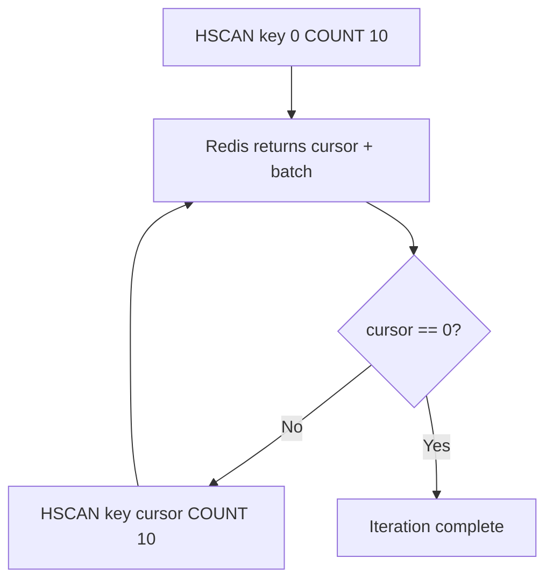
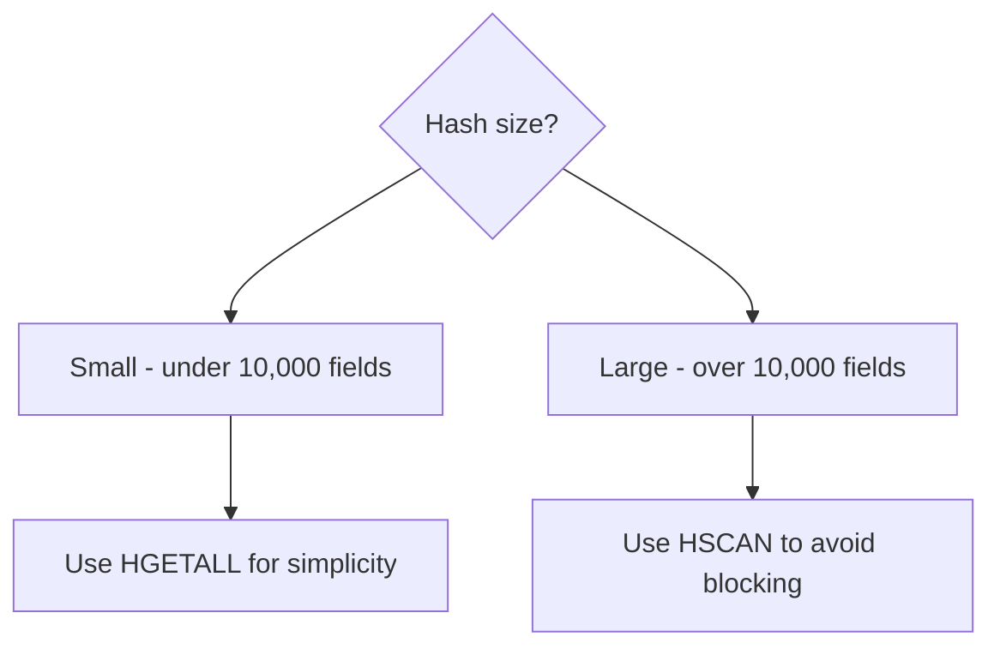

# How to Use HSCAN in Redis to Iterate Over Hash Fields

Author: [nawazdhandala](https://www.github.com/nawazdhandala)

Tags: Redis, HSCAN, Hash, Iterator, Cursor, Command, Performance

Description: Learn how to use the Redis HSCAN command to incrementally iterate over hash fields without blocking Redis, ideal for large hashes that cannot be read with HGETALL.

---

## How HSCAN Works

`HSCAN` iterates over fields in a hash using a cursor-based approach. Each call returns a new cursor and a batch of field-value pairs. You continue calling `HSCAN` with the returned cursor until it returns 0, indicating the full iteration is complete. This approach lets you page through large hashes without blocking Redis the way a single `HGETALL` would.

`HSCAN` is the hash-specific variant of the general `SCAN` family (which also includes `SCAN`, `SSCAN`, and `ZSCAN`).



## Syntax

```redis
HSCAN key cursor [MATCH pattern] [COUNT count]
```

- `cursor` - start with 0 for the first call; use the cursor returned by each call for subsequent calls
- `MATCH pattern` - filter field names by a glob pattern (applied after fetching, not before)
- `COUNT count` - hint to Redis about how many elements to return per call (not a guarantee)

Returns an array with two elements:
1. New cursor (string) - use this for the next call; when it is "0", iteration is complete
2. Array of field-value pairs for this batch

## Examples

### Basic HSCAN

Start iteration from cursor 0.

```redis
HSET myhash f1 v1 f2 v2 f3 v3 f4 v4 f5 v5
HSCAN myhash 0
```

```text
(integer) 5
1) "0"
2) 1) "f1"
   2) "v1"
   3) "f2"
   4) "v2"
   5) "f3"
   6) "v3"
   7) "f4"
   8) "v4"
   9) "f5"
  10) "v5"
```

Cursor returned is "0", meaning the iteration is complete in one call (small hash).

### Full iteration loop (bash)

Iterate over a large hash page by page.

```bash
cursor=0
while true; do
  result=$(redis-cli HSCAN bighash "$cursor" COUNT 100)
  cursor=$(echo "$result" | head -1)
  echo "$result" | tail -n +2
  [ "$cursor" = "0" ] && break
done
```

### HSCAN with MATCH pattern

Only return fields whose names match a glob pattern.

```redis
HSET user:1 name "Alice" email_primary "alice@example.com" email_backup "alice2@example.com" role "admin" phone "555-1234"
HSCAN user:1 0 MATCH email*
```

```text
1) "0"
2) 1) "email_primary"
   2) "alice@example.com"
   3) "email_backup"
   4) "alice2@example.com"
```

### HSCAN with COUNT hint

Ask Redis to return approximately 50 fields per call. Redis may return more or fewer.

```redis
HSCAN bighash 0 COUNT 50
```

```text
1) "128"
2) 1) "field_1"
   2) "value_1"
   ... (up to ~50 pairs)
```

Use the returned cursor "128" for the next call.

### Complete iteration in application code

In Python (using redis-py), the `hscan_iter` helper wraps the cursor loop:

```text
for field, value in redis_client.hscan_iter("user_settings:42", match="theme_*"):
    print(f"{field}: {value}")
```

### When to use HSCAN vs HGETALL



## Important notes about HSCAN

- `MATCH` is applied after the fields are fetched, so small batches can return 0 results even if matching fields exist elsewhere in the hash. Always iterate until cursor == "0".
- `COUNT` is a hint, not a strict limit. For hashes small enough to use listpack/ziplist encoding, Redis may return all fields in one call regardless of COUNT.
- `HSCAN` may return the same field multiple times across iterations if a rehash occurs during iteration. Your application should handle duplicates.
- The iteration order is not guaranteed to be consistent.

## Use Cases

- Iterating over a large user preferences hash without blocking Redis
- Pattern-based field filtering (e.g., find all `email_*` fields)
- Background jobs that process hash fields in chunks
- Admin tooling that inspects or exports hash contents
- Bulk field deletion using HSCAN + HDEL in batches

## Summary

`HSCAN` is the safe way to iterate over large Redis hashes. Its cursor-based design avoids the O(N) blocking behavior of `HGETALL`. Use `MATCH` to filter fields by pattern and `COUNT` to control batch size. Always iterate until the cursor returns "0" to ensure complete coverage, and be prepared to handle duplicate entries that may appear across iterations.
