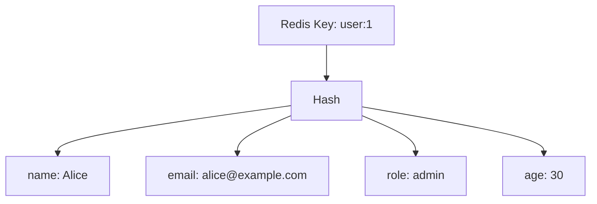

# How to Use HSET and HGET in Redis for Hash Field Operations

Author: [nawazdhandala](https://www.github.com/nawazdhandala)

Tags: Redis, HSET, HGET, Hash, Field, Command, Data Structure

Description: Learn how to use Redis HSET and HGET to store and retrieve individual fields within a hash, the ideal data structure for representing objects and records.

---

## How HSET and HGET Work

A Redis Hash is a map of string field names to string values, stored under a single key. `HSET` sets one or more fields in a hash. `HGET` retrieves the value of a single field. Hashes are memory-efficient for storing objects because Redis uses a compact encoding (ziplist/listpack) for small hashes.

`HSET` in Redis 4.0+ accepts multiple field-value pairs in one call. Older versions required `HMSET` for bulk sets.



## Syntax

```redis
HSET key field value [field value ...]
HGET key field
```

- `HSET` returns the number of new fields added (fields that did not exist before). Updating an existing field returns 0.
- `HGET` returns the field value as a bulk string, or nil if the field or the key does not exist.

## Examples

### Setting and getting a single field

```redis
HSET user:1 name "Alice"
HGET user:1 name
```

```text
(integer) 1
"Alice"
```

### Setting multiple fields in one call

```redis
HSET user:1 name "Alice" email "alice@example.com" role "admin" age "30"
HGET user:1 email
HGET user:1 role
```

```text
(integer) 4
"alice@example.com"
"admin"
```

`HSET` returned 4 because all four fields were new.

### Updating an existing field

Updating a field returns 0 (no new fields added).

```redis
HSET user:1 role "superadmin"
HGET user:1 role
```

```text
(integer) 0
"superadmin"
```

### Adding new fields to an existing hash

When you add a mix of new and existing fields, `HSET` returns only the count of newly created fields.

```redis
HSET user:1 name "Alice" city "New York"
```

```text
(integer) 1
```

`name` was updated (existing), `city` was added (new), so the return is 1.

### HGET on missing field

Returns nil without an error.

```redis
HGET user:1 phone
```

```text
(nil)
```

### HGET on missing key

Returns nil without an error.

```redis
HGET nonexistent:key field
```

```text
(nil)
```

### Storing a product record

Use a hash to store a product with multiple attributes.

```redis
HSET product:101 name "Wireless Mouse" price "29.99" stock "150" category "Electronics"
HGET product:101 price
HGET product:101 stock
```

```text
(integer) 4
"29.99"
"150"
```

### Storing a session object

```redis
HSET session:abc123 user_id "42" created_at "1743379200" ip "192.168.1.1" agent "Mozilla/5.0"
HGET session:abc123 user_id
```

```text
(integer) 4
"42"
```

## Hash vs String comparison

| Approach | Memory | Access |
|----------|--------|--------|
| Store each field as separate string key (`user:1:name`) | Higher overhead per key | O(1) per field |
| Store all fields in a hash (`user:1`) | Compact (ziplist for small hashes) | O(1) per field |

For objects with fewer than 128 fields and values under 64 bytes each (configurable), Redis uses a memory-optimized listpack encoding.

## Use Cases

- User profiles (name, email, role, preferences)
- Product catalog entries (name, price, stock, description)
- Session storage (user_id, IP, user agent, created_at)
- Configuration objects (key-value settings grouped under one key)
- Shopping cart items (product_id, quantity, price)

## Summary

`HSET` and `HGET` are the foundation of Redis hash operations. `HSET` creates or updates one or more fields in a single call and returns the number of new fields created. `HGET` retrieves a single field value. Hashes are the natural data structure for storing object-like records in Redis, offering compact memory usage and O(1) field access. For retrieving all fields at once, use `HGETALL`.
