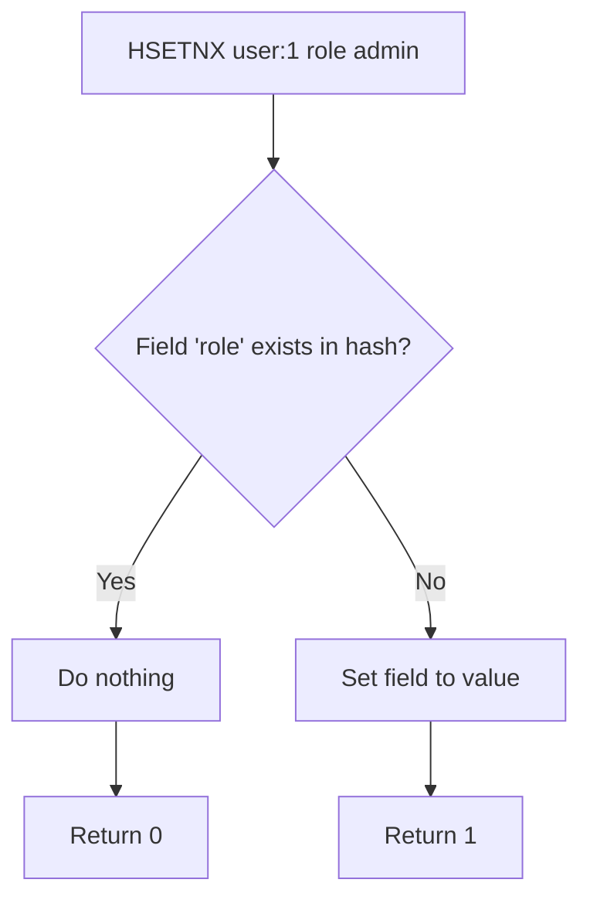

# How to Use HSETNX in Redis for Conditional Hash Field Setting

Author: [nawazdhandala](https://www.github.com/nawazdhandala)

Tags: Redis, HSETNX, Hash, Conditional, Field, Command, Idempotent

Description: Learn how to use the Redis HSETNX command to set a hash field only if it does not already exist, enabling safe default initialization and idempotent writes.

---

## How HSETNX Works

`HSETNX` (Hash SET if Not eXists) sets a field in a hash only if that field does not already exist. If the field already has a value, the command does nothing and returns 0. If the field is new, it sets the value and returns 1. The hash key is created automatically if it does not exist.

This is the hash-field equivalent of the string command `SETNX`.



## Syntax

```redis
HSETNX key field value
```

Returns:
- `1` - field was set (did not exist before)
- `0` - field was NOT set (already existed)

## Examples

### Basic HSETNX

```redis
HSET user:1 name "Alice" email "alice@example.com"
HSETNX user:1 role "admin"
HSETNX user:1 role "viewer"
HGET user:1 role
```

```text
(integer) 2
(integer) 1
(integer) 0
"admin"
```

The second `HSETNX` returned 0 and did not overwrite "admin".

### Initialize default field values

Set defaults for any fields that are not yet configured.

```redis
HSET config:app timeout "30"
HSETNX config:app timeout "60"
HSETNX config:app retries "3"
HSETNX config:app debug "false"
HGETALL config:app
```

```text
(integer) 1
(integer) 0
(integer) 1
(integer) 1
1) "timeout"
2) "30"
3) "retries"
4) "3"
5) "debug"
6) "false"
```

`timeout` was not changed (already "30"), but `retries` and `debug` were added.

### Safe first-write pattern

Use HSETNX to record the creation timestamp only once.

```redis
HSETNX user:42 created_at "1743379200"
HSETNX user:42 created_at "9999999999"
HGET user:42 created_at
```

```text
(integer) 1
(integer) 0
"1743379200"
```

### Idempotent feature flag initialization

Add a feature flag field only if it is not already set.

```redis
HSET feature_flags:user:5 dark_mode "off"
HSETNX feature_flags:user:5 dark_mode "on"
HSETNX feature_flags:user:5 new_ui "on"
HGETALL feature_flags:user:5
```

```text
(integer) 1
(integer) 0
(integer) 1
1) "dark_mode"
2) "off"
3) "new_ui"
4) "on"
```

`dark_mode` stays "off" (was already set); `new_ui` is added.

### HSETNX on a non-existent hash key

HSETNX creates the hash if needed.

```redis
DEL newuser:99
HSETNX newuser:99 status "active"
HGETALL newuser:99
```

```text
(integer) 0
(integer) 1
1) "status"
2) "active"
```

## HSETNX vs HSET

| Command | Behavior | Return |
|---------|----------|--------|
| `HSET key field value` | Always sets (overwrites) | Number of new fields added |
| `HSETNX key field value` | Sets only if field absent | 1 (set) or 0 (skipped) |

## Use Cases

- Initialize default field values in a hash without overwriting existing ones
- Record creation timestamps that should never be updated
- Idempotent object initialization (create fields safely on first access)
- Feature flag defaults (set "off" only if not already configured)
- Schema migration: add new fields to existing hashes without disturbing current values

## Summary

`HSETNX` provides conditional field creation for Redis hashes. It sets a field value only if the field does not already exist, returning 1 on success and 0 when skipped. It is ideal for safe default initialization, immutable "created_at" fields, and idempotent writes where you want to set a value exactly once. For multi-field conditional initialization, use a Lua script combining multiple `HSETNX` calls or check field existence with `HEXISTS` first.
