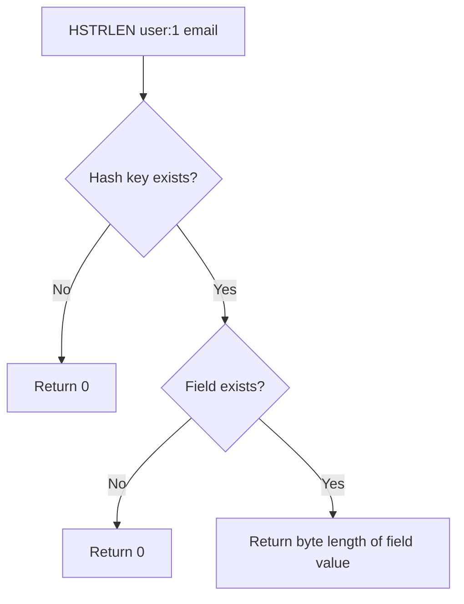

# How to Use HSTRLEN in Redis to Get Hash Field Value Length

Author: [nawazdhandala](https://www.github.com/nawazdhandala)

Tags: Redis, HSTRLEN, Hash, String, Length, Command

Description: Learn how to use the Redis HSTRLEN command to get the byte length of a hash field's value without retrieving the full value, useful for size validation and optimization.

---

## How HSTRLEN Works

`HSTRLEN` returns the string length (in bytes) of the value associated with a given field in a hash. If the field or the hash key does not exist, it returns 0. Like `STRLEN` for string keys, it counts bytes rather than Unicode characters.

`HSTRLEN` is useful when you want to check the size of a stored value without paying the cost of transferring the full value over the network.



## Syntax

```redis
HSTRLEN key field
```

Returns an integer: the byte length of the field value, or 0 if the field or key does not exist.

## Examples

### Basic usage

```redis
HSET user:1 name "Alice" email "alice@example.com" bio "Software engineer at Acme Corp"
HSTRLEN user:1 name
HSTRLEN user:1 email
HSTRLEN user:1 bio
```

```text
(integer) 3
(integer) 5
(integer) 17
(integer) 30
```

### Non-existent field returns 0

```redis
HSTRLEN user:1 phone
```

```text
(integer) 0
```

### Non-existent key returns 0

```redis
HSTRLEN missing_key field
```

```text
(integer) 0
```

### Checking JSON payload size

Validate that a cached JSON blob is within an acceptable size limit.

```redis
HSET cache:user:42 profile '{"id":42,"name":"Bob","email":"bob@example.com","preferences":{"theme":"dark","lang":"en"}}'
HSTRLEN cache:user:42 profile
```

```text
(integer) 1
(integer) 91
```

### Enforcing maximum field length before setting

Check the current length before deciding whether to append or replace.

```redis
HSET user:1 bio "Software engineer"
HSTRLEN user:1 bio
```

```text
(integer) 1
(integer) 18
```

If the length is already near the maximum, prompt the user instead of silently truncating.

### Comparing field sizes across records

Quickly identify records with unusually large field values.

```redis
HSET article:1 title "Hello World"
HSET article:2 title "A Very Long Article Title That Might Cause Display Issues"
HSTRLEN article:1 title
HSTRLEN article:2 title
```

```text
(integer) 1
(integer) 1
(integer) 11
(integer) 57
```

### HSTRLEN vs fetching the value

| Approach | Data transferred | Use when |
|----------|-----------------|----------|
| `HGET key field` + measure in client | Full value transferred | You need the value anyway |
| `HSTRLEN key field` | Just an integer | You only need the size |

For large cached blobs (HTML, JSON, images encoded as base64), `HSTRLEN` avoids unnecessary data transfer.

## Use Cases

- Validate field length before updating (enforce max bio length, URL length)
- Check if a cached JSON or HTML fragment is populated (non-zero length)
- Monitor field sizes across records for schema auditing
- Decide whether to serve a cached value or regenerate it based on size
- Enforce storage quotas per hash field

## Summary

`HSTRLEN` returns the byte length of a hash field's value without transferring the value itself. It returns 0 for non-existent fields or keys. Use it to validate field sizes, check cache population, and avoid unnecessary data transfer when you only need to know how large a stored value is. Remember it measures bytes, not Unicode characters.
