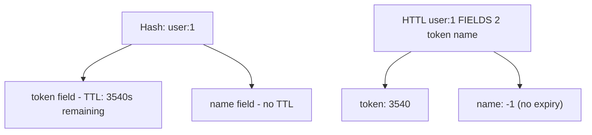

# How to Use HTTL and HPTTL in Redis for Hash Field Time-to-Live

Author: [nawazdhandala](https://www.github.com/nawazdhandala)

Tags: Redis, HTTL, HPTTL, Hash, TTL, Expiration, Field, Command

Description: Learn how to use the Redis HTTL and HPTTL commands (Redis 7.4+) to check the remaining time-to-live of individual hash fields in seconds and milliseconds.

---

## How HTTL and HPTTL Work

`HTTL` returns the remaining time-to-live of specific hash fields in seconds. `HPTTL` returns the same information in milliseconds. Both commands were introduced in Redis 7.4 alongside the hash field expiration commands (`HEXPIRE`, `HPEXPIRE`, `HPERSIST`).

These commands allow you to inspect per-field TTLs without modifying them.



## Syntax

```redis
HTTL key FIELDS numfields field [field ...]
HPTTL key FIELDS numfields field [field ...]
```

Returns an array of integers, one per requested field:
- Positive integer - remaining TTL in seconds (HTTL) or milliseconds (HPTTL)
- `-1` - the field exists but has no associated expiry
- `-2` - the field does not exist in the hash

## Examples

### Basic HTTL

Set a TTL on a field and check it.

```redis
HSET session:abc user_id "42" role "admin" temp_key "xyz"
HEXPIRE session:abc 1800 FIELDS 1 temp_key
HTTL session:abc FIELDS 1 temp_key
```

```text
(integer) 3
1) (integer) 1
1) (integer) 1800
```

### HTTL on a field with no expiry

Returns -1 for permanent fields.

```redis
HTTL session:abc FIELDS 1 role
```

```text
1) (integer) -1
```

### HTTL on a non-existent field

Returns -2.

```redis
HTTL session:abc FIELDS 1 nonexistent_field
```

```text
1) (integer) -2
```

### Check multiple fields at once

```redis
HSET user:1 name "Alice" token "abc123" cache "fragment" role "admin"
HEXPIRE user:1 3600 FIELDS 2 token cache
HTTL user:1 FIELDS 4 name token cache role
```

```text
(integer) 4
1) (integer) 1
1) (integer) -1
2) (integer) 3600
3) (integer) 3600
4) (integer) -1
```

- `name` and `role` have no TTL (-1)
- `token` and `cache` have 3600 seconds remaining

### HPTTL for millisecond precision

```redis
HSET data:key field1 "value1"
HEXPIRE data:key 10 FIELDS 1 field1
HPTTL data:key FIELDS 1 field1
```

```text
(integer) 1
1) (integer) 1
1) (integer) 9998
```

The remaining TTL is ~9998 milliseconds (slightly less than 10000 due to processing time).

### Comparing HTTL and HPTTL for the same field

```redis
HSET mykey myfield "hello"
HEXPIRE mykey 7 FIELDS 1 myfield
HTTL mykey FIELDS 1 myfield
HPTTL mykey FIELDS 1 myfield
```

```text
(integer) 1
1) (integer) 1
1) (integer) 7
1) (integer) 6999
```

HTTL returns 7 seconds; HPTTL returns ~6999 milliseconds.

### Monitoring expiring fields in a session hash

Periodically check which fields are about to expire.

```redis
HSET session:xyz user_id "99" token "t123" temp_data "abc" perm_data "xyz"
HEXPIRE session:xyz 60 FIELDS 2 token temp_data
HTTL session:xyz FIELDS 4 user_id token temp_data perm_data
```

```text
(integer) 4
1) (integer) 1
1) (integer) -1
2) (integer) 60
3) (integer) 60
4) (integer) -1
```

## Return value reference

| Return value | Meaning |
|-------------|---------|
| Positive N | Remaining TTL in seconds (HTTL) or ms (HPTTL) |
| `-1` | Field exists but has no expiry (permanent) |
| `-2` | Field does not exist in the hash |

## HTTL vs key-level TTL commands

| Command | Scope | Unit |
|---------|-------|------|
| `TTL key` | Entire key | Seconds |
| `PTTL key` | Entire key | Milliseconds |
| `HTTL key FIELDS ...` | Individual fields | Seconds |
| `HPTTL key FIELDS ...` | Individual fields | Milliseconds |

## Use Cases

- Monitoring per-field TTLs in session and cache hashes
- Deciding whether to refresh a field's TTL before it expires
- Debugging hash field expiration behavior
- Building expiry-aware UI (show "expires in X minutes" for tokens)
- Health checks that verify critical fields haven't expired unexpectedly

## Summary

`HTTL` and `HPTTL` provide visibility into per-field TTLs within a Redis hash. `HTTL` returns remaining time in seconds; `HPTTL` in milliseconds. They return -1 for permanent fields (no TTL) and -2 for non-existent fields. These commands are part of the Redis 7.4+ hash field expiration feature set and complement `HEXPIRE`, `HPEXPIRE`, and `HPERSIST`.
