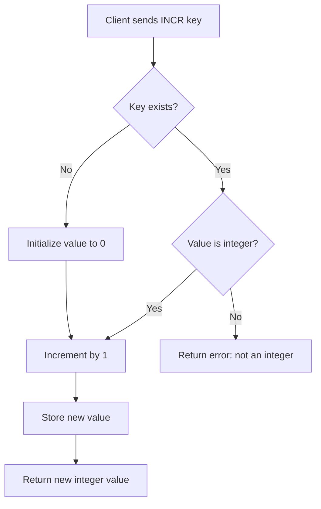

# How to Use INCR and DECR in Redis for Atomic Counters

Author: [nawazdhandala](https://www.github.com/nawazdhandala)

Tags: Redis, INCR, DECR, Counter, Atomic, String, Command

Description: Learn how to use Redis INCR and DECR commands to build thread-safe atomic counters for page views, rate limiting, and inventory tracking.

---

## How INCR and DECR Work

`INCR` atomically increments the integer value stored at a key by 1. `DECR` atomically decrements it by 1. If the key does not exist, Redis initializes it to 0 before performing the operation, so the result of the first `INCR` is always 1.

Because both operations are atomic, they are safe for concurrent use from multiple clients without any locking - Redis processes each command sequentially.



## Syntax

```redis
INCR key
DECR key
```

Both commands take exactly one argument and return the new integer value after the operation.

## Examples

### Page view counter

Count visits to a page. Each call increments the counter by 1.

```redis
INCR pageviews:home
INCR pageviews:home
INCR pageviews:home
GET pageviews:home
```

```text
(integer) 1
(integer) 2
(integer) 3
"3"
```

### Decrement a counter

Track remaining items in stock.

```redis
SET inventory:widget 10
DECR inventory:widget
DECR inventory:widget
GET inventory:widget
```

```text
OK
(integer) 9
(integer) 8
"8"
```

### Auto-initialization

`INCR` on a non-existent key starts from 0 and returns 1.

```redis
DEL hits:new_page
INCR hits:new_page
```

```text
(integer) 0
(integer) 1
```

Wait - `DEL` returns the number of keys deleted (0 if the key did not exist), and the subsequent `INCR` returns 1.

### Rate limiting with INCR and EXPIRE

Count requests per IP within a time window.

```redis
INCR rate:192.168.1.1
EXPIRE rate:192.168.1.1 60
GET rate:192.168.1.1
```

```text
(integer) 1
(integer) 1
"1"
```

A more robust pattern uses `SET key 0 EX 60 NX` to avoid a race condition between `INCR` and `EXPIRE`:

```redis
SET rate:192.168.1.1 0 EX 60 NX
INCR rate:192.168.1.1
```

```text
OK
(integer) 1
```

### Negative counters with DECR

`DECR` happily goes below zero, useful for tracking debt or deficit metrics.

```redis
SET balance:user42 5
DECR balance:user42
DECR balance:user42
DECR balance:user42
DECR balance:user42
DECR balance:user42
DECR balance:user42
GET balance:user42
```

```text
OK
(integer) 4
(integer) 3
(integer) 2
(integer) 1
(integer) 0
(integer) -1
"-1"
```

### Error on non-integer values

If the stored value cannot be interpreted as a base-10 integer, Redis returns an error.

```redis
SET badkey "hello"
INCR badkey
```

```text
OK
(error) ERR value is not an integer or out of range
```

## Use Cases

| Pattern | Command |
|---------|---------|
| Page / API hit counters | `INCR` |
| Rate limiting (request count per window) | `INCR` + `EXPIRE` |
| Inventory management (stock decrement on purchase) | `DECR` |
| Unique ID generation | `INCR` on a global sequence key |
| Active connection tracking | `INCR` on connect, `DECR` on disconnect |

## Summary

`INCR` and `DECR` are Redis's go-to commands for atomic integer counters. They initialize missing keys to 0, operate atomically without extra locking, and return the updated value in a single round-trip. Common applications include page view counters, rate limiters, inventory trackers, and distributed ID generators. For increments larger than 1, use `INCRBY` and `DECRBY`.
