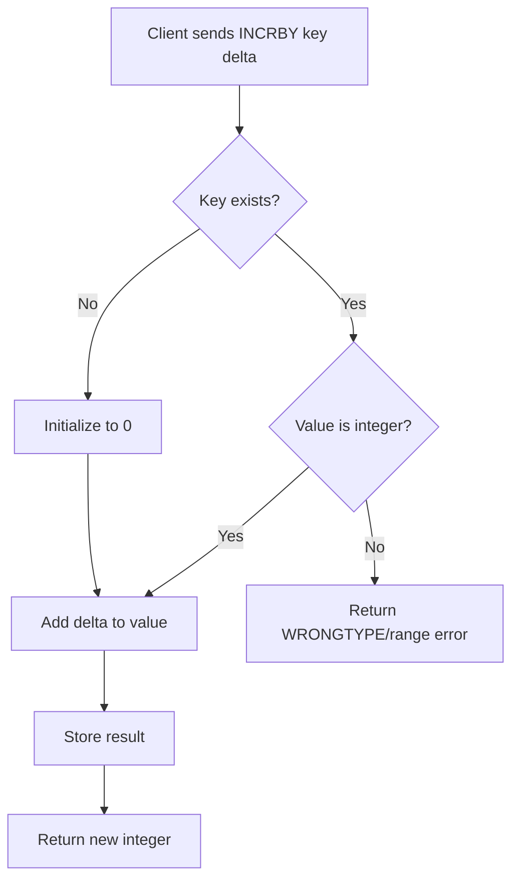

# How to Use INCRBY and DECRBY in Redis for Custom Increments

Author: [nawazdhandala](https://www.github.com/nawazdhandala)

Tags: Redis, INCRBY, DECRBY, Counter, Atomic, String, Command

Description: Learn how to use Redis INCRBY and DECRBY commands to atomically increment or decrement integer values by any custom amount in a single operation.

---

## How INCRBY and DECRBY Work

`INCRBY` adds a specified integer increment to the value stored at a key. `DECRBY` subtracts a specified integer decrement. Both commands are atomic, auto-initialize missing keys to 0 before applying the delta, and return the new value. They are generalized versions of `INCR` and `DECR` that let you change values by more than 1 in a single round-trip.



## Syntax

```redis
INCRBY key increment
DECRBY key decrement
```

- `increment` / `decrement` - a signed 64-bit integer

Both commands return the new integer value after the operation.

## Examples

### Add points to a user score

Reward a user with 50 points after completing a task.

```redis
SET score:user:42 200
INCRBY score:user:42 50
GET score:user:42
```

```text
OK
(integer) 250
"250"
```

### Deduct credits

Subtract 30 credits when a user makes a purchase.

```redis
SET credits:user:42 100
DECRBY credits:user:42 30
GET credits:user:42
```

```text
OK
(integer) 70
"70"
```

### Auto-initialization

A missing key is treated as 0 before the operation.

```redis
DEL stats:downloads
INCRBY stats:downloads 500
INCRBY stats:downloads 250
GET stats:downloads
```

```text
(integer) 0
(integer) 500
(integer) 750
"750"
```

### Batch upload tracking

When processing a CSV import, add the number of rows processed in each batch.

```redis
INCRBY import:job:99:rows_processed 1000
INCRBY import:job:99:rows_processed 1000
INCRBY import:job:99:rows_processed 543
GET import:job:99:rows_processed
```

```text
(integer) 1000
(integer) 2000
(integer) 2543
"2543"
```

### Using DECRBY for a token bucket

Consume multiple tokens at once.

```redis
SET tokens:api_key:abc 1000
DECRBY tokens:api_key:abc 5
DECRBY tokens:api_key:abc 10
GET tokens:api_key:abc
```

```text
OK
(integer) 995
(integer) 985
"985"
```

### Negative increment with INCRBY

Passing a negative increment to `INCRBY` is equivalent to `DECRBY`.

```redis
SET balance 100
INCRBY balance -25
```

```text
OK
(integer) 75
```

### Error on overflow

Redis integers are 64-bit signed, so adding to the maximum value causes an overflow error.

```redis
SET bignum 9223372036854775807
INCRBY bignum 1
```

```text
OK
(error) ERR increment or decrement would overflow
```

## Comparison table

| Command | Equivalent to | Use case |
|---------|---------------|----------|
| `INCR key` | `INCRBY key 1` | Simple hit counter |
| `DECR key` | `DECRBY key 1` | Simple stock decrement |
| `INCRBY key N` | - | Batch scoring, bulk adds |
| `DECRBY key N` | - | Token bucket, bulk deductions |

## Use Cases

- Leaderboard scoring (add variable point values)
- Billing systems (deduct variable amounts per API call)
- Token bucket rate limiting (consume N tokens per request)
- Batch processing progress (add rows_processed in chunks)
- Bandwidth metering (add bytes transferred periodically)

## Summary

`INCRBY` and `DECRBY` extend the atomic counter capabilities of `INCR` and `DECR` by letting you specify any integer delta. They auto-initialize missing keys, are safe for concurrent access, and return the new value immediately. When you need fractional increments, use `INCRBYFLOAT` instead.
