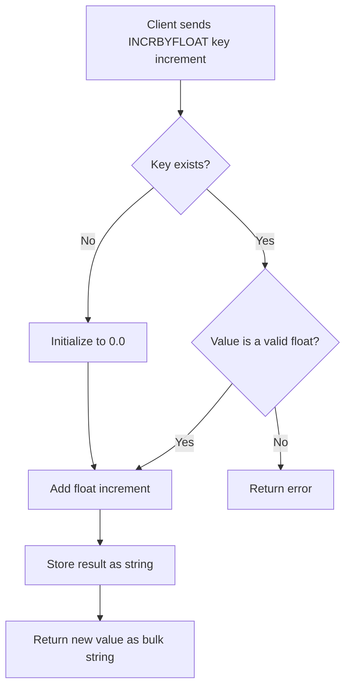

# How to Use INCRBYFLOAT in Redis for Floating-Point Counters

Author: [nawazdhandala](https://www.github.com/nawazdhandala)

Tags: Redis, INCRBYFLOAT, Float, Counter, Atomic, String, Command

Description: Learn how to use Redis INCRBYFLOAT to atomically increment or decrement floating-point values, with examples for financial totals, sensor data, and analytics.

---

## How INCRBYFLOAT Works

`INCRBYFLOAT` atomically adds a floating-point number to the value stored at a key and returns the new value as a string. The increment can be positive or negative, integer or decimal. If the key does not exist, Redis initializes it to 0 before adding the increment. The stored value must be parseable as a double-precision floating-point number.

Redis stores the result as a string, using the minimum number of digits needed to represent the value - so `1.0` becomes `"1"` and `3.1415` stays `"3.1415"`.



## Syntax

```redis
INCRBYFLOAT key increment
```

- `key` - the key holding the float value
- `increment` - a floating-point number (positive or negative, can use scientific notation)

Returns the new value as a bulk string.

## Examples

### Basic float increment

Add 1.5 to a counter three times.

```redis
DEL temp_reading
INCRBYFLOAT temp_reading 1.5
INCRBYFLOAT temp_reading 1.5
INCRBYFLOAT temp_reading 1.5
GET temp_reading
```

```text
"1.5"
"3"
"4.5"
"4.5"
```

### Financial total accumulation

Accumulate a running total of order amounts.

```redis
DEL revenue:today
INCRBYFLOAT revenue:today 49.99
INCRBYFLOAT revenue:today 12.50
INCRBYFLOAT revenue:today 199.00
GET revenue:today
```

```text
"49.99"
"62.49"
"261.49"
"261.49"
```

### Negative increment (decrement)

Subtract from a balance by passing a negative value.

```redis
SET wallet:user:7 100.00
INCRBYFLOAT wallet:user:7 -15.75
GET wallet:user:7
```

```text
OK
"84.25"
"84.25"
```

### Scientific notation

Redis accepts scientific notation for the increment.

```redis
SET counter 3.1415e2
INCRBYFLOAT counter 10
GET counter
```

```text
OK
"324.15"
"324.15"
```

### Mixing integers and floats

An existing integer value can be incremented by a float.

```redis
SET page_time 100
INCRBYFLOAT page_time 0.5
GET page_time
```

```text
OK
"100.5"
"100.5"
```

### Sensor aggregation

Accumulate average temperature data from IoT sensors.

```redis
INCRBYFLOAT sensor:room1:temp_sum 22.3
INCRBYFLOAT sensor:room1:temp_sum 22.7
INCRBYFLOAT sensor:room1:temp_sum 23.1
INCR sensor:room1:readings
GET sensor:room1:temp_sum
GET sensor:room1:readings
```

```text
"22.3"
"45"
"68.1"
(integer) 3
"68.1"
"3"
```

Average = 68.1 / 3 = 22.7

### Error on non-numeric value

If the stored value cannot be parsed as a float, Redis returns an error.

```redis
SET mykey "hello"
INCRBYFLOAT mykey 1.0
```

```text
OK
(error) ERR value is not a valid float
```

## Precision notes

`INCRBYFLOAT` uses double-precision IEEE 754 arithmetic. This can introduce small floating-point rounding errors for certain decimal values. For financial applications requiring exact decimal arithmetic, consider storing values as integers in the smallest currency unit (e.g., cents) and using `INCRBY` instead.

```redis
# Store $12.50 as 1250 cents
SET price:item 1250
INCRBY price:item 50
GET price:item
```

```text
OK
(integer) 1300
"1300"
```

## Use Cases

- Accumulating revenue or financial totals
- Tracking average sensor readings (sum + count pattern)
- Per-user analytics metrics (time-on-page, bytes transferred)
- Geospatial or physics simulations with floating-point state
- A/B test metric aggregation (conversion rates, click-through rates)

## Summary

`INCRBYFLOAT` gives Redis the ability to atomically update floating-point counters without external locking. It auto-initializes missing keys, accepts positive and negative increments, and stores the result as a compact string. For precise financial math, prefer integer-based storage with `INCRBY`. For sensor data, analytics, and non-critical float tracking, `INCRBYFLOAT` is a clean and efficient choice.
