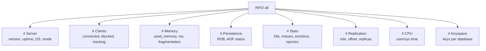

# How to Monitor Redis with INFO all

Author: [nawazdhandala](https://www.github.com/nawazdhandala)

Tags: Redis, INFO, Monitoring, Observability, Administration

Description: Learn how to use INFO all to retrieve all Redis server metrics in one command, with a guide to the most important sections and fields for production monitoring.

---

## Introduction

`INFO all` returns every available metric from the Redis server in a single command, spanning server metadata, memory, persistence, stats, replication, clients, CPU, keyspace, and more. It is the most comprehensive observability command available in Redis without external tooling.

## Basic Syntax

```redis
INFO all
```

Returns a bulk string with newline-separated `field:value` pairs organized into named sections.

You can also request individual sections:

```redis
INFO server
INFO memory
INFO persistence
INFO stats
INFO replication
INFO clients
INFO cpu
INFO keyspace
INFO latencystats
INFO commandstats
INFO errorstats
```

## INFO all Sections Overview



## Key Fields by Section

### Server

```redis
INFO server
# redis_version:7.2.4
# redis_mode:standalone
# os:Linux 5.15.0 x86_64
# arch_bits:64
# uptime_in_seconds:86400
# uptime_in_days:1
# hz:10
# configured_hz:10
# tcp_port:6379
# config_file:/etc/redis/redis.conf
```

### Clients

```redis
INFO clients
# connected_clients:42
# cluster_connections:0
# maxclients:10000
# client_recent_max_input_buffer:20504
# client_recent_max_output_buffer:0
# blocked_clients:2
# tracking_clients:0
# clients_in_timeout_table:0
```

Alert on: `connected_clients` approaching `maxclients`, high `blocked_clients`

### Memory

```redis
INFO memory
# used_memory_human:450.00M
# used_memory_rss_human:520.00M
# mem_fragmentation_ratio:1.16
# maxmemory_human:512.00M
# maxmemory_policy:allkeys-lru
# mem_allocator:jemalloc-5.3.0
```

Alert on: `mem_fragmentation_ratio` > 1.5, `used_memory` close to `maxmemory`

### Persistence

```redis
INFO persistence
# rdb_bgsave_in_progress:0
# rdb_last_bgsave_status:ok
# rdb_last_save_time:1711900800
# aof_enabled:1
# aof_rewrite_in_progress:0
# aof_last_bgrewrite_status:ok
```

Alert on: `rdb_last_bgsave_status:err`, `aof_last_bgrewrite_status:err`

### Stats

```redis
INFO stats
# total_commands_processed:5000000
# instantaneous_ops_per_sec:12500
# keyspace_hits:4800000
# keyspace_misses:200000
# evicted_keys:1500
# expired_keys:25000
# total_connections_received:150000
# rejected_connections:0
```

Key ratio: `keyspace_hits / (keyspace_hits + keyspace_misses)` = cache hit rate

### Replication

```redis
INFO replication
# role:master
# connected_slaves:2
# slave0:ip=10.0.0.11,port=6380,state=online,offset=204800,lag=0
# master_repl_offset:204800
# repl_backlog_active:1
```

Alert on: `connected_slaves` lower than expected, non-zero `lag`

### Keyspace

```redis
INFO keyspace
# db0:keys=50000,expires=5000,avg_ttl=86400
# db1:keys=1200,expires=100,avg_ttl=3600
```

## Monitoring Script

```bash
#!/bin/bash
# Capture all metrics and extract key values
redis-cli INFO all | awk -F: '
  /used_memory_human/    { print "Memory Used:      " $2 }
  /mem_fragmentation_ratio/ { print "Fragmentation:   " $2 }
  /connected_clients/    { print "Clients:          " $2 }
  /instantaneous_ops_per_sec/ { print "Ops/sec:        " $2 }
  /evicted_keys/         { print "Evicted Keys:     " $2 }
  /rdb_last_bgsave_status/ { print "RDB Status:      " $2 }
  /aof_last_bgrewrite_status/ { print "AOF Status:    " $2 }
'
```

## Prometheus / Grafana Integration

Use `redis_exporter` to scrape `INFO all` automatically and expose it as Prometheus metrics:

```bash
docker run -d \
  -e REDIS_ADDR=redis://localhost:6379 \
  -p 9121:9121 \
  oliver006/redis_exporter
```

Key Prometheus metrics derived from `INFO all`:

- `redis_memory_used_bytes`
- `redis_connected_clients`
- `redis_keyspace_hits_total`
- `redis_keyspace_misses_total`
- `redis_evicted_keys_total`
- `redis_replication_offset`

## Alerting Thresholds

| Metric | Warning Threshold | Critical Threshold |
|---|---|---|
| `mem_fragmentation_ratio` | > 1.5 | > 2.0 |
| `used_memory / maxmemory` | > 80% | > 95% |
| `evicted_keys` delta | > 0/min | > 100/min |
| `rejected_connections` | > 0 | > 10 |
| `rdb_last_bgsave_status` | - | err |
| `connected_slaves` | < expected | 0 |

## Summary

`INFO all` returns the complete Redis server health snapshot in a single command. Use individual section queries (`INFO memory`, `INFO replication`, etc.) for targeted checks in scripts. Deploy `redis_exporter` to feed `INFO all` metrics into Prometheus for dashboards and alerting. Focus monitoring on memory fragmentation, eviction rates, replication lag, persistence status, and client connection counts.
