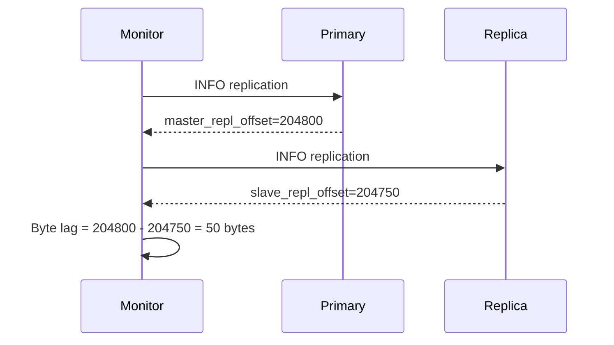
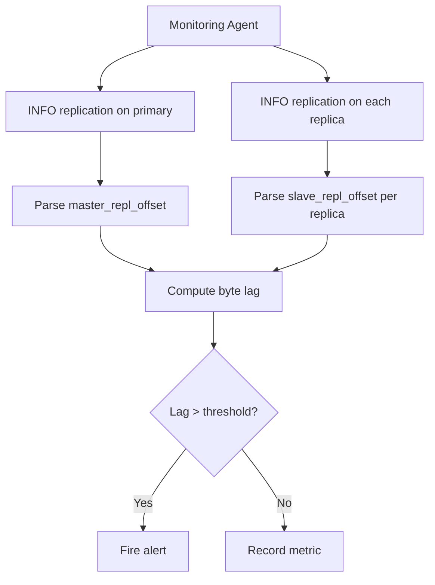

# How to Monitor Redis Replication with INFO replication

Author: [nawazdhandala](https://www.github.com/nawazdhandala)

Tags: Redis, Replication, Monitoring, INFO, Observability

Description: Learn how to use INFO replication to monitor Redis primary-replica replication health, lag, and offset, with practical examples and alerting guidance.

---

## Introduction

`INFO replication` returns a snapshot of the replication state for a Redis instance. Whether you are checking whether a replica is caught up, diagnosing lag, or confirming failover status, this command is your primary observability tool for replication.

## Basic Syntax

```redis
INFO replication
```

Returns a plain-text section of key-value pairs describing the replication state.

## Output on a Primary

```redis
INFO replication
# # Replication
# role:master
# connected_slaves:2
# slave0:ip=192.168.1.11,port=6380,state=online,offset=204800,lag=0
# slave1:ip=192.168.1.12,port=6381,state=online,offset=204750,lag=1
# master_failover_state:no-failover
# master_replid:7d6a8b2c1f4e9a3d5b0c8e2f6a4d1b9c3e7f0
# master_replid2:0000000000000000000000000000000000000000
# master_repl_offset:204800
# second_repl_offset:-1
# repl_backlog_active:1
# repl_backlog_size:1048576
# repl_backlog_first_byte_offset:1
# repl_backlog_histlen:204800
```

## Output on a Replica

```redis
INFO replication
# # Replication
# role:slave
# master_host:192.168.1.10
# master_port:6379
# master_link_status:up
# master_last_io_seconds_ago:1
# master_sync_in_progress:0
# slave_read_repl_offset:204800
# slave_repl_offset:204800
# slave_priority:100
# slave_read_only:1
# replica_announced:1
# connected_slaves:0
# master_failover_state:no-failover
# master_replid:7d6a8b2c1f4e9a3d5b0c8e2f6a4d1b9c3e7f0
# master_repl_offset:204800
# repl_backlog_active:0
# repl_backlog_size:1048576
```

## Key Fields Explained

| Field | Description |
|---|---|
| `role` | `master` or `slave` |
| `connected_slaves` | Number of replicas connected (primary only) |
| `master_repl_offset` | Current replication offset on the primary |
| `slave_repl_offset` | Offset the replica has consumed |
| `lag` | Seconds since the replica last sent a REPLCONF ACK |
| `master_link_status` | `up` or `down` - whether the replica is connected |
| `master_last_io_seconds_ago` | Seconds since last communication from primary |
| `master_sync_in_progress` | 1 during initial full sync, 0 otherwise |
| `repl_backlog_size` | Size of replication backlog buffer in bytes |

## Calculating Replication Lag in Bytes



```bash
#!/bin/bash
PRIMARY_OFFSET=$(redis-cli -h 192.168.1.10 -p 6379 INFO replication | grep "master_repl_offset" | awk -F: '{print $2}' | tr -d '\r')
REPLICA_OFFSET=$(redis-cli -h 192.168.1.11 -p 6380 INFO replication | grep "slave_repl_offset" | awk -F: '{print $2}' | tr -d '\r')
LAG=$((PRIMARY_OFFSET - REPLICA_OFFSET))
echo "Replication lag: $LAG bytes"
```

## Detecting a Disconnected Replica

```redis
# On primary
INFO replication
# slave0:ip=192.168.1.11,port=6380,state=wait_bgsave,offset=0,lag=30
```

A `state` of `wait_bgsave` combined with a high `lag` value indicates the replica is performing a full resync or is behind.

A `master_link_status:down` on the replica means it has lost contact with the primary:

```redis
# On replica
INFO replication
# master_link_status:down
# master_last_io_seconds_ago:-1
```

## Monitoring Replication in a Dashboard



## Useful Metrics to Track

- `master_repl_offset` vs `slave_repl_offset` per replica (byte lag)
- `lag` field per replica (second lag)
- `master_link_status` per replica (up/down)
- `master_sync_in_progress` (1 means full sync underway)
- `connected_slaves` on primary (detect replica disconnects)

## Summary

`INFO replication` provides comprehensive replication state for both primary and replica instances. Use it to compute byte lag by comparing `master_repl_offset` and `slave_repl_offset`, detect disconnected replicas via `master_link_status`, and confirm full sync completion with `master_sync_in_progress`. Automate monitoring with shell scripts or feed the metrics into Prometheus via redis_exporter.
