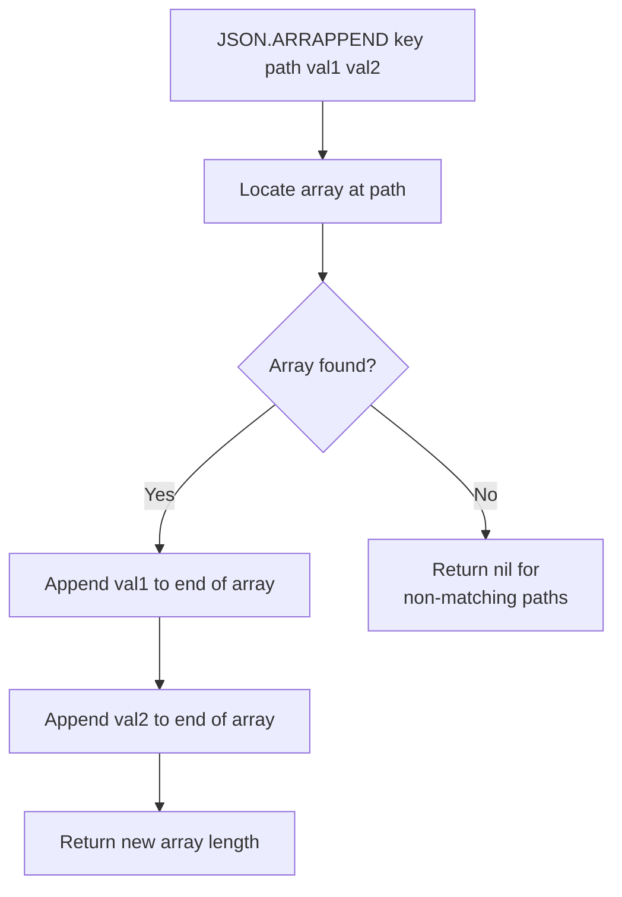

# How to Use JSON.ARRAPPEND in Redis to Append to JSON Arrays

Author: [nawazdhandala](https://www.github.com/nawazdhandala)

Tags: Redis, JSON, RedisJSON, Array, Document

Description: Learn how to use JSON.ARRAPPEND in Redis to add one or more values to the end of a JSON array in a stored document, returning the new array length.

---

## Introduction

`JSON.ARRAPPEND` appends one or more JSON values to the end of an array at a given JSONPath. It modifies the document in place and returns the new array length. This is the JSON equivalent of `RPUSH` for Redis lists, but operating on arrays embedded inside JSON documents.

## Basic Syntax

```redis
JSON.ARRAPPEND key path value [value ...]
```

- `key` - the Redis key
- `path` - JSONPath pointing to an array
- `value` - one or more valid JSON values to append

## Setup

```redis
JSON.SET tags:1 $ '{"post":"redis-intro","tags":["redis","database"]}'
```

## Append a Single Value

```redis
127.0.0.1:6379> JSON.ARRAPPEND tags:1 $.tags '"performance"'
1) (integer) 3

JSON.GET tags:1 $.tags
# [["redis","database","performance"]]
```

## Append Multiple Values

```redis
127.0.0.1:6379> JSON.ARRAPPEND tags:1 $.tags '"caching"' '"pubsub"'
1) (integer) 5

JSON.GET tags:1 $.tags
# [["redis","database","performance","caching","pubsub"]]
```

## Append Objects to an Array

```redis
JSON.SET cart:1 $ '{"user_id":1,"items":[]}'

JSON.ARRAPPEND cart:1 $.items '{"sku":"A1","qty":2,"price":9.99}'
JSON.ARRAPPEND cart:1 $.items '{"sku":"B3","qty":1,"price":19.99}'

JSON.GET cart:1 $.items
# [[{"sku":"A1","qty":2,"price":9.99},{"sku":"B3","qty":1,"price":19.99}]]
```

## Using a Wildcard Path

```redis
JSON.SET data $ '{"lists":[[1,2],[3,4],[5,6]]}'

JSON.ARRAPPEND data '$.lists[*]' '99'
# 1) (integer) 3
# 2) (integer) 3
# 3) (integer) 3
```

The return value is an array of new lengths, one per matched array.

## Append Workflow



## Python Example: Event Log

```python
import redis, json, time

r = redis.Redis()
r.json().set("log:session:42", "$", {"session_id": 42, "events": []})

def log_event(session_id, event_type, data):
    entry = {"ts": int(time.time()), "type": event_type, "data": data}
    length = r.json().arrappend(f"log:session:{session_id}", "$.events", entry)
    return length[0]

log_event(42, "page_view", {"url": "/home"})
log_event(42, "click", {"element": "signup-btn"})
log_event(42, "page_view", {"url": "/signup"})

events = r.json().get("log:session:42", "$.events")
print(events)
```

## Append vs Alternative Approaches

| Approach | Atomicity | Simplicity |
|---|---|---|
| `JSON.ARRAPPEND` | Atomic | High |
| GET + modify in app + SET | Not atomic | Medium |
| Lua script with JSON | Atomic | Low |

Always prefer `JSON.ARRAPPEND` over the read-modify-write pattern to avoid race conditions.

## Summary

`JSON.ARRAPPEND key path value [value ...]` appends one or more JSON values to the end of an array stored inside a JSON document. It returns the new array length (or an array of lengths for wildcard paths). Use it for event logs, shopping carts, tag lists, and any use case where you grow an array incrementally without reading the full document.
