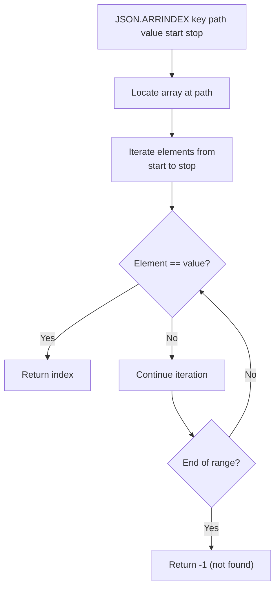

# How to Use JSON.ARRINDEX in Redis to Search JSON Arrays

Author: [nawazdhandala](https://www.github.com/nawazdhandala)

Tags: Redis, JSON, RedisJSON, Array, Search

Description: Learn how to use JSON.ARRINDEX in Redis to find the index of a value inside a JSON array, with optional start and stop range parameters.

---

## Introduction

`JSON.ARRINDEX` searches a JSON array for a specific value and returns its zero-based index. If the value appears multiple times, only the first occurrence is returned. Use it to check membership, find a position before inserting, or locate an element before removing it.

## Basic Syntax

```redis
JSON.ARRINDEX key path value [start [stop]]
```

- `key` - the Redis key
- `path` - JSONPath pointing to an array
- `value` - the JSON value to search for (must be valid JSON)
- `start` - optional start index (default 0, negative counts from end)
- `stop` - optional stop index (exclusive, default 0 means end of array)

Returns the index (integer) of the first match, or -1 if not found.

## Setup

```redis
JSON.SET playlist:1 $ '{"name":"Workout Mix","tracks":["Song A","Song B","Song C","Song D","Song A"]}'
```

## Find a Value

```redis
127.0.0.1:6379> JSON.ARRINDEX playlist:1 $.tracks '"Song C"'
1) (integer) 2
```

## Value Not Found

```redis
127.0.0.1:6379> JSON.ARRINDEX playlist:1 $.tracks '"Song Z"'
1) (integer) -1
```

## Find with a Start Offset

```redis
# Search starting from index 1 (skip first element)
127.0.0.1:6379> JSON.ARRINDEX playlist:1 $.tracks '"Song A"' 1
1) (integer) 4
```

Without the offset:

```redis
JSON.ARRINDEX playlist:1 $.tracks '"Song A"'
1) (integer) 0
```

Only the first occurrence from the start position is returned.

## Find Within a Range

```redis
# Search between index 1 and 3 (exclusive)
JSON.ARRINDEX playlist:1 $.tracks '"Song C"' 1 3
# 1) (integer) 2

# Search between index 1 and 2 (exclusive) - Song C at 2 is excluded
JSON.ARRINDEX playlist:1 $.tracks '"Song C"' 1 2
# 1) (integer) -1
```

## Searching for Objects

```redis
JSON.SET orders:1 $ '{"items":[{"sku":"A1"},{"sku":"B2"},{"sku":"C3"}]}'

JSON.ARRINDEX orders:1 $.items '{"sku":"B2"}'
# 1) (integer) 1
```

The value must exactly match the JSON representation of the object.

## Wildcard Path

```redis
JSON.SET matrix $ '{"rows":[[1,2,3],[4,5,6],[7,8,9]]}'

JSON.ARRINDEX matrix '$.rows[*]' '5'
# 1) (integer) -1   (row 0: no 5)
# 2) (integer) 1    (row 1: 5 at index 1)
# 3) (integer) -1   (row 2: no 5)
```

## Search Logic



## Checking Before Insert (Deduplication)

```python
import redis

r = redis.Redis()
r.json().set("user:1", "$", {"name": "Alice", "roles": ["viewer", "editor"]})

def add_role_if_absent(key, role):
    idx = r.json().arrindex(key, "$.roles", role)
    if idx[0] == -1:
        r.json().arrappend(key, "$.roles", role)
        print(f"Role '{role}' added")
    else:
        print(f"Role '{role}' already at index {idx[0]}")

add_role_if_absent("user:1", "admin")
add_role_if_absent("user:1", "editor")
```

## Summary

`JSON.ARRINDEX key path value [start [stop]]` returns the zero-based index of the first occurrence of a value in a JSON array, or -1 if not found. Optional `start` and `stop` bounds restrict the search range. Use it to check membership, find a position before splicing, or implement deduplication in array-based JSON data.
