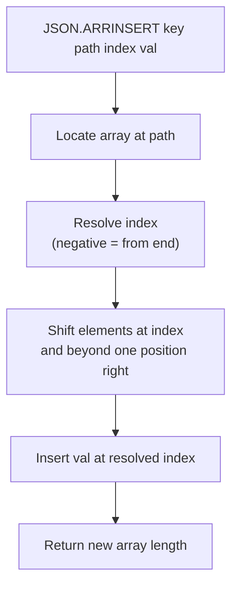

# How to Use JSON.ARRINSERT in Redis to Insert into JSON Arrays

Author: [nawazdhandala](https://www.github.com/nawazdhandala)

Tags: Redis, JSON, RedisJSON, Array, Document

Description: Learn how to use JSON.ARRINSERT in Redis to insert one or more values at a specific position inside a JSON array, shifting existing elements right.

---

## Introduction

`JSON.ARRINSERT` inserts one or more values at a specified index inside a JSON array. Elements at that index and beyond are shifted right to make room. This lets you perform positional inserts into embedded arrays without reading and rewriting the entire document.

## Basic Syntax

```redis
JSON.ARRINSERT key path index value [value ...]
```

- `key` - the Redis key
- `path` - JSONPath pointing to an array
- `index` - zero-based position at which to insert (negative values count from end)
- `value` - one or more valid JSON values

Returns the new array length.

## Setup

```redis
JSON.SET playlist:1 $ '{"tracks":["Song A","Song C","Song D"]}'
```

## Insert at a Specific Index

```redis
# Insert "Song B" at index 1 (before "Song C")
127.0.0.1:6379> JSON.ARRINSERT playlist:1 $.tracks 1 '"Song B"'
1) (integer) 4

JSON.GET playlist:1 $.tracks
# [["Song A","Song B","Song C","Song D"]]
```

## Insert at the Beginning

```redis
JSON.ARRINSERT playlist:1 $.tracks 0 '"Intro"'
# 1) (integer) 5

JSON.GET playlist:1 $.tracks
# [["Intro","Song A","Song B","Song C","Song D"]]
```

## Insert Multiple Values at Once

```redis
JSON.ARRINSERT playlist:1 $.tracks 2 '"Track X"' '"Track Y"'
# 1) (integer) 7
```

Both values are inserted at index 2 in order; existing elements shift right.

## Negative Index: Insert Relative to End

```redis
JSON.SET nums:1 $ '[10,20,30,40,50]'

# Insert 25 at position -2 (before the second-to-last element)
JSON.ARRINSERT nums:1 $ -2 '25'
# 1) (integer) 6

JSON.GET nums:1
# [[10,20,30,25,40,50]]
```

## Insert Workflow



## Inserting Objects into an Array

```redis
JSON.SET pipeline:1 $ '{"stages":["build","deploy"]}'

JSON.ARRINSERT pipeline:1 $.stages 1 '"test"' '"lint"'
# 1) (integer) 4

JSON.GET pipeline:1 $.stages
# [["build","test","lint","deploy"]]
```

## Python: Priority Queue Pattern

```python
import redis

r = redis.Redis()
r.json().set("queue:1", "$", {"tasks": ["low-1", "low-2", "low-3"]})

def insert_priority_task(queue_key, task, position=0):
    new_len = r.json().arrinsert(queue_key, "$.tasks", position, task)
    print(f"Inserted '{task}' at position {position}. Queue length: {new_len[0]}")

insert_priority_task("queue:1", "urgent-A", 0)
insert_priority_task("queue:1", "urgent-B", 1)

print(r.json().get("queue:1", "$.tasks"))
# [['urgent-A', 'urgent-B', 'low-1', 'low-2', 'low-3']]
```

## ARRINSERT vs ARRAPPEND

| Command | Position | Use case |
|---|---|---|
| `JSON.ARRAPPEND` | End only | Push to tail (queue, log) |
| `JSON.ARRINSERT` | Any index | Priority insert, sorted list maintenance |

## Summary

`JSON.ARRINSERT key path index value [value ...]` inserts one or more JSON values at a specific position inside a JSON array. Existing elements shift right. Negative indexes count from the end. Returns the new array length. Use it when order matters and you need to place elements at a precise position rather than appending to the end.
