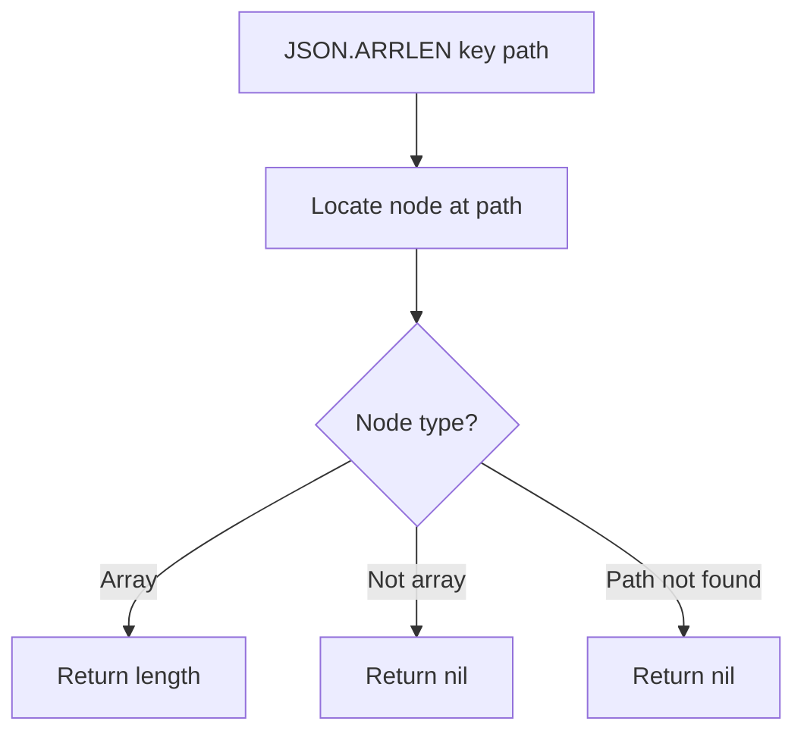

# How to Use JSON.ARRLEN in Redis to Get JSON Array Length

Author: [nawazdhandala](https://www.github.com/nawazdhandala)

Tags: Redis, JSON, RedisJSON, Array, Document

Description: Learn how to use JSON.ARRLEN in Redis to get the number of elements in a JSON array without retrieving the full document.

---

## Introduction

`JSON.ARRLEN` returns the number of elements in a JSON array at the specified path. It lets you check array size without fetching the entire document, making it useful for pagination calculations, capacity checks, and conditional logic.

## Basic Syntax

```redis
JSON.ARRLEN key [path]
```

- `key` - the Redis key
- `path` - JSONPath expression pointing to an array (defaults to `$`)

Returns an array of integers (one per path match), or nil if the path does not exist.

## Setup

```redis
JSON.SET post:1 $ '{"title":"Redis Tips","tags":["redis","performance","caching"],"comments":[]}'
```

## Get Array Length

```redis
127.0.0.1:6379> JSON.ARRLEN post:1 $.tags
1) (integer) 3

127.0.0.1:6379> JSON.ARRLEN post:1 $.comments
1) (integer) 0
```

## Path Not Found

```redis
127.0.0.1:6379> JSON.ARRLEN post:1 $.nonexistent
1) (nil)
```

Returns nil for each path that does not match an array.

## Root is an Array

```redis
JSON.SET scores:1 $ '[10,20,30,40,50]'

JSON.ARRLEN scores:1 $
# 1) (integer) 5
```

## Wildcard: Length of Multiple Arrays

```redis
JSON.SET users:1 $ '{"teams":{"alpha":["u1","u2","u3"],"beta":["u4","u5"],"gamma":["u6"]}}'

JSON.ARRLEN users:1 '$.teams.*'
# 1) (integer) 3
# 2) (integer) 2
# 3) (integer) 1
```

Returns one length per matched array in document order.

## Checking Array Size Before Appending

```python
import redis

r = redis.Redis()
r.json().set("post:100", "$", {"tags": ["redis"]})

MAX_TAGS = 10

def add_tag(key, tag):
    length = r.json().arrlen(key, "$.tags")
    if length and length[0] < MAX_TAGS:
        r.json().arrappend(key, "$.tags", tag)
        print(f"Tag '{tag}' added. New length: {length[0] + 1}")
    else:
        print(f"Tag limit reached ({MAX_TAGS})")

add_tag("post:100", "performance")
add_tag("post:100", "caching")
```

## Pagination Helper

```python
import redis
import math

r = redis.Redis()

def get_page(key, array_path, page, page_size):
    total = r.json().arrlen(key, array_path)
    if not total or not total[0]:
        return []
    total_count = total[0]
    total_pages = math.ceil(total_count / page_size)
    start = page * page_size
    stop = min(start + page_size, total_count)
    items = r.json().get(key, f"{array_path}[{start}:{stop}]")
    return items, total_pages
```

## Flow Diagram



## Summary

`JSON.ARRLEN key [path]` returns the number of elements in a JSON array without reading the array contents. It returns nil for non-existent or non-array paths. Use it for capacity checks, pagination metadata, conditional appending, and monitoring array growth rates.
