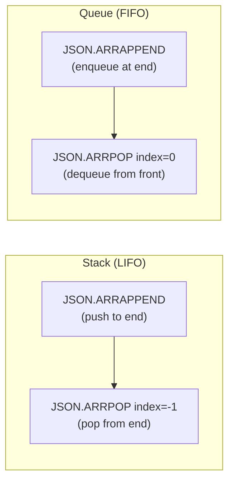

# How to Use JSON.ARRPOP in Redis to Pop from JSON Arrays

Author: [nawazdhandala](https://www.github.com/nawazdhandala)

Tags: Redis, JSON, RedisJSON, Array, Document

Description: Learn how to use JSON.ARRPOP in Redis to remove and return an element from a JSON array by index, enabling stack and queue patterns inside JSON documents.

---

## Introduction

`JSON.ARRPOP` removes and returns an element from a JSON array at a given index. It is the JSON equivalent of `LPOP` / `RPOP` for Redis lists, but operates on arrays embedded within JSON documents. By default it pops the last element (like a stack pop), but you can specify any index.

## Basic Syntax

```redis
JSON.ARRPOP key [path [index]]
```

- `key` - the Redis key
- `path` - JSONPath pointing to an array (defaults to `$`)
- `index` - zero-based index of the element to remove (default -1 = last element)

Returns the popped element as a JSON string.

## Setup

```redis
JSON.SET queue:1 $ '{"name":"task-queue","tasks":["task-A","task-B","task-C","task-D"]}'
```

## Pop the Last Element (Default)

```redis
127.0.0.1:6379> JSON.ARRPOP queue:1 $.tasks
1) "\"task-D\""

JSON.GET queue:1 $.tasks
# [["task-A","task-B","task-C"]]
```

## Pop the First Element (Index 0)

```redis
127.0.0.1:6379> JSON.ARRPOP queue:1 $.tasks 0
1) "\"task-A\""

JSON.GET queue:1 $.tasks
# [["task-B","task-C"]]
```

## Pop by Negative Index

```redis
JSON.SET stack:1 $ '[1,2,3,4,5]'

# Pop second-to-last (-2)
JSON.ARRPOP stack:1 $ -2
# "4"

JSON.GET stack:1
# [[1,2,3,5]]
```

## Pop an Object Element

```redis
JSON.SET cart:1 $ '{"items":[{"sku":"A1","qty":2},{"sku":"B3","qty":1}]}'

JSON.ARRPOP cart:1 $.items 0
# "{\"sku\":\"A1\",\"qty\":2}"
```

The returned value is the full JSON representation of the popped element.

## Empty Array Behavior

```redis
JSON.SET empty:1 $ '{"list":[]}'

JSON.ARRPOP empty:1 $.list
# 1) (nil)
```

Returns nil when the array is empty.

## Stack and Queue Patterns



## Python: Task Queue Example

```python
import redis

r = redis.Redis()
r.json().set("taskq:1", "$", {"tasks": []})

def enqueue(key, task):
    r.json().arrappend(key, "$.tasks", task)

def dequeue(key):
    item = r.json().arrpop(key, "$.tasks", 0)
    return item[0] if item else None

enqueue("taskq:1", {"id": 1, "action": "send-email"})
enqueue("taskq:1", {"id": 2, "action": "generate-report"})

task = dequeue("taskq:1")
print(f"Processing: {task}")  # {"id": 1, "action": "send-email"}
```

## ARRPOP vs JSON.DEL for Array Elements

| Command | Effect |
|---|---|
| `JSON.ARRPOP` | Removes and returns the element |
| `JSON.DEL key $.array[0]` | Removes but does not return |

Use `JSON.ARRPOP` when you need the removed value. Use `JSON.DEL` when you only want to discard it.

## Summary

`JSON.ARRPOP key [path [index]]` removes and returns an element from a JSON array. The default index is -1 (last element). Positive indexes remove from the front or middle. Negative indexes count from the end. Returns nil if the array is empty. Use it to implement stack (pop last) and queue (pop first) patterns inside JSON documents.
