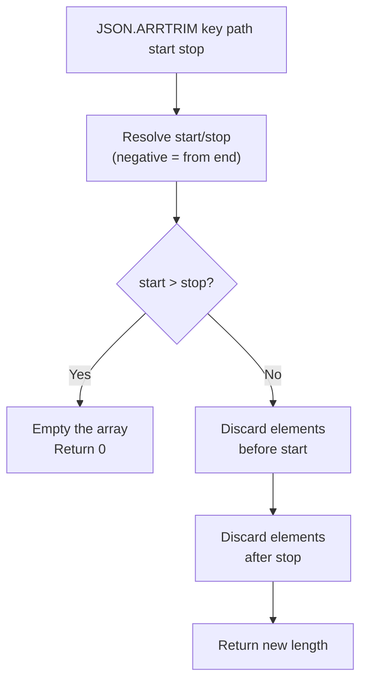

# How to Use JSON.ARRTRIM in Redis to Trim JSON Arrays

Author: [nawazdhandala](https://www.github.com/nawazdhandala)

Tags: Redis, JSON, RedisJSON, Array, Document

Description: Learn how to use JSON.ARRTRIM in Redis to keep only a slice of a JSON array by specifying start and stop indexes, discarding elements outside that range.

---

## Introduction

`JSON.ARRTRIM` trims a JSON array to only include elements within the specified index range. Elements outside the range are deleted. It is the JSON equivalent of `LTRIM` for Redis lists, and is the cleanest way to enforce a maximum array length or discard stale entries from a bounded log.

## Basic Syntax

```redis
JSON.ARRTRIM key path start stop
```

- `key` - the Redis key
- `path` - JSONPath pointing to an array
- `start` - inclusive start index (0-based, negative counts from end)
- `stop` - inclusive stop index

Returns the new array length.

## Setup

```redis
JSON.SET log:1 $ '{"events":["e1","e2","e3","e4","e5","e6","e7","e8","e9","e10"]}'
```

## Trim to Last 5 Elements

```redis
127.0.0.1:6379> JSON.ARRTRIM log:1 $.events 5 9
1) (integer) 5

JSON.GET log:1 $.events
# [["e6","e7","e8","e9","e10"]]
```

## Keep First 3 Elements

```redis
JSON.SET queue:1 $ '["task-A","task-B","task-C","task-D","task-E"]'

JSON.ARRTRIM queue:1 $ 0 2
# (integer) 3

JSON.GET queue:1
# [["task-A","task-B","task-C"]]
```

## Using Negative Indexes

```redis
JSON.SET buf:1 $ '{"buffer":[1,2,3,4,5,6,7,8,9,10]}'

# Keep last 3 elements
JSON.ARRTRIM buf:1 $.buffer -3 -1
# 1) (integer) 3

JSON.GET buf:1 $.buffer
# [[8,9,10]]
```

## Out-of-Range Behavior

```redis
JSON.SET data:1 $ '{"nums":[10,20,30]}'

# Stop index beyond array length: clamped to last index
JSON.ARRTRIM data:1 $.nums 0 100
# 1) (integer) 3   (no change, all elements within range)

# Start > stop: all elements removed
JSON.ARRTRIM data:1 $.nums 5 2
# 1) (integer) 0

JSON.GET data:1 $.nums
# [[]]
```

## Trim Logic



## Capped Log Pattern

A common pattern is to maintain a rolling log with a fixed maximum size:

```python
import redis, time

r = redis.Redis()
r.json().set("audit:1", "$", {"entries": []})

MAX_ENTRIES = 100

def append_and_cap(key, entry):
    r.json().arrappend(key, "$.entries", entry)
    length = r.json().arrlen(key, "$.entries")[0]
    if length > MAX_ENTRIES:
        # Keep only the last MAX_ENTRIES
        r.json().arrtrim(key, "$.entries", length - MAX_ENTRIES, length - 1)

append_and_cap("audit:1", {"ts": int(time.time()), "action": "login", "user": "alice"})
append_and_cap("audit:1", {"ts": int(time.time()), "action": "view", "user": "alice"})
```

## Wildcard Trim

```redis
JSON.SET matrix $ '{"rows":[[1,2,3,4,5],[6,7,8,9,10],[11,12,13,14,15]]}'

# Keep only first 3 elements of each row
JSON.ARRTRIM matrix '$.rows[*]' 0 2
# 1) (integer) 3
# 2) (integer) 3
# 3) (integer) 3
```

## Summary

`JSON.ARRTRIM key path start stop` keeps only the elements in the inclusive range `[start, stop]` and deletes the rest. Negative indexes count from the end. If start exceeds stop the array is emptied. Returns the new array length. Use it for bounded event logs, sliding-window data, and capped array buffers inside JSON documents.
