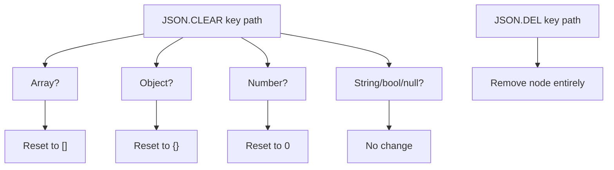

# How to Use JSON.CLEAR in Redis to Clear JSON Containers

Author: [nawazdhandala](https://www.github.com/nawazdhandala)

Tags: Redis, JSON, RedisJSON, Clear, Document

Description: Learn how to use JSON.CLEAR in Redis to empty JSON arrays and objects or reset numeric values to zero without deleting the key or its structure.

---

## Introduction

`JSON.CLEAR` resets JSON containers and numeric values in a document:
- Arrays are emptied to `[]`
- Objects are emptied to `{}`
- Numbers are set to `0`
- Strings, booleans, and null values are ignored (not cleared)

It preserves the key and the document structure, unlike `JSON.DEL` which removes the node entirely.

## Basic Syntax

```redis
JSON.CLEAR key [path]
```

- `key` - the Redis key
- `path` - JSONPath expression (defaults to `$`)

Returns the number of containers/values that were cleared.

## Setup

```redis
JSON.SET session:1 $ '{"user_id":42,"cart":{"items":[{"sku":"A1","qty":2}],"total":19.99},"tags":["vip","active"],"score":100}'
```

## Clear the Entire Document (Root)

```redis
127.0.0.1:6379> JSON.CLEAR session:1 $
1) (integer) 1

JSON.GET session:1
# [{}]
```

The key still exists but the root object is now empty.

## Clear a Specific Array

```redis
JSON.SET cart:1 $ '{"items":["A","B","C"],"totals":[10,20,30]}'

JSON.CLEAR cart:1 $.items
# 1) (integer) 1

JSON.GET cart:1 $.items
# [[]]   (empty array)

JSON.GET cart:1 $.totals
# [[10,20,30]]  (unchanged)
```

## Clear a Specific Object

```redis
JSON.SET config:1 $ '{"db":{"host":"localhost","port":5432},"cache":{"host":"redis","port":6379}}'

JSON.CLEAR config:1 $.db
# 1) (integer) 1

JSON.GET config:1 $.db
# [{}]   (empty object)
JSON.GET config:1 $.cache
# [{"host":"redis","port":6379}]  (unchanged)
```

## Clear a Number

```redis
JSON.SET stats:1 $ '{"views":500,"likes":200,"shares":80}'

JSON.CLEAR stats:1 $.views
# 1) (integer) 1

JSON.GET stats:1 $.views
# [0]
```

## Clear Using Wildcard

```redis
JSON.SET counters:1 $ '{"daily":100,"weekly":700,"monthly":3000}'

JSON.CLEAR counters:1 '$.*'
# 1) (integer) 3

JSON.GET counters:1
# [{"daily":0,"weekly":0,"monthly":0}]
```

## What JSON.CLEAR Does Not Clear

```redis
JSON.SET mixed:1 $ '{"count":10,"label":"hello","active":true,"data":null}'

JSON.CLEAR mixed:1 '$.*'
# 1) (integer) 1   (only "count" was clearable)

JSON.GET mixed:1
# [{"count":0,"label":"hello","active":true,"data":null}]
```

Strings, booleans, and null are not affected by `JSON.CLEAR`.

## Clear vs Del



## Python: Reset Session on Logout

```python
import redis

r = redis.Redis()

def reset_session(session_key):
    # Clear cart items and reset score without destroying the session structure
    cleared = r.json().clear(session_key, "$.cart.items")
    r.json().set(session_key, "$.score", 0)
    print(f"Session reset: {cleared[0]} containers cleared")

r.json().set("session:5", "$", {
    "user_id": 99,
    "cart": {"items": [{"sku": "X1"}, {"sku": "Y2"}]},
    "score": 250
})
reset_session("session:5")

print(r.json().get("session:5"))
# {'user_id': 99, 'cart': {'items': []}, 'score': 0}
```

## Summary

`JSON.CLEAR key [path]` empties arrays (`[]`), empties objects (`{}`), and resets numbers to `0`. Strings, booleans, and null are skipped. Returns the count of nodes that were actually cleared. Use it to reset counters, flush cart contents, or clean up session state while preserving the document's structural skeleton.
