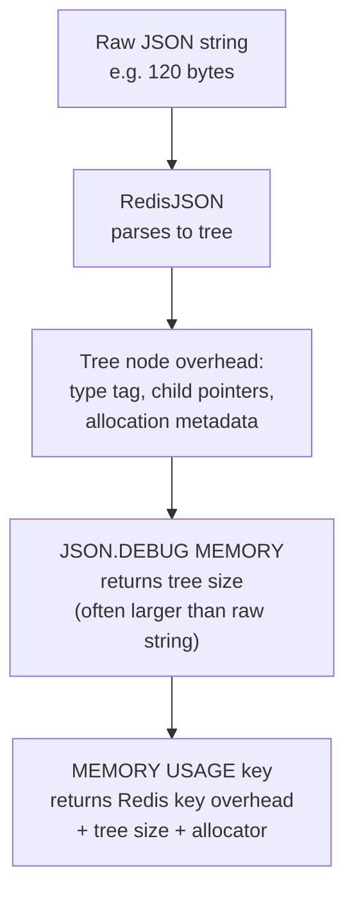

# How to Use JSON.DEBUG MEMORY in Redis for JSON Memory Analysis

Author: [nawazdhandala](https://www.github.com/nawazdhandala)

Tags: Redis, JSON, RedisJSON, Memory, Diagnostics

Description: Learn how to use JSON.DEBUG MEMORY in Redis to measure the memory consumed by a JSON document or a specific path within it, aiding capacity planning and optimization.

---

## Introduction

`JSON.DEBUG MEMORY` reports the number of bytes used by a JSON value stored at a specific path. It measures the in-memory size of the RedisJSON tree structure, which differs from the raw JSON string length. Use it to find memory-heavy documents, compare encoding efficiency, and plan capacity.

## Basic Syntax

```redis
JSON.DEBUG MEMORY key [path]
```

- `key` - the Redis key holding a JSON document
- `path` - JSONPath expression (defaults to `$` for the full document)

Returns an integer (bytes), or an array of integers for wildcard paths.

## Setup

```redis
JSON.SET user:1 $ '{"name":"Alice","age":30,"email":"alice@example.com","tags":["redis","json","performance"],"address":{"city":"London","zip":"EC1A"}}'
```

## Measure Entire Document

```redis
127.0.0.1:6379> JSON.DEBUG MEMORY user:1
(integer) 231
```

## Measure a Specific Field

```redis
127.0.0.1:6379> JSON.DEBUG MEMORY user:1 $.name
1) (integer) 24

127.0.0.1:6379> JSON.DEBUG MEMORY user:1 $.tags
1) (integer) 84

127.0.0.1:6379> JSON.DEBUG MEMORY user:1 $.address
1) (integer) 67
```

## Measure All Top-Level Fields

```redis
JSON.DEBUG MEMORY user:1 '$.*'
# 1) (integer) 24   (name)
# 2) (integer) 16   (age)
# 3) (integer) 40   (email)
# 4) (integer) 84   (tags)
# 5) (integer) 67   (address)
```

## Comparing Small vs Large Documents

```redis
JSON.SET small:1 $ '{"x":1}'
JSON.SET large:1 $ '{"a":"aaaaaaaaaaaaaaaaaaaaaaaaaaaaaaaaaaaaaaaaaaaaaaaaaaaaaaaaaaaaaaaa","b":"bbbbbbbbbbbbbbbbbbbbbbbbbbbbbbbbbbbbbbbbbbbbbbbbbbbbbbbbbbbbbbbb"}'

JSON.DEBUG MEMORY small:1
# (integer) 32

JSON.DEBUG MEMORY large:1
# (integer) 213
```

## Finding Large JSON Keys

```bash
#!/bin/bash
# Report JSON keys sorted by memory usage
redis-cli --scan --pattern "user:*" | while read key; do
  BYTES=$(redis-cli JSON.DEBUG MEMORY "$key" 2>/dev/null || echo 0)
  echo "$BYTES $key"
done | sort -rn | head -20
```

## How JSON Memory Differs from Raw String Size



Note: `JSON.DEBUG MEMORY` measures only the JSON tree. `MEMORY USAGE key` measures everything including Redis key overhead and allocator padding.

## Python: Auditing JSON Memory Usage

```python
import redis

r = redis.Redis()

keys = list(r.scan_iter("session:*"))
results = []
for key in keys:
    size = r.json().debug_memory(key.decode())
    results.append((size, key.decode()))

results.sort(reverse=True)
print("Top 10 largest JSON documents:")
for size, key in results[:10]:
    print(f"  {key}: {size} bytes")
```

## Comparing Storage Efficiency

```python
import redis, json

r = redis.Redis()

# Option A: store as JSON document
data = {"metrics": [i * 1.5 for i in range(100)]}
r.json().set("metrics:json:1", "$", data)
json_size = r.json().debug_memory("metrics:json:1")

# Option B: store as compressed string
import zlib
compressed = zlib.compress(json.dumps(data).encode())
r.set("metrics:zlib:1", compressed)
from redis.commands.core import MEMORY_USAGE
raw_size = r.memory_usage("metrics:zlib:1")

print(f"JSON document: {json_size} bytes")
print(f"Compressed string: {raw_size} bytes")
```

## Summary

`JSON.DEBUG MEMORY key [path]` returns the number of bytes consumed by a JSON document or a path within it in the RedisJSON tree representation. Use it to find memory-heavy documents, audit storage efficiency across document versions, and plan capacity for RedisJSON workloads. Combine it with `MEMORY USAGE` for total key cost including Redis overhead.
