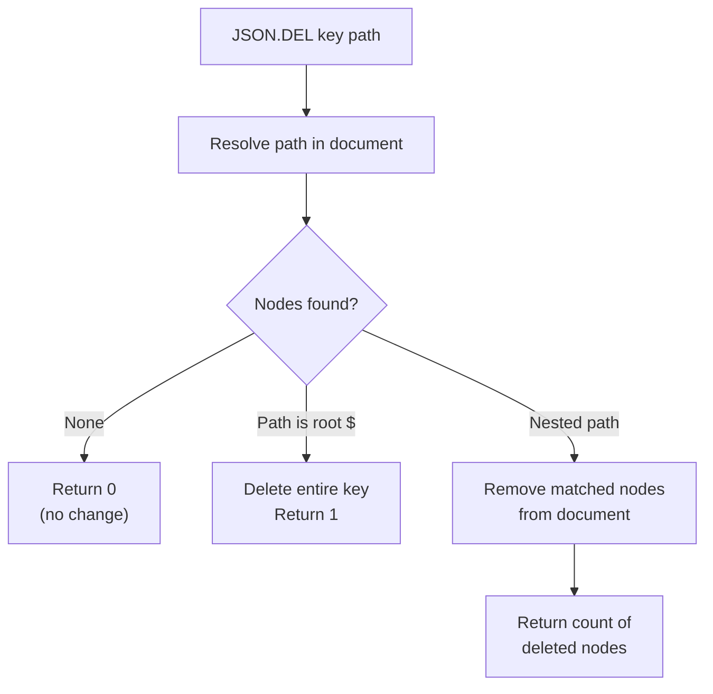

# How to Use JSON.DEL in Redis to Delete JSON Elements

Author: [nawazdhandala](https://www.github.com/nawazdhandala)

Tags: Redis, JSON, RedisJSON, Delete, Document

Description: Learn how to use JSON.DEL in Redis to remove a full JSON document or a specific nested field, array element, or object key from an existing document.

---

## Introduction

`JSON.DEL` deletes a JSON element identified by a JSONPath. When the path targets the root `$`, the entire key is deleted. When it targets a nested path, only that node is removed from the document. The command returns the number of elements deleted.

## Basic Syntax

```redis
JSON.DEL key [path]
```

- `key` - the Redis key
- `path` - JSONPath expression (defaults to `$` if omitted)

## Delete the Entire Document

```redis
JSON.SET user:1 $ '{"name":"Alice","age":30,"city":"London"}'

JSON.DEL user:1
# (integer) 1

JSON.GET user:1
# (nil)
```

The key is fully removed.

## Delete a Specific Field

```redis
JSON.SET user:2 $ '{"name":"Bob","age":25,"email":"bob@example.com","city":"Paris"}'

JSON.DEL user:2 $.email
# (integer) 1

JSON.GET user:2
# [{"name":"Bob","age":25,"city":"Paris"}]
```

## Delete a Nested Field

```redis
JSON.SET order:1 $ '{"id":1,"customer":{"name":"Alice","loyalty":true},"total":99.99}'

JSON.DEL order:1 $.customer.loyalty
# (integer) 1

JSON.GET order:1 $.customer
# [{"name":"Alice"}]
```

## Delete an Array Element by Index

```redis
JSON.SET tags:1 $ '["redis","json","performance","caching"]'

JSON.DEL tags:1 '$[2]'
# (integer) 1

JSON.GET tags:1
# [["redis","json","caching"]]
```

## Delete Multiple Matching Nodes (Wildcard)

```redis
JSON.SET catalog $ '{"items":[{"price":10,"sale":true},{"price":20,"sale":false},{"price":5,"sale":true}]}'

# Delete the "sale" field from all items
JSON.DEL catalog '$.items[*].sale'
# (integer) 3

JSON.GET catalog
# [{"items":[{"price":10},{"price":20},{"price":5}]}]
```

The return value is the count of nodes removed.

## Behavior When Path Does Not Exist

```redis
JSON.DEL user:2 $.nonexistent
# (integer) 0
```

Returns 0 if no nodes matched the path. The document is not modified.

## Delete Workflow



## Conditional Delete Pattern

```python
import redis

r = redis.Redis()
r.json().set("user:5", "$", {"name": "Eve", "temp_token": "abc123", "active": True})

# Remove temp_token if it exists
deleted = r.json().delete("user:5", "$.temp_token")
print(f"Deleted {deleted} fields")

doc = r.json().get("user:5")
print(doc)  # {'name': 'Eve', 'active': True}
```

## Cleaning Up Optional Fields in Bulk

```python
import redis

r = redis.Redis()

# Remove the "debug_info" field from all session keys
keys = r.scan_iter("session:*")
for key in keys:
    r.json().delete(key, "$.debug_info")
```

## JSON.DEL vs EXPIRE vs UNLINK

| Command | Effect |
|---|---|
| `JSON.DEL key $` | Deletes key synchronously |
| `DEL key` | Also deletes the key (same result for JSON keys) |
| `UNLINK key` | Asynchronous key deletion |
| `JSON.DEL key $.field` | Removes only the named field |

## Summary

`JSON.DEL key [path]` removes a JSON node from a RedisJSON document. When called with `$` or no path, it deletes the entire key. With a JSONPath expression it removes only the matching nodes and returns the count removed. Zero is returned if the path is not found, making it safe to call unconditionally without checking for the field first.
