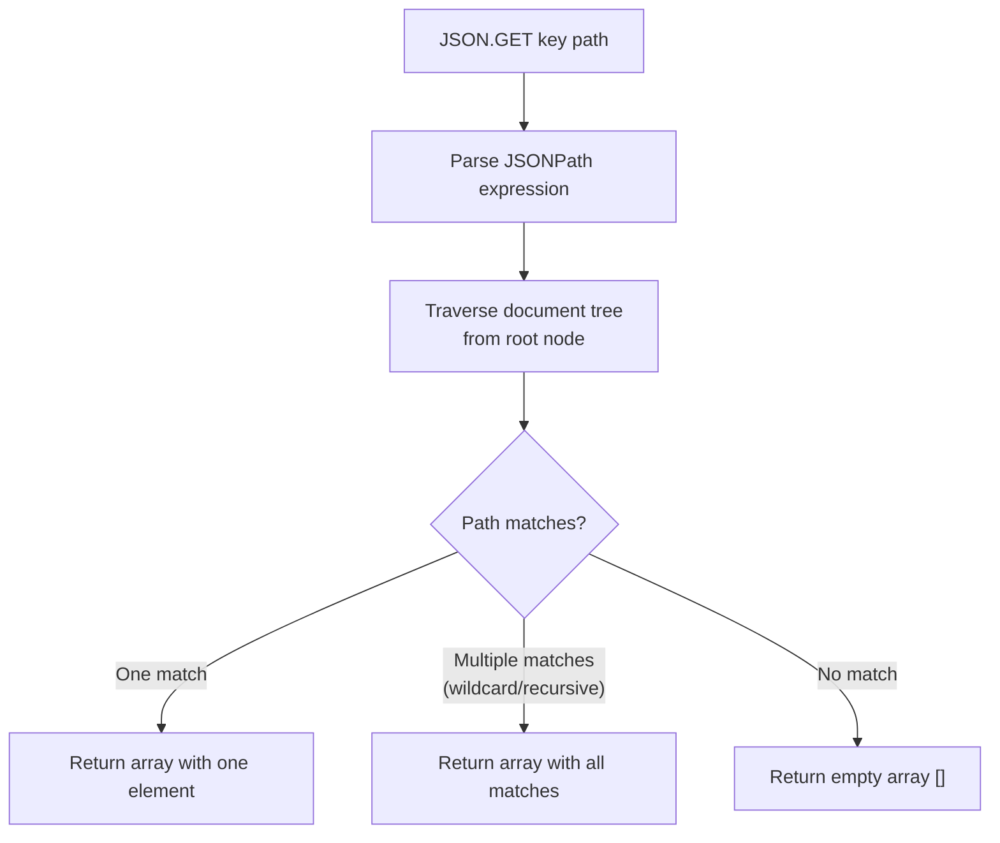

# How to Use JSON.GET in Redis to Retrieve JSON Documents

Author: [nawazdhandala](https://www.github.com/nawazdhandala)

Tags: Redis, JSON, RedisJSON, Query, Document

Description: Learn how to use JSON.GET in Redis to retrieve full or partial JSON documents using JSONPath expressions, with formatting and multi-path options.

---

## Introduction

`JSON.GET` retrieves JSON values from a key. You can fetch the entire document, a single nested field, or multiple paths in one call. It is the primary read command in the RedisJSON module.

## Basic Syntax

```redis
JSON.GET key [INDENT indent] [NEWLINE newline] [SPACE space] [path [path ...]]
```

- `key` - the Redis key holding a JSON document
- `INDENT` / `NEWLINE` / `SPACE` - formatting options for pretty output
- `path` - one or more JSONPath expressions (default is `$` for root)

## Store Sample Data

```redis
JSON.SET user:1 $ '{"name":"Alice","age":30,"address":{"city":"London","zip":"EC1A"},"tags":["admin","user"]}'
```

## Retrieve the Full Document

```redis
127.0.0.1:6379> JSON.GET user:1
"[{\"name\":\"Alice\",\"age\":30,\"address\":{\"city\":\"London\",\"zip\":\"EC1A\"},\"tags\":[\"admin\",\"user\"]}]"
```

The result is always wrapped in an array (JSONPath `$` returns an array of matches).

## Retrieve a Specific Field

```redis
127.0.0.1:6379> JSON.GET user:1 $.name
"[\"Alice\"]"

127.0.0.1:6379> JSON.GET user:1 $.age
"[30]"
```

## Retrieve a Nested Field

```redis
127.0.0.1:6379> JSON.GET user:1 $.address.city
"[\"London\"]"
```

## Retrieve Multiple Paths in One Call

```redis
127.0.0.1:6379> JSON.GET user:1 $.name $.age $.address.city
"{\"$.name\":[\"Alice\"],\"$.age\":[30],\"$.address.city\":[\"London\"]}"
```

When multiple paths are specified, the response is a JSON object mapping each path to its result array.

## Pretty-Print Formatting

```redis
127.0.0.1:6379> JSON.GET user:1 INDENT "  " NEWLINE "\n" SPACE " "
"[\n  {\n    \"name\": \"Alice\",\n    \"age\": 30,\n    ...}\n]"
```

## Wildcard Access

```redis
JSON.SET products $ '[{"id":1,"price":9.99},{"id":2,"price":19.99},{"id":3,"price":4.99}]'

JSON.GET products $[*].price
"[9.99,19.99,4.99]"
```

## Recursive Descent

```redis
JSON.SET catalog $ '{"electronics":{"laptop":{"price":999},"phone":{"price":499}},"books":{"novel":{"price":12}}}'

JSON.GET catalog $..price
"[999,499,12]"
```

The `..` operator searches all nested levels.

## How JSON.GET Resolves Paths



## Checking for a Missing Key or Path

```redis
JSON.GET nonexistent $
# (nil)  key does not exist

JSON.GET user:1 $.nonexistent_field
# "[]"  key exists but path not found
```

## Using JSON.GET in Application Code

```python
import redis, json

r = redis.Redis()
r.json().set("user:1", "$", {"name": "Alice", "age": 30, "city": "London"})

# Get full document
doc = r.json().get("user:1")
print(doc)  # {'name': 'Alice', 'age': 30, 'city': 'London'}

# Get specific field
name = r.json().get("user:1", "$.name")
print(name)  # ['Alice']

# Get multiple fields
fields = r.json().get("user:1", "$.name", "$.city")
print(fields)  # {'$.name': ['Alice'], '$.city': ['London']}
```

## Summary

`JSON.GET key [path ...]` retrieves JSON values from a RedisJSON document. Without a path it returns the full document. With one path it returns an array of matching values. With multiple paths it returns an object keyed by path. Use `INDENT`, `NEWLINE`, and `SPACE` for human-readable output. Missing paths return empty arrays; missing keys return nil.
