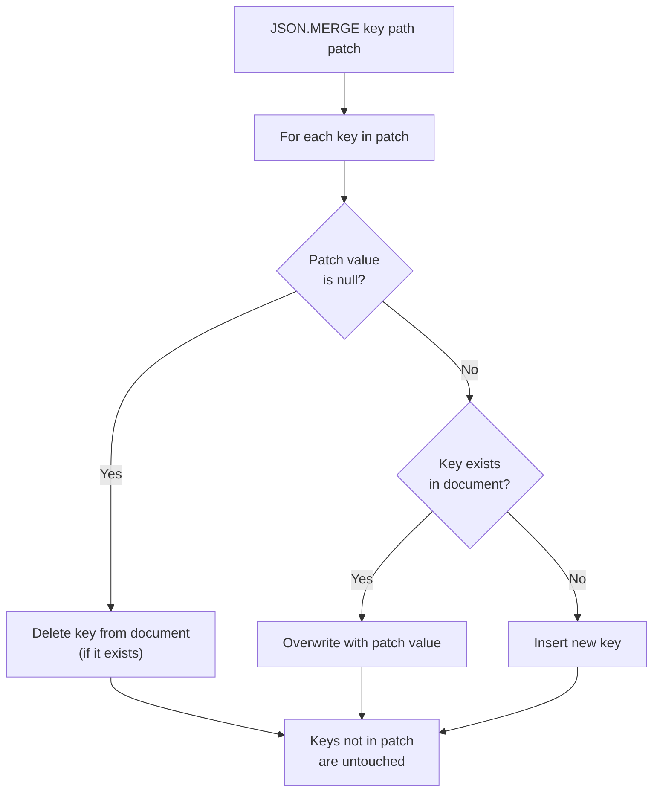

# How to Use JSON.MERGE in Redis for Partial JSON Updates

Author: [nawazdhandala](https://www.github.com/nawazdhandala)

Tags: Redis, JSON, RedisJSON, Merge, Document

Description: Learn how to use JSON.MERGE in Redis to apply a partial JSON patch to a stored document using RFC 7396 merge patch semantics, updating only the specified fields.

---

## Introduction

`JSON.MERGE` applies RFC 7396 JSON Merge Patch semantics to update a stored JSON document. You provide a partial document, and Redis merges it into the existing one: new keys are added, existing keys are updated, and keys set to `null` in the patch are deleted. Keys not mentioned are left unchanged.

`JSON.MERGE` was introduced in Redis Stack 6.2 / RedisJSON 2.6.

## Basic Syntax

```redis
JSON.MERGE key path value
```

- `key` - the Redis key
- `path` - JSONPath (use `$` for root merge)
- `value` - JSON patch document

Returns `OK`.

## Setup

```redis
JSON.SET user:1 $ '{"name":"Alice","age":30,"email":"alice@example.com","city":"London","active":true}'
```

## Merge: Update and Add Fields

```redis
JSON.MERGE user:1 $ '{"age":31,"country":"UK"}'
# OK

JSON.GET user:1
# [{"name":"Alice","age":31,"email":"alice@example.com","city":"London","active":true,"country":"UK"}]
```

- `age` was updated from 30 to 31
- `country` was added
- Other fields are unchanged

## Merge: Delete a Field (Set to null)

```redis
JSON.MERGE user:1 $ '{"city":null}'
# OK

JSON.GET user:1
# [{"name":"Alice","age":31,"email":"alice@example.com","active":true,"country":"UK"}]
```

Setting a key to `null` in the patch removes it from the stored document.

## Merge at a Nested Path

```redis
JSON.SET product:1 $ '{"id":1,"details":{"color":"red","size":"M","weight":0.5}}'

JSON.MERGE product:1 $.details '{"color":"blue","material":"cotton"}'
# OK

JSON.GET product:1 $.details
# [{"color":"blue","size":"M","weight":0.5,"material":"cotton"}]
```

## Merge Semantics (RFC 7396)



## Merging Nested Objects Recursively

```redis
JSON.SET config:1 $ '{"server":{"host":"localhost","port":8080,"tls":false},"limits":{"rate":100,"burst":200}}'

# Update only the port and add tls cert path
JSON.MERGE config:1 $.server '{"port":443,"tls":true,"cert":"/etc/ssl/cert.pem"}'

JSON.GET config:1 $.server
# [{"host":"localhost","port":443,"tls":true,"cert":"/etc/ssl/cert.pem"}]
```

## Python: Partial Update Pattern

```python
import redis

r = redis.Redis()
r.json().set("session:100", "$", {
    "user_id": 42,
    "cart": {"items": 3, "total": 29.97},
    "expires_at": 1711900800
})

# Apply a partial update - update total and remove items count
patch = {
    "cart": {
        "total": 39.97,
        "items": None  # This removes "items" from cart
    }
}
r.json().merge("session:100", "$", patch)

doc = r.json().get("session:100")
print(doc)
# {'user_id': 42, 'cart': {'total': 39.97}, 'expires_at': 1711900800}
```

## JSON.MERGE vs JSON.SET for Partial Updates

| Approach | Keys not in patch | Null handling | Atomicity |
|---|---|---|---|
| `JSON.MERGE` | Preserved | Deletes key | Atomic |
| `JSON.SET $.field val` per field | Preserved (per-call) | Sets to JSON null | Atomic per call |
| GET + modify + SET | Depends on app logic | Depends | Not atomic |

`JSON.MERGE` is the cleanest way to apply a partial update without enumerating every field separately.

## Summary

`JSON.MERGE key path value` applies RFC 7396 merge patch semantics: new keys are added, existing keys are overwritten, and keys set to `null` in the patch are deleted. Keys not in the patch remain untouched. It is ideal for partial document updates (PATCH semantics), configuration overlays, and any scenario where you want to update only specific fields without reading the full document first.
