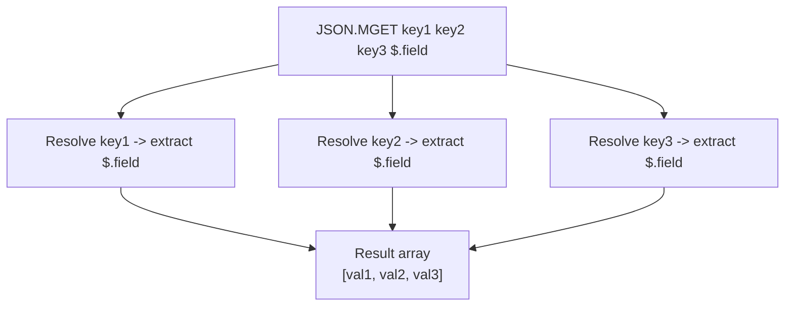

# How to Use JSON.MGET in Redis to Get JSON from Multiple Keys

Author: [nawazdhandala](https://www.github.com/nawazdhandala)

Tags: Redis, JSON, RedisJSON, Multi-key, Query

Description: Learn how to use JSON.MGET in Redis to retrieve the same JSONPath from multiple keys in a single atomic command, reducing round trips.

---

## Introduction

`JSON.MGET` retrieves the value at a given JSONPath from multiple keys in a single call. It is the JSON equivalent of `MGET` for plain strings, letting you batch-fetch a specific field from many documents at once without multiple round trips.

## Basic Syntax

```redis
JSON.MGET key [key ...] path
```

- `key [key ...]` - one or more Redis keys, each holding a JSON document
- `path` - a single JSONPath expression applied to every key

The path comes **last**, after all keys.

## Setup

```redis
JSON.SET user:1 $ '{"name":"Alice","age":30,"active":true}'
JSON.SET user:2 $ '{"name":"Bob","age":25,"active":false}'
JSON.SET user:3 $ '{"name":"Carol","age":35,"active":true}'
```

## Retrieve a Field from All Keys

```redis
127.0.0.1:6379> JSON.MGET user:1 user:2 user:3 $.name
1) "[\"Alice\"]"
2) "[\"Bob\"]"
3) "[\"Carol\"]"
```

Results are returned in the same order as the keys.

## Retrieve a Numeric Field

```redis
127.0.0.1:6379> JSON.MGET user:1 user:2 user:3 $.age
1) "[30]"
2) "[25]"
3) "[35]"
```

## Handling Missing Keys

```redis
127.0.0.1:6379> JSON.MGET user:1 user:999 user:3 $.name
1) "[\"Alice\"]"
2) (nil)
3) "[\"Carol\"]"
```

A missing key returns `nil` in its position. The other results are unaffected.

## Handling Missing Path

```redis
JSON.SET user:4 $ '{"username":"dave"}'

JSON.MGET user:1 user:4 $.name
1) "[\"Alice\"]"
2) "[]"
```

If the path does not exist in a document, the result is an empty JSON array `[]`.

## Data Flow



## Using JSON.MGET in Python

```python
import redis

r = redis.Redis()

# Set up documents
for i, name in enumerate(["Alice", "Bob", "Carol"], 1):
    r.json().set(f"user:{i}", "$", {"name": name, "score": i * 10})

# Fetch scores for multiple users
scores = r.json().mget(["user:1", "user:2", "user:3"], "$.score")
print(scores)
# [[10], [20], [30]]
```

## Batch Loading User Profiles

```python
import redis

r = redis.Redis()

user_ids = [101, 102, 103, 104, 105]
keys = [f"user:{uid}" for uid in user_ids]

names = r.json().mget(keys, "$.name")
active = r.json().mget(keys, "$.active")

for uid, name, act in zip(user_ids, names, active):
    status = "active" if act and act[0] else "inactive"
    display = name[0] if name else "unknown"
    print(f"User {uid}: {display} ({status})")
```

## JSON.MGET vs JSON.GET

| Feature | JSON.GET | JSON.MGET |
|---|---|---|
| Number of keys | One | Many |
| Number of paths | Many | One |
| Missing keys | nil | nil in position |
| Round trips | 1 per key | 1 total |

Use `JSON.GET` when you need multiple fields from one document. Use `JSON.MGET` when you need one field from many documents.

## Summary

`JSON.MGET key [key ...] path` extracts the same JSONPath from multiple Redis keys in a single round trip. Results are ordered to match the key list. Missing keys return `nil` and missing paths return `[]`. It is the ideal command for batch-reading a specific field - such as name, status, or score - across many JSON documents.
