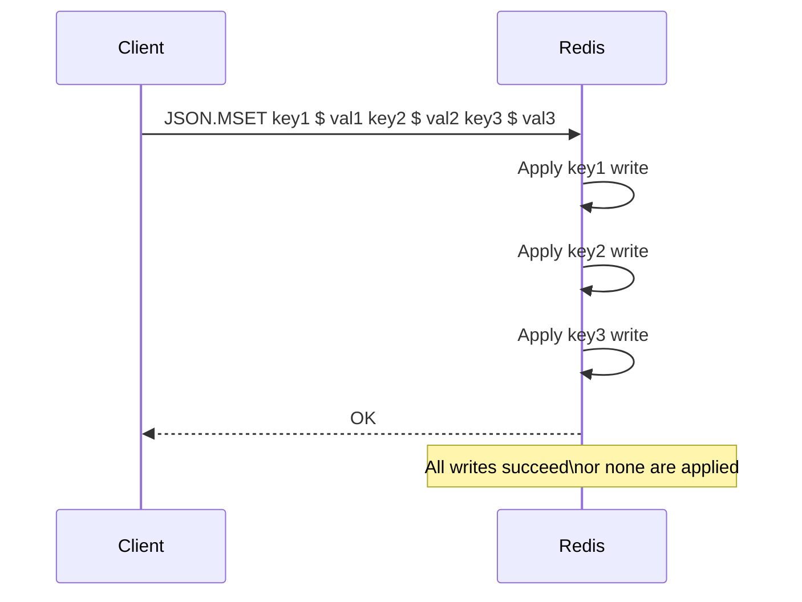

# How to Use JSON.MSET in Redis to Set JSON on Multiple Keys

Author: [nawazdhandala](https://www.github.com/nawazdhandala)

Tags: Redis, JSON, RedisJSON, Multi-Key, Bulk Write

Description: Learn how to use JSON.MSET in Redis to atomically write JSON values to multiple keys and paths in a single command, reducing write round trips.

---

## Introduction

`JSON.MSET` sets JSON values on multiple keys and paths in a single atomic call. It is the JSON equivalent of the `MSET` string command. Use it to initialize many documents at once or to apply the same structural update across a batch of keys.

`JSON.MSET` was added in Redis Stack 2.6 / RedisJSON 2.6.

## Basic Syntax

```redis
JSON.MSET key path value [key path value ...]
```

Each triplet is `key`, `path`, `value`. All triplets are applied atomically.

## Initialize Multiple Documents

```redis
JSON.MSET \
  user:1 $ '{"name":"Alice","age":30}' \
  user:2 $ '{"name":"Bob","age":25}' \
  user:3 $ '{"name":"Carol","age":35}'
# OK
```

Verify:

```redis
JSON.MGET user:1 user:2 user:3 $.name
1) "[\"Alice\"]"
2) "[\"Bob\"]"
3) "[\"Carol\"]"
```

## Update a Field on Multiple Keys

```redis
# Mark users 1 and 3 as active, user 2 as inactive
JSON.MSET \
  user:1 $.active 'true' \
  user:2 $.active 'false' \
  user:3 $.active 'true'
# OK
```

## Mixed Paths in One Call

```redis
JSON.MSET \
  config:app $.version '"2.1.0"' \
  config:app $.debug 'false' \
  config:db $.max_connections '100'
# OK
```

## Atomicity Guarantee



Either all key-path-value triplets are written, or the command fails entirely. No partial state is possible.

## Using JSON.MSET in Python

```python
import redis

r = redis.Redis()

# Bulk-insert user documents
users = [
    ("user:10", {"name": "Dave", "score": 0, "active": True}),
    ("user:11", {"name": "Eve", "score": 0, "active": True}),
    ("user:12", {"name": "Frank", "score": 0, "active": False}),
]

triplets = []
for key, doc in users:
    triplets.append((key, "$", doc))

r.json().mset(triplets)

# Verify
scores = r.json().mget([k for k, _ in users], "$.name")
print(scores)
```

## Bulk Update a Specific Field

```python
import redis

r = redis.Redis()

# Reset scores for a batch of users
user_ids = [10, 11, 12, 13, 14]
triplets = [(f"user:{uid}", "$.score", 0) for uid in user_ids]
r.json().mset(triplets)
```

## JSON.MSET vs Pipeline with JSON.SET

| Approach | Round trips | Atomicity |
|---|---|---|
| `JSON.MSET` with N triplets | 1 | Atomic (all or nothing) |
| Pipeline of N `JSON.SET` calls | 1 (batched) | Not atomic (partial success possible) |

Prefer `JSON.MSET` when you need atomicity. Use a pipeline when you need conditional options (NX/XX) per key.

## Summary

`JSON.MSET key path value [key path value ...]` writes JSON values to multiple key-path pairs atomically in one round trip. It is the multi-key write counterpart to `JSON.MGET`. Use it for bulk document initialization, applying the same structural change across many keys, or any batch write scenario where atomicity matters.
