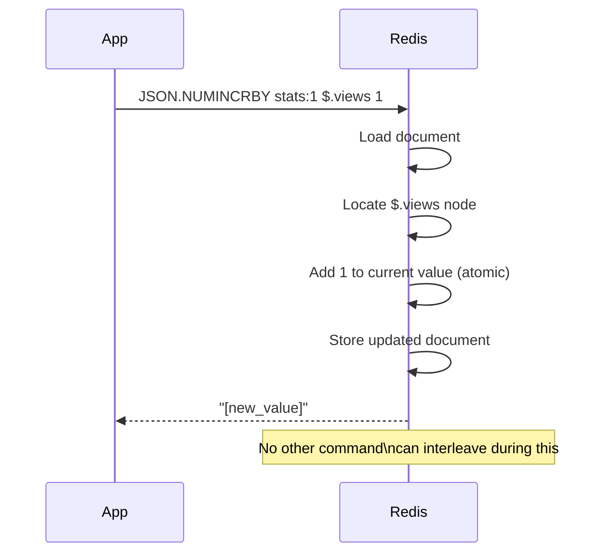

# How to Use JSON.NUMINCRBY in Redis to Increment JSON Numbers

Author: [nawazdhandala](https://www.github.com/nawazdhandala)

Tags: Redis, JSON, RedisJSON, Counter, Document

Description: Learn how to use JSON.NUMINCRBY in Redis to atomically increment or decrement a numeric value inside a JSON document without reading and rewriting it.

---

## Introduction

`JSON.NUMINCRBY` atomically increments (or decrements) a numeric value at a JSONPath inside a stored document. It is the JSON equivalent of `INCRBYFLOAT` for strings and eliminates the read-modify-write race condition when updating counters or scores embedded in JSON.

## Basic Syntax

```redis
JSON.NUMINCRBY key path value
```

- `key` - the Redis key
- `path` - JSONPath pointing to a numeric value
- `value` - the number to add (negative to decrement, float supported)

Returns an array of the new value(s) after the increment.

## Setup

```redis
JSON.SET stats:1 $ '{"views":100,"likes":25,"score":4.5,"inventory":50}'
```

## Increment a Counter

```redis
127.0.0.1:6379> JSON.NUMINCRBY stats:1 $.views 1
1) "[101]"

127.0.0.1:6379> JSON.NUMINCRBY stats:1 $.views 10
1) "[111]"
```

## Decrement

```redis
127.0.0.1:6379> JSON.NUMINCRBY stats:1 $.inventory -5
1) "[45]"
```

## Floating-Point Increment

```redis
127.0.0.1:6379> JSON.NUMINCRBY stats:1 $.score 0.1
1) "[4.6]"

127.0.0.1:6379> JSON.NUMINCRBY stats:1 $.score -0.2
1) "[4.4]"
```

## Wildcard: Increment All Matching Numbers

```redis
JSON.SET prices:1 $ '{"items":[{"name":"apple","price":1.0},{"name":"banana","price":0.5},{"name":"cherry","price":2.0}]}'

JSON.NUMINCRBY prices:1 '$.items[*].price' 0.25
# 1) "[1.25]"
# 2) "[0.75]"
# 3) "[2.25]"
```

All matched numeric nodes are incremented and all new values are returned.

## Nested Counter Update

```redis
JSON.SET user:1 $ '{"profile":{"name":"Alice","metrics":{"logins":10,"api_calls":500}}}'

JSON.NUMINCRBY user:1 $.profile.metrics.logins 1
# 1) "[11]"

JSON.NUMINCRBY user:1 $.profile.metrics.api_calls 25
# 1) "[525]"
```

## Atomic Increment Flow



## Python Example: Real-Time Analytics

```python
import redis

r = redis.Redis()

def track_event(page_id, event_type):
    key = f"analytics:{page_id}"
    # Ensure document exists
    if not r.exists(key):
        r.json().set(key, "$", {"views": 0, "clicks": 0, "signups": 0})
    r.json().numincrby(key, f"$.{event_type}", 1)

track_event("home", "views")
track_event("home", "views")
track_event("home", "clicks")

stats = r.json().get("analytics:home")
print(stats)  # {'views': 2, 'clicks': 1, 'signups': 0}
```

## JSON.NUMINCRBY vs INCR / INCRBYFLOAT

| Command | Scope | Use case |
|---|---|---|
| `INCR key` | Whole key (integer) | Simple counters |
| `INCRBYFLOAT key delta` | Whole key (float) | Float counters |
| `JSON.NUMINCRBY key path delta` | Nested JSON field | Counters inside documents |

Use `JSON.NUMINCRBY` when the counter is part of a larger JSON object and you do not want to maintain separate Redis keys for every field.

## Summary

`JSON.NUMINCRBY key path value` atomically adds `value` to the numeric JSON node at `path`. It supports integers and floats, positive and negative increments, and wildcard paths. It returns the resulting value(s) after the operation. Use it to maintain counters, scores, and totals embedded within JSON documents without read-modify-write patterns.
