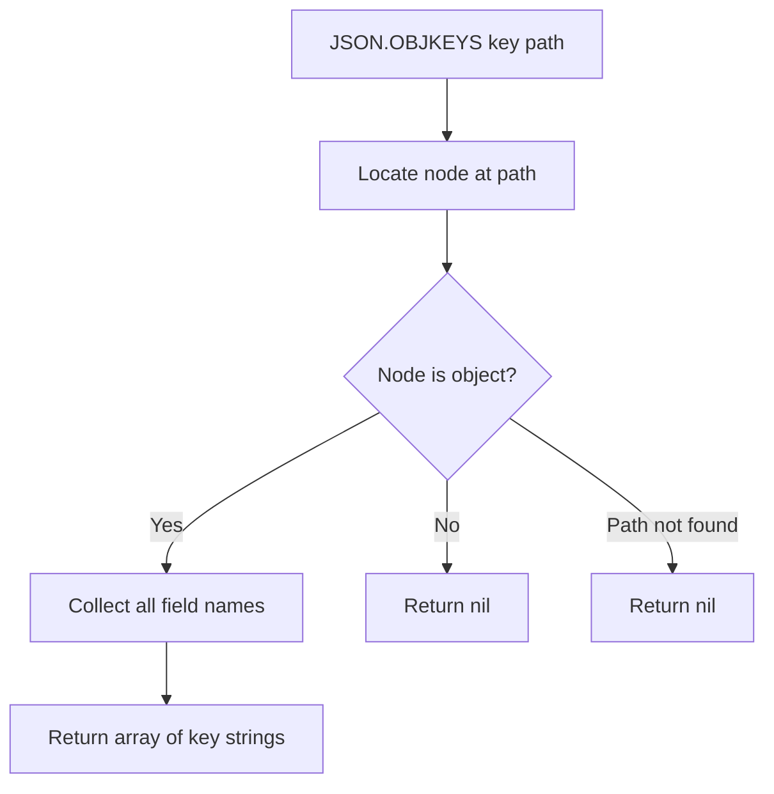

# How to Use JSON.OBJKEYS in Redis to List JSON Object Keys

Author: [nawazdhandala](https://www.github.com/nawazdhandala)

Tags: Redis, JSON, RedisJSON, Object, Document

Description: Learn how to use JSON.OBJKEYS in Redis to retrieve the field names of a JSON object at a given path without fetching the entire document.

---

## Introduction

`JSON.OBJKEYS` returns the list of keys (field names) of a JSON object at the specified path. It is the JSON equivalent of calling `Object.keys()` in JavaScript or iterating a dictionary's keys in Python, but operates server-side on the stored document.

## Basic Syntax

```redis
JSON.OBJKEYS key [path]
```

- `key` - the Redis key
- `path` - JSONPath expression pointing to an object (defaults to `$`)

Returns an array of string field names, or nil if the path does not point to an object.

## Setup

```redis
JSON.SET user:1 $ '{"name":"Alice","age":30,"email":"alice@example.com","active":true,"address":{"city":"London","zip":"EC1A"}}'
```

## Get Keys of Root Object

```redis
127.0.0.1:6379> JSON.OBJKEYS user:1 $
1) 1) "name"
   2) "age"
   3) "email"
   4) "active"
   5) "address"
```

## Get Keys of a Nested Object

```redis
127.0.0.1:6379> JSON.OBJKEYS user:1 $.address
1) 1) "city"
   2) "zip"
```

## Non-Object Path

```redis
127.0.0.1:6379> JSON.OBJKEYS user:1 $.name
1) (nil)
```

Returns nil if the path points to a non-object value.

## Wildcard: Keys of All Nested Objects

```redis
JSON.SET config:1 $ '{"db":{"host":"localhost","port":5432},"cache":{"host":"redis","port":6379}}'

JSON.OBJKEYS config:1 '$.*'
# 1) 1) "host"
#    2) "port"
# 2) 1) "host"
#    2) "port"
```

Returns one key list per matched object.

## Schema Discovery

Use `JSON.OBJKEYS` to discover the shape of documents dynamically:

```python
import redis

r = redis.Redis()
r.json().set("event:1", "$", {
    "id": 1,
    "type": "click",
    "metadata": {"source": "homepage", "campaign": "spring2026"},
    "user": {"id": 42, "tier": "premium"}
})

# Discover top-level fields
top_keys = r.json().objkeys("event:1", "$")
print("Top-level keys:", top_keys)

# Discover nested object keys
nested_keys = r.json().objkeys("event:1", "$.metadata")
print("Metadata keys:", nested_keys)
```

## Checking Field Existence Before Update

```python
import redis

r = redis.Redis()

def safe_update(key, field, value):
    keys = r.json().objkeys(key, "$")
    if keys and field in keys[0]:
        r.json().set(key, f"$.{field}", value)
        print(f"Updated $.{field}")
    else:
        print(f"Field '{field}' not found in document")

r.json().set("product:1", "$", {"name": "Widget", "price": 9.99})
safe_update("product:1", "price", 12.99)
safe_update("product:1", "discount", 0.1)
```

## Flow Diagram



## Summary

`JSON.OBJKEYS key [path]` returns the field names of a JSON object without fetching the full document content. Use `$` to inspect the root, or a deeper JSONPath for nested objects. It returns nil for non-object paths. Use it for schema discovery, conditional field checks, and dynamic document introspection.
