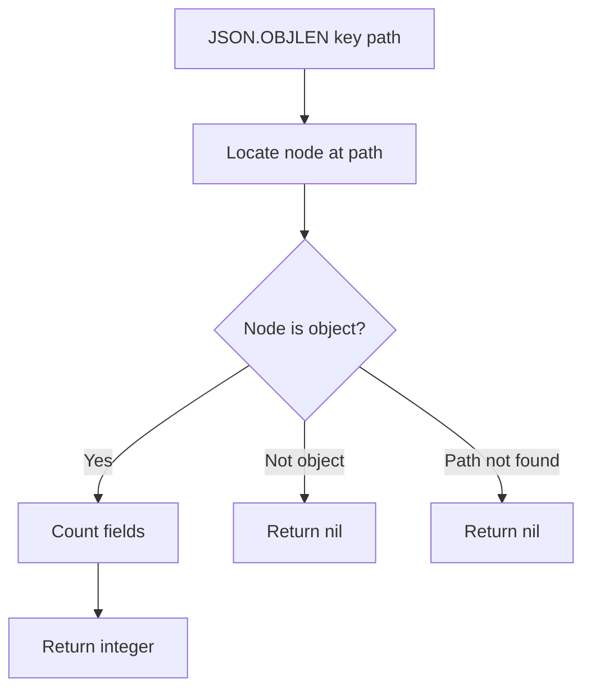

# How to Use JSON.OBJLEN in Redis to Count JSON Object Keys

Author: [nawazdhandala](https://www.github.com/nawazdhandala)

Tags: Redis, JSON, RedisJSON, Object, Document

Description: Learn how to use JSON.OBJLEN in Redis to count the number of fields in a JSON object without retrieving the full document or its keys.

---

## Introduction

`JSON.OBJLEN` returns the number of keys (fields) in a JSON object at the specified path. It is a scalar shortcut compared to fetching the full key list with `JSON.OBJKEYS` - useful when you only need the count for conditional logic or monitoring.

## Basic Syntax

```redis
JSON.OBJLEN key [path]
```

- `key` - the Redis key
- `path` - JSONPath expression pointing to an object (defaults to `$`)

Returns an integer count, or nil if the path does not point to an object.

## Setup

```redis
JSON.SET user:1 $ '{"name":"Alice","age":30,"email":"alice@example.com","active":true}'
```

## Count Root Object Fields

```redis
127.0.0.1:6379> JSON.OBJLEN user:1 $
1) (integer) 4
```

## Count Nested Object Fields

```redis
JSON.SET order:1 $ '{"id":1,"customer":{"name":"Alice","email":"alice@example.com","tier":"gold"},"total":99.99}'

127.0.0.1:6379> JSON.OBJLEN order:1 $.customer
1) (integer) 3
```

## Path Not an Object

```redis
127.0.0.1:6379> JSON.OBJLEN user:1 $.name
1) (nil)
```

Returns nil if the path points to a string, number, boolean, or array.

## Wildcard: Count Fields in All Nested Objects

```redis
JSON.SET config:1 $ '{"db":{"host":"localhost","port":5432,"user":"admin"},"cache":{"host":"redis","port":6379}}'

JSON.OBJLEN config:1 '$.*'
# 1) (integer) 3
# 2) (integer) 2
```

One count per matched object.

## Comparing Objects by Field Count

```python
import redis

r = redis.Redis()

keys = ["schema:v1", "schema:v2", "schema:v3"]
for key in keys:
    count = r.json().objlen(key, "$")
    print(f"{key}: {count[0] if count else 'not found'} fields")
```

## Monitoring Document Growth

```python
import redis

r = redis.Redis()

def check_document_bloat(key, max_fields=20):
    count = r.json().objlen(key, "$")
    if count and count[0] > max_fields:
        print(f"WARNING: {key} has {count[0]} fields (limit: {max_fields})")
    else:
        print(f"{key}: {count[0] if count else 0} fields (OK)")

r.json().set("user:1", "$", {f"field_{i}": i for i in range(25)})
check_document_bloat("user:1")
```

## Flow Diagram



## JSON.OBJLEN vs JSON.OBJKEYS

| Command | Returns | Best for |
|---|---|---|
| `JSON.OBJLEN` | Integer count | Capacity checks, conditional logic |
| `JSON.OBJKEYS` | List of field names | Iteration, schema inspection |

Use `JSON.OBJLEN` when you only need the count. Use `JSON.OBJKEYS` when you need to iterate or check specific names.

## Summary

`JSON.OBJLEN key [path]` returns the number of fields in a JSON object as an integer. It returns nil for non-object paths. Use it as a lightweight cardinality check for JSON documents, to enforce field count limits, or to compare schema complexity across document versions.
