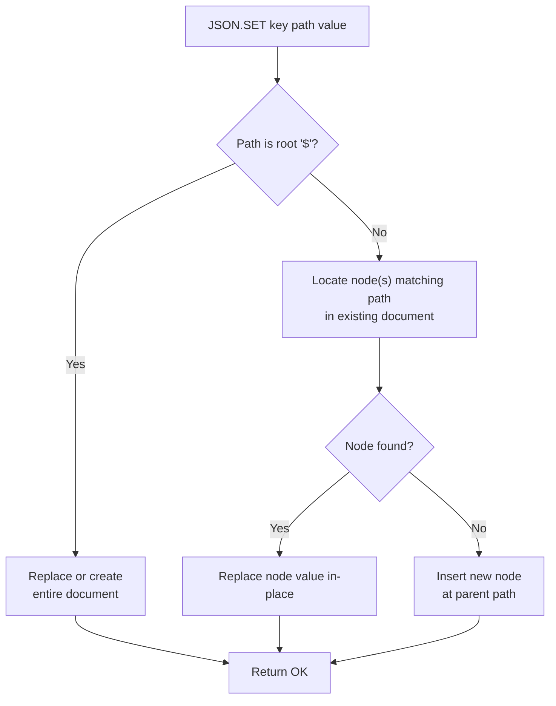

# How to Use JSON.SET in Redis to Store JSON Documents

Author: [nawazdhandala](https://www.github.com/nawazdhandala)

Tags: Redis, JSON, RedisJSON, Document, Storage

Description: Learn how to use JSON.SET in Redis to store full or partial JSON documents, including conditional set options and JSONPath targeting for nested updates.

---

## Introduction

`JSON.SET` stores a JSON value at a key and an optional JSONPath. It is the primary write command in the RedisJSON module. You can store a full document, update a nested field, or insert a new property - all without reading and rewriting the entire document.

RedisJSON is included in Redis Stack and Redis Cloud out of the box.

## Basic Syntax

```redis
JSON.SET key path value [NX | XX]
```

- `key` - the Redis key
- `path` - JSONPath expression (use `$` for the root)
- `value` - valid JSON string
- `NX` - set only if the key does not exist
- `XX` - set only if the key already exists

## Store a Full Document

```redis
JSON.SET user:1 $ '{"name":"Alice","age":30,"email":"alice@example.com","active":true}'
```

## Read It Back

```redis
JSON.GET user:1
# "[{\"name\":\"Alice\",\"age\":30,\"email\":\"alice@example.com\",\"active\":true}]"
```

## Update a Nested Field

```redis
JSON.SET user:1 $.age 31
# OK
```

Only the `age` field is updated; the rest of the document is unchanged.

## Add a New Field

```redis
JSON.SET user:1 $.city '"London"'
# OK

JSON.GET user:1 $.city
# "[\"London\"]"
```

## Conditional Set: NX (Only if New Key)

```redis
JSON.SET user:2 $ '{"name":"Bob"}' NX
# OK  (key did not exist)

JSON.SET user:2 $ '{"name":"Carol"}' NX
# (nil)  (key already exists, no change)
```

## Conditional Set: XX (Only if Existing Key)

```redis
JSON.SET user:999 $ '{"name":"Ghost"}' XX
# (nil)  (key does not exist, no change)

JSON.SET user:1 $.name '"Alice Updated"' XX
# OK  (key exists, update applied)
```

## Storing Nested JSON

```redis
JSON.SET order:100 $ '{
  "id": 100,
  "customer": {"id": 1, "name": "Alice"},
  "items": [
    {"sku": "A1", "qty": 2, "price": 9.99},
    {"sku": "B3", "qty": 1, "price": 24.99}
  ],
  "status": "pending"
}'
```

Update a nested property:

```redis
JSON.SET order:100 $.status '"shipped"'
JSON.SET order:100 $.customer.name '"Alice Smith"'
```

## JSONPath for Array Elements

```redis
# Update the price of the first item
JSON.SET order:100 $.items[0].price 10.99

# Update the qty of all items (wildcard)
JSON.SET order:100 $.items[*].qty 5
```

## How JSON.SET Works Internally



## Storing Arrays

```redis
JSON.SET tags:post1 $ '["redis","json","performance"]'

# Append later with JSON.ARRAPPEND
JSON.ARRAPPEND tags:post1 $ '"caching"'
```

## Performance Notes

- `JSON.SET` at root `$` replaces the entire document; avoid on very large documents when only a field changes.
- Use JSONPath targeting (e.g., `$.field`) for partial updates to minimize data rewriting.
- Documents are stored in a tree-structured binary representation, not as raw JSON strings.

## Summary

`JSON.SET key path value [NX|XX]` is the core write command for RedisJSON. Use `$` as the path to set the entire document, or a JSONPath expression to update a nested field. The `NX` flag creates only if absent; `XX` updates only if present. Partial path updates avoid rewriting the full document and are the preferred pattern for frequently changing fields.
