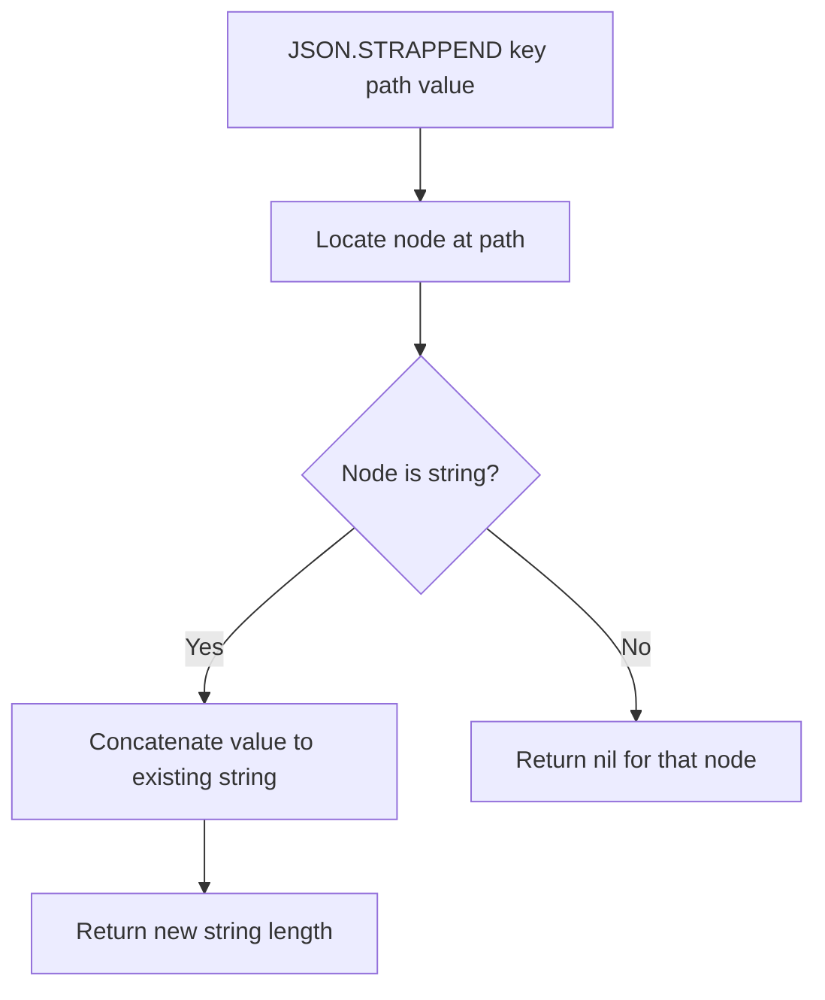

# How to Use JSON.STRAPPEND in Redis to Append to JSON Strings

Author: [nawazdhandala](https://www.github.com/nawazdhandala)

Tags: Redis, JSON, RedisJSON, String, Document

Description: Learn how to use JSON.STRAPPEND in Redis to append a string to an existing JSON string value in-place, returning the new string length.

---

## Introduction

`JSON.STRAPPEND` appends a string to the existing string value at a JSONPath inside a JSON document. It is the JSON equivalent of `APPEND` for Redis strings and is useful for building up strings incrementally inside documents without a full read-modify-write cycle.

## Basic Syntax

```redis
JSON.STRAPPEND key path value
```

- `key` - the Redis key
- `path` - JSONPath pointing to a string value
- `value` - the JSON string to append (must be a JSON-encoded string, i.e., wrapped in quotes)

Returns the new length of the string after appending.

## Setup

```redis
JSON.SET post:1 $ '{"title":"Redis","content":"Redis is a fast in-memory store."}'
```

## Append to a String Field

```redis
127.0.0.1:6379> JSON.STRAPPEND post:1 $.content '" It supports many data structures."'
1) (integer) 67

JSON.GET post:1 $.content
# ["Redis is a fast in-memory store. It supports many data structures."]
```

## Append to Title

```redis
127.0.0.1:6379> JSON.STRAPPEND post:1 $.title '" 7.0 Features"'
1) (integer) 15

JSON.GET post:1 $.title
# ["Redis 7.0 Features"]
```

## Wildcard: Append to All Matching Strings

```redis
JSON.SET labels:1 $ '{"buttons":{"ok":"OK","cancel":"Cancel","submit":"Submit"}}'

JSON.STRAPPEND labels:1 '$.buttons.*' '" Button"'
# 1) (integer) 9   ("OK Button")
# 2) (integer) 13  ("Cancel Button")
# 3) (integer) 13  ("Submit Button")
```

Returns one length per matched string node.

## Non-String Path Returns Nil

```redis
JSON.SET data:1 $ '{"count":10,"label":"hello"}'

JSON.STRAPPEND data:1 $.count '" extra"'
# 1) (nil)
```

Returns nil when the path points to a non-string value.

## Building Log Entries

```python
import redis, time

r = redis.Redis()
r.json().set("log:entry:1", "$", {"message": "Request received"})

def append_log(key, text):
    new_len = r.json().strappend(key, "$.message", f" | {text}")
    return new_len[0]

append_log("log:entry:1", "Authenticated")
append_log("log:entry:1", "Processing")
append_log("log:entry:1", "Done")

print(r.json().get("log:entry:1", "$.message"))
# ['Request received | Authenticated | Processing | Done']
```

## Flow Diagram



## JSON.STRAPPEND vs Read-Modify-Write

| Approach | Atomic | Round trips |
|---|---|---|
| `JSON.STRAPPEND` | Yes | 1 |
| `JSON.GET` then `JSON.SET` | No | 2 |

Always prefer `JSON.STRAPPEND` to avoid race conditions when two clients append concurrently.

## Summary

`JSON.STRAPPEND key path value` appends a JSON-encoded string to the existing string value at a path inside a JSON document. It returns the new length of the string. It is atomic and more efficient than GET-then-SET. Use it for building messages, log entries, or growing string fields incrementally inside stored documents.
