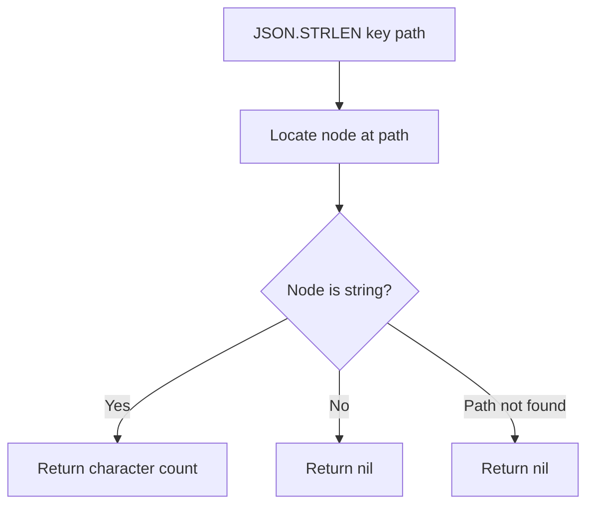

# How to Use JSON.STRLEN in Redis to Get JSON String Length

Author: [nawazdhandala](https://www.github.com/nawazdhandala)

Tags: Redis, JSON, RedisJSON, String, Document

Description: Learn how to use JSON.STRLEN in Redis to get the character length of a string value stored inside a JSON document without retrieving the full string.

---

## Introduction

`JSON.STRLEN` returns the length of a string value at a given JSONPath inside a JSON document. It is the JSON equivalent of `STRLEN` for Redis strings and lets you check string size without reading the actual content - useful for validation, pagination, and truncation decisions.

## Basic Syntax

```redis
JSON.STRLEN key [path]
```

- `key` - the Redis key
- `path` - JSONPath pointing to a string value (defaults to `$`)

Returns an integer length, or nil if the path does not point to a string.

## Setup

```redis
JSON.SET post:1 $ '{"title":"Redis Performance Guide","body":"Redis is a fast in-memory data structure store used as a cache, message broker, and database."}'
```

## Get String Length

```redis
127.0.0.1:6379> JSON.STRLEN post:1 $.title
1) (integer) 24

127.0.0.1:6379> JSON.STRLEN post:1 $.body
1) (integer) 87
```

## Non-String Path Returns Nil

```redis
JSON.SET data:1 $ '{"count":10,"label":"hello"}'

JSON.STRLEN data:1 $.count
# 1) (nil)

JSON.STRLEN data:1 $.label
# 1) (integer) 5
```

## Root is a String

```redis
JSON.SET greeting:1 $ '"Hello, Redis!"'

JSON.STRLEN greeting:1 $
# 1) (integer) 13
```

## Wildcard: Length of All String Fields

```redis
JSON.SET user:1 $ '{"name":"Alice","city":"London","country":"United Kingdom"}'

JSON.STRLEN user:1 '$.*'
# 1) (integer) 5    ("Alice")
# 2) (integer) 6    ("London")
# 3) (integer) 14   ("United Kingdom")
```

Returns one integer per matched string node; nil for non-string nodes.

## Checking Before Truncation

```python
import redis

r = redis.Redis()
r.json().set("article:1", "$", {"title": "Very Long Title That Might Need Truncating If Too Long", "views": 100})

MAX_TITLE = 40

length = r.json().strlen("article:1", "$.title")
if length and length[0] > MAX_TITLE:
    # Read and truncate
    title = r.json().get("article:1", "$.title")[0]
    r.json().set("article:1", "$.title", title[:MAX_TITLE])
    print(f"Title truncated to {MAX_TITLE} chars")
else:
    print(f"Title length {length[0] if length else 0} is OK")
```

## Validation Before Storage

```python
import redis

r = redis.Redis()

def set_description(key, text):
    if len(text) > 500:
        raise ValueError("Description too long (max 500 chars)")
    r.json().set(key, "$.description", text)
    stored_len = r.json().strlen(key, "$.description")
    print(f"Stored description length: {stored_len[0]}")
```

## Flow Diagram



## JSON.STRLEN vs Reading the String

| Approach | Network overhead | Use case |
|---|---|---|
| `JSON.STRLEN` | Minimal (integer) | Size check, validation |
| `JSON.GET` + `len()` in app | Transfers full string | When you need the content too |

Use `JSON.STRLEN` when you only need the size to make a decision.

## Summary

`JSON.STRLEN key [path]` returns the character length of a string value stored inside a JSON document. It returns nil for non-string paths. Use it to validate input size limits, check whether a field needs truncation, or monitor string growth in document fields without transferring the full string value.
