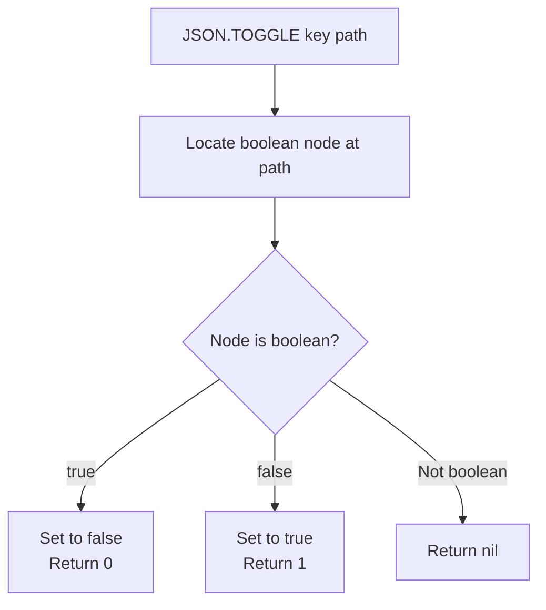

# How to Use JSON.TOGGLE in Redis to Toggle JSON Booleans

Author: [nawazdhandala](https://www.github.com/nawazdhandala)

Tags: Redis, JSON, RedisJSON, Boolean, Document

Description: Learn how to use JSON.TOGGLE in Redis to atomically flip a boolean value inside a JSON document between true and false without reading and rewriting the document.

---

## Introduction

`JSON.TOGGLE` flips a boolean value at a JSONPath from `true` to `false` or `false` to `true`. It is atomic and eliminates the read-modify-write pattern for simple flag toggling. Use it for feature flags, active/inactive status, and any binary state field in a JSON document.

## Basic Syntax

```redis
JSON.TOGGLE key path
```

- `key` - the Redis key
- `path` - JSONPath pointing to a boolean value

Returns an array with the new boolean value(s): 0 for false, 1 for true.

## Setup

```redis
JSON.SET user:1 $ '{"name":"Alice","active":true,"notifications":false,"premium":true}'
```

## Toggle a Boolean Field

```redis
127.0.0.1:6379> JSON.TOGGLE user:1 $.active
1) (integer) 0    # was true, now false

127.0.0.1:6379> JSON.TOGGLE user:1 $.active
1) (integer) 1    # was false, now true
```

## Toggle Multiple Fields at Once (Wildcard)

```redis
JSON.SET flags:1 $ '{"dark_mode":false,"beta":true,"compact":false}'

JSON.TOGGLE flags:1 '$.*'
# 1) (integer) 1   (dark_mode: false -> true)
# 2) (integer) 0   (beta: true -> false)
# 3) (integer) 1   (compact: false -> true)

JSON.GET flags:1
# [{"dark_mode":true,"beta":false,"compact":true}]
```

## Non-Boolean Path Returns Nil

```redis
JSON.SET data:1 $ '{"count":5,"enabled":true}'

JSON.TOGGLE data:1 $.count
# 1) (nil)

JSON.TOGGLE data:1 $.enabled
# 1) (integer) 0
```

Returns nil for non-boolean values.

## Feature Flag Pattern

```python
import redis

r = redis.Redis()
r.json().set("feature:dark_mode", "$", {
    "name": "dark_mode",
    "enabled": False,
    "last_toggled_by": None
})

def toggle_feature(feature_key, admin_user):
    new_state = r.json().toggle(feature_key, "$.enabled")
    r.json().set(feature_key, "$.last_toggled_by", admin_user)
    state_str = "enabled" if new_state[0] == 1 else "disabled"
    print(f"Feature {state_str} by {admin_user}")

toggle_feature("feature:dark_mode", "alice")
toggle_feature("feature:dark_mode", "bob")
```

## Toggle Workflow



## Audit Toggle with Timestamp

```python
import redis, time

r = redis.Redis()

def audited_toggle(key, path):
    new_val = r.json().toggle(key, path)
    r.json().set(key, "$.last_modified", int(time.time()))
    return new_val[0]

r.json().set("config:1", "$", {"maintenance_mode": False, "last_modified": 0})
result = audited_toggle("config:1", "$.maintenance_mode")
print(f"maintenance_mode is now: {bool(result)}")
```

## JSON.TOGGLE vs JSON.SET for Booleans

| Approach | Atomic | Reads required | Code simplicity |
|---|---|---|---|
| `JSON.TOGGLE` | Yes | 0 | High |
| `JSON.GET` + `JSON.SET` | No | 1 | Medium |

Always prefer `JSON.TOGGLE` for boolean flipping to avoid race conditions.

## Summary

`JSON.TOGGLE key path` atomically inverts a boolean value in a JSON document. It returns 0 for the new false state and 1 for the new true state. Non-boolean paths return nil. Use it for feature flags, user preference toggles, maintenance mode switches, and any binary state embedded in a JSON document.
