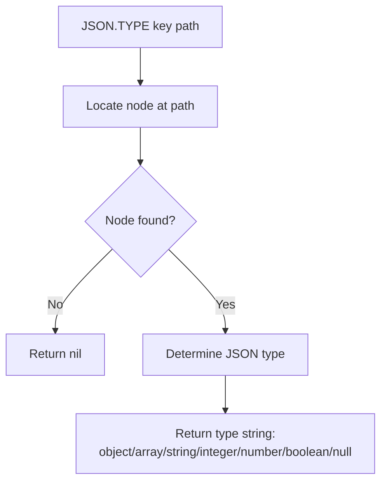

# How to Use JSON.TYPE in Redis to Check JSON Value Type

Author: [nawazdhandala](https://www.github.com/nawazdhandala)

Tags: Redis, JSON, RedisJSON, Type, Document

Description: Learn how to use JSON.TYPE in Redis to check the JSON type of a value at a specific path inside a stored document, supporting schema validation and conditional logic.

---

## Introduction

`JSON.TYPE` returns the JSON type of the value at a given path in a stored document. The returned type names are: `object`, `array`, `string`, `integer`, `number`, `boolean`, and `null`. Use it to validate document structure, branch on value type, or inspect unknown documents.

## Basic Syntax

```redis
JSON.TYPE key [path]
```

- `key` - the Redis key
- `path` - JSONPath expression (defaults to `$`)

Returns an array of type strings (one per matched node), or nil if the key does not exist or the path is not found.

## Setup

```redis
JSON.SET profile:1 $ '{
  "name": "Alice",
  "age": 30,
  "score": 9.5,
  "active": true,
  "notes": null,
  "tags": ["redis","json"],
  "address": {"city": "London"}
}'
```

## Check Types of Various Fields

```redis
127.0.0.1:6379> JSON.TYPE profile:1 $.name
1) "string"

127.0.0.1:6379> JSON.TYPE profile:1 $.age
1) "integer"

127.0.0.1:6379> JSON.TYPE profile:1 $.score
1) "number"

127.0.0.1:6379> JSON.TYPE profile:1 $.active
1) "boolean"

127.0.0.1:6379> JSON.TYPE profile:1 $.notes
1) "null"

127.0.0.1:6379> JSON.TYPE profile:1 $.tags
1) "array"

127.0.0.1:6379> JSON.TYPE profile:1 $.address
1) "object"
```

## Root Type

```redis
127.0.0.1:6379> JSON.TYPE profile:1 $
1) "object"
```

## Path Not Found

```redis
127.0.0.1:6379> JSON.TYPE profile:1 $.nonexistent
1) (nil)
```

## Wildcard: Type of All Values

```redis
JSON.TYPE profile:1 '$.*'
# 1) "string"    (name)
# 2) "integer"   (age)
# 3) "number"    (score)
# 4) "boolean"   (active)
# 5) "null"      (notes)
# 6) "array"     (tags)
# 7) "object"    (address)
```

## JSON Type Reference

| JSON value | JSON.TYPE return |
|---|---|
| `"text"` | `string` |
| `42` | `integer` |
| `3.14` | `number` |
| `true` / `false` | `boolean` |
| `null` | `null` |
| `[...]` | `array` |
| `{...}` | `object` |

Note: `integer` is returned only when the value has no decimal point. `number` covers floats.

## Type-Safe Update Pattern

```python
import redis

r = redis.Redis()

def safe_numincrby(key, path, delta):
    type_info = r.json().type(key, path)
    if type_info and type_info[0] in ("integer", "number"):
        return r.json().numincrby(key, path, delta)
    else:
        print(f"Cannot increment: {path} is type '{type_info}'")
        return None

r.json().set("stats:1", "$", {"count": 10, "label": "total"})
safe_numincrby("stats:1", "$.count", 5)     # Works
safe_numincrby("stats:1", "$.label", 5)    # Prints error
```

## Schema Validation

```python
import redis

EXPECTED_SCHEMA = {
    "$.name": "string",
    "$.age": "integer",
    "$.active": "boolean",
    "$.tags": "array",
}

def validate_schema(r, key):
    errors = []
    for path, expected_type in EXPECTED_SCHEMA.items():
        actual = r.json().type(key, path)
        if not actual or actual[0] != expected_type:
            errors.append(f"{path}: expected {expected_type}, got {actual}")
    return errors

r = redis.Redis()
r.json().set("user:5", "$", {"name": "Bob", "age": "thirty", "active": True, "tags": []})
errors = validate_schema(r, "user:5")
for e in errors:
    print("Schema error:", e)
```

## Flow Diagram



## Summary

`JSON.TYPE key [path]` returns the JSON type of the value at a path as a string. The seven possible types are `object`, `array`, `string`, `integer`, `number`, `boolean`, and `null`. Use it for schema validation, type-safe command routing, and runtime introspection of documents whose structure may vary.
