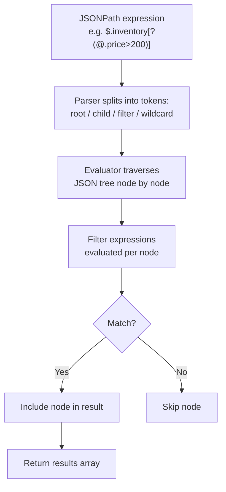

# How to Use JSONPath Queries in Redis for Nested Data Access

Author: [nawazdhandala](https://www.github.com/nawazdhandala)

Tags: Redis, JSON, RedisJSON, JSONPath, Query

Description: Learn how to use JSONPath expressions in Redis with the RedisJSON module to access, filter, and traverse nested document data using wildcards, recursive descent, and filter expressions.

---

## Introduction

RedisJSON supports JSONPath syntax (RFC 9535 / Goessner-style) for all `JSON.*` commands. JSONPath lets you target specific fields, traverse arrays, apply wildcards, use recursive descent, and filter nodes by value - all server-side without transferring the full document.

## JSONPath Basics

| Expression | Meaning |
|---|---|
| `$` | Root element |
| `$.field` | Child field named `field` |
| `$.a.b.c` | Nested path |
| `$.*` | All direct children |
| `$[*]` | All elements of a root array |
| `$..field` | All `field` values at any depth (recursive) |
| `$[0]` | First element of a root array |
| `$[-1]` | Last element of a root array |
| `$[1:3]` | Array slice (indexes 1 to 2) |
| `$[?(@.price > 10)]` | Filter: elements where price > 10 |

## Sample Document

```redis
JSON.SET store:1 $ '{
  "name": "Tech Shop",
  "inventory": [
    {"id": 1, "name": "Laptop", "price": 999, "tags": ["electronics","portable"], "in_stock": true},
    {"id": 2, "name": "Phone",  "price": 499, "tags": ["electronics","mobile"],   "in_stock": true},
    {"id": 3, "name": "Desk",   "price": 149, "tags": ["furniture"],              "in_stock": false},
    {"id": 4, "name": "Chair",  "price": 89,  "tags": ["furniture","ergonomic"],  "in_stock": true}
  ],
  "meta": {"version": 2, "updated": "2026-03-31"}
}'
```

## Access Root Object

```redis
JSON.GET store:1 $
```

## Access a Top-Level Field

```redis
JSON.GET store:1 $.name
# ["Tech Shop"]
```

## Access All Item Names (Wildcard)

```redis
JSON.GET store:1 '$.inventory[*].name'
# ["Laptop","Phone","Desk","Chair"]
```

## Access First Item

```redis
JSON.GET store:1 '$.inventory[0]'
# [{"id":1,"name":"Laptop","price":999,...}]
```

## Access Last Item

```redis
JSON.GET store:1 '$.inventory[-1]'
# [{"id":4,"name":"Chair",...}]
```

## Array Slice

```redis
JSON.GET store:1 '$.inventory[1:3]'
# Items at index 1 and 2 (Phone and Desk)
```

## Recursive Descent: All Prices at Any Depth

```redis
JSON.SET nested:1 $ '{"shop":{"items":[{"price":10},{"sub":{"price":20}}]}}'
JSON.GET nested:1 '$..price'
# [10, 20]
```

## Filter Expression: Items with Price > 200

```redis
JSON.GET store:1 '$.inventory[?(@.price > 200)]'
# [{"id":1,"name":"Laptop","price":999,...},{"id":2,"name":"Phone","price":499,...}]
```

## Filter: In-Stock Items Only

```redis
JSON.GET store:1 '$.inventory[?(@.in_stock == true)]'
```

## Filter: Items with a Specific Tag

```redis
JSON.GET store:1 '$.inventory[?("electronics" in @.tags)]'
```

## Complex Filters

```redis
# In-stock items costing less than 200
JSON.GET store:1 '$.inventory[?(@.in_stock == true && @.price < 200)]'
```

## JSONPath with Aggregate Operations

```redis
# Count all in-stock items
JSON.ARRLEN store:1 '$.inventory[?(@.in_stock == true)]'

# Get all prices for filtering
JSON.GET store:1 '$.inventory[*].price'
```

## How JSONPath Is Evaluated



## Using JSONPath in Python

```python
import redis

r = redis.Redis()

# Get all prices
prices = r.json().get("store:1", "$.inventory[*].price")
print("All prices:", prices)

# Get in-stock item names
in_stock = r.json().get("store:1", "$.inventory[?(@.in_stock == true)].name")
print("In stock:", in_stock)

# Get metadata version
version = r.json().get("store:1", "$.meta.version")
print("Version:", version)
```

## Supported Filter Operators

| Operator | Example |
|---|---|
| `==` | `@.status == "active"` |
| `!=` | `@.type != "admin"` |
| `<` `>` `<=` `>=` | `@.price >= 100` |
| `&&` | `@.active && @.verified` |
| `\|\|` | `@.type == "a" \|\| @.type == "b"` |
| `!` | `!@.deleted` |
| `in` | `"tag" in @.tags` |
| `nin` | `"banned" nin @.roles` |
| `exists` | `@.email exists` |

## Summary

JSONPath in RedisJSON enables server-side traversal and filtering of nested JSON documents. Use `$` for root, `.*` for all children, `..field` for recursive search, `[n]` for array index, `[start:stop]` for slices, and `[?(@.field op value)]` for filtering. All `JSON.*` commands accept JSONPath, making it the primary way to target specific parts of documents without full document reads.
