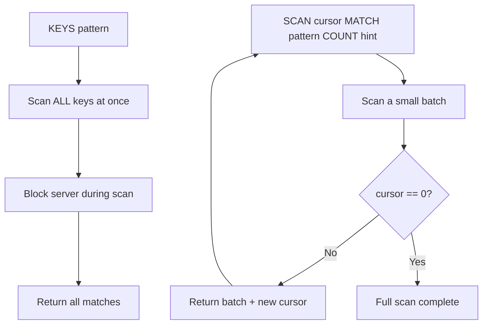

# How to Use KEYS and SCAN in Redis to Find Keys by Pattern

Author: [nawazdhandala](https://www.github.com/nawazdhandala)

Tags: Redis, Key, SCAN, Pattern Matching, Key Management

Description: Learn how to find Redis keys by pattern using KEYS and SCAN, understand the performance difference between them, and use SCAN safely in production environments.

---

## How KEYS and SCAN Work

KEYS returns all keys matching a given glob-style pattern in a single blocking call. It is simple but dangerous in production because it scans the entire keyspace synchronously, blocking all other commands until it finishes.

SCAN is the production-safe alternative. It iterates through the keyspace incrementally using a cursor, returning a small batch of keys per call. No single SCAN call blocks the server for long, even on a dataset with millions of keys.



## Syntax

```redis
KEYS pattern

SCAN cursor [MATCH pattern] [COUNT count] [TYPE type]
```

- `pattern` - glob-style pattern: `*` (any chars), `?` (single char), `[ae]` (character set)
- `cursor` - start with 0, use the returned cursor for subsequent calls
- `COUNT count` - hint for how many keys to return per iteration (not a strict limit)
- `TYPE type` - filter by key type (string, list, hash, set, zset, stream)

## Examples

### KEYS - find all keys matching a pattern

```redis
SET user:1 "alice"
SET user:2 "bob"
SET product:1 "laptop"
SET session:abc "active"

KEYS user:*
```

```text
1) "user:2"
2) "user:1"
```

### KEYS with single-character wildcard

```redis
SET key:a "1"
SET key:b "2"
SET key:cc "3"

KEYS key:?
```

```text
1) "key:b"
2) "key:a"
```

### KEYS - list all keys (dangerous in production)

```redis
KEYS *
```

This returns every key in the database. Never run this on a production server with large datasets.

### SCAN - safe incremental iteration

Start with cursor 0:

```redis
SCAN 0 MATCH user:* COUNT 10
```

```text
1) "14"
2) 1) "user:2"
   2) "user:1"
```

The first element (`14`) is the next cursor. Use it for the next call:

```redis
SCAN 14 MATCH user:* COUNT 10
```

```text
1) "0"
2) (empty array)
```

When the returned cursor is `0`, the full scan is complete.

### SCAN with TYPE filter (Redis 6.0+)

Find only hash keys matching a pattern:

```redis
HSET profile:1 name "alice"
SET token:1 "jwt..."

SCAN 0 MATCH *:1 TYPE hash
```

```text
1) "0"
2) 1) "profile:1"
```

### Full SCAN loop in bash

```bash
cursor=0
while true; do
  result=$(redis-cli SCAN $cursor MATCH "session:*" COUNT 100)
  cursor=$(echo "$result" | head -1)
  keys=$(echo "$result" | tail -n +2)
  echo "$keys"
  if [ "$cursor" -eq 0 ]; then
    break
  fi
done
```

### Using redis-cli --scan for easy iteration

```bash
redis-cli --scan --pattern "session:*"
```

This automatically handles the cursor loop and streams matching keys.

## Pattern Syntax Reference

| Pattern | Matches |
|---------|---------|
| `*` | Any sequence of characters |
| `?` | Any single character |
| `[abc]` | Any one of a, b, or c |
| `[a-z]` | Any lowercase letter |
| `[^abc]` | Any character except a, b, or c |
| `h?llo` | hello, hallo, hxllo |
| `h*llo` | hllo, heeello, hello |

## KEYS vs SCAN Comparison

| Feature | KEYS | SCAN |
|---------|------|------|
| Blocking | Yes - blocks entire server | No - iterates in small steps |
| Returns | All matches at once | Batches via cursor |
| Production safe | No | Yes |
| Speed (small datasets) | Fast | Slightly slower (multiple calls) |
| Guarantees | Returns exact set at moment of call | May return duplicates, misses keys added/removed mid-scan |

## Use Cases

**Development and debugging** - KEYS is fine for exploring data in a dev environment with small datasets.

**Bulk cache invalidation** - Use SCAN to find and delete all cache keys matching a pattern without blocking production traffic.

**Keyspace auditing** - Iterate through all keys of a specific type or prefix to analyze data distribution.

**Scheduled cleanup** - Background workers use SCAN to find expired or orphaned keys to clean up.

## Summary

KEYS is simple and useful in development but should never be used in production on large datasets due to its blocking behavior. SCAN provides the same pattern-matching capability in an incremental, non-blocking way using a cursor. Always use SCAN (or the redis-cli --scan flag) in production applications. The TYPE filter in SCAN is valuable for narrowing results to a specific data structure without extra EXISTS/TYPE checks.
