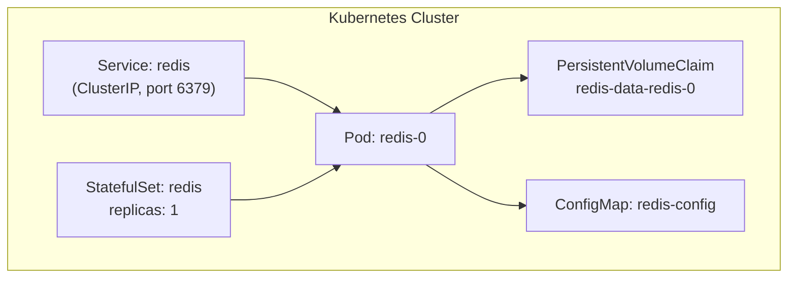
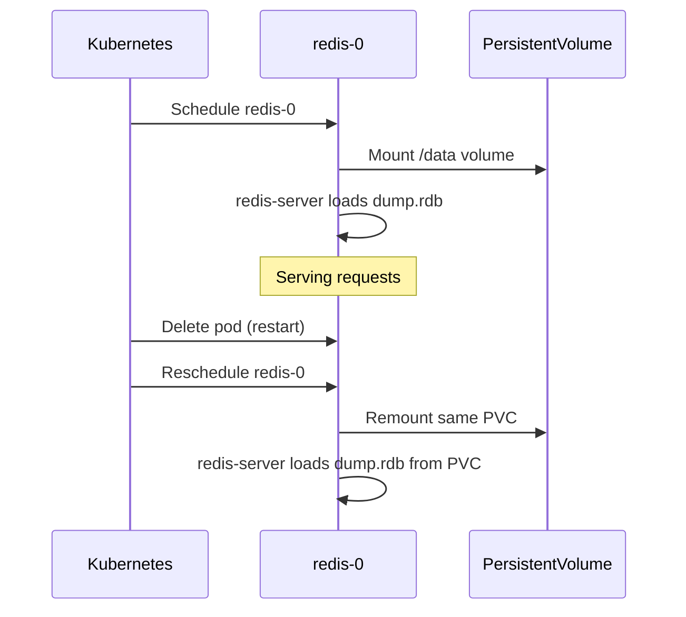

# How to Set Up Redis on Kubernetes with StatefulSet

Author: [nawazdhandala](https://www.github.com/nawazdhandala)

Tags: Redis, Kubernetes, StatefulSet, Persistence, Infrastructure

Description: Learn how to deploy Redis on Kubernetes using a StatefulSet with persistent volumes, a headless service, and ConfigMap-based configuration.

---

## Introduction

Kubernetes StatefulSets are the right choice for stateful workloads like Redis because they provide stable pod names, stable network identities, and ordered pod management. This guide walks through deploying a standalone Redis instance on Kubernetes with persistent storage.

## Architecture Overview



## ConfigMap for redis.conf

```yaml
apiVersion: v1
kind: ConfigMap
metadata:
  name: redis-config
  namespace: default
data:
  redis.conf: |
    bind 0.0.0.0
    protected-mode no
    maxmemory 512mb
    maxmemory-policy allkeys-lru
    save 900 1
    save 300 10
    save 60 10000
    appendonly yes
    appendfsync everysec
    dir /data
    dbfilename dump.rdb
    appendfilename appendonly.aof
```

## Headless Service

A headless service provides stable DNS names for StatefulSet pods:

```yaml
apiVersion: v1
kind: Service
metadata:
  name: redis-headless
  namespace: default
spec:
  clusterIP: None
  selector:
    app: redis
  ports:
    - port: 6379
      targetPort: 6379
```

## ClusterIP Service for Application Access

```yaml
apiVersion: v1
kind: Service
metadata:
  name: redis
  namespace: default
spec:
  type: ClusterIP
  selector:
    app: redis
  ports:
    - port: 6379
      targetPort: 6379
```

## StatefulSet

```yaml
apiVersion: apps/v1
kind: StatefulSet
metadata:
  name: redis
  namespace: default
spec:
  serviceName: redis-headless
  replicas: 1
  selector:
    matchLabels:
      app: redis
  template:
    metadata:
      labels:
        app: redis
    spec:
      containers:
        - name: redis
          image: redis:7.2-alpine
          command: ["redis-server", "/etc/redis/redis.conf"]
          ports:
            - containerPort: 6379
          resources:
            requests:
              memory: "256Mi"
              cpu: "100m"
            limits:
              memory: "512Mi"
              cpu: "500m"
          volumeMounts:
            - name: redis-config
              mountPath: /etc/redis
            - name: redis-data
              mountPath: /data
          livenessProbe:
            exec:
              command: ["redis-cli", "PING"]
            initialDelaySeconds: 15
            periodSeconds: 10
          readinessProbe:
            exec:
              command: ["redis-cli", "PING"]
            initialDelaySeconds: 5
            periodSeconds: 5
      volumes:
        - name: redis-config
          configMap:
            name: redis-config
  volumeClaimTemplates:
    - metadata:
        name: redis-data
      spec:
        accessModes: ["ReadWriteOnce"]
        resources:
          requests:
            storage: 10Gi
```

## Deploy

```bash
kubectl apply -f redis-configmap.yaml
kubectl apply -f redis-service.yaml
kubectl apply -f redis-headless-service.yaml
kubectl apply -f redis-statefulset.yaml
```

## Verify Deployment

```bash
kubectl get statefulset redis
# NAME    READY   AGE
# redis   1/1     60s

kubectl get pod redis-0
# NAME      READY   STATUS    RESTARTS   AGE
# redis-0   1/1     Running   0          60s

kubectl get pvc
# NAME                STATUS   VOLUME   CAPACITY   ACCESS MODES
# redis-data-redis-0  Bound    pvc-...  10Gi       RWO
```

## Access Redis CLI

```bash
kubectl exec -it redis-0 -- redis-cli PING
# PONG

kubectl exec -it redis-0 -- redis-cli INFO server | grep redis_version
# redis_version:7.2.x
```

## Pod Restart and Data Persistence

When `redis-0` restarts (e.g., due to a node failure or rolling update), Kubernetes reattaches the same PVC (`redis-data-redis-0`) to the new pod, preserving all data.



## Adding Authentication

Add a Secret and reference it in the StatefulSet:

```yaml
apiVersion: v1
kind: Secret
metadata:
  name: redis-secret
type: Opaque
stringData:
  password: "your_strong_password"
```

Update the container command:

```yaml
command: ["redis-server", "/etc/redis/redis.conf", "--requirepass", "$(REDIS_PASSWORD)"]
env:
  - name: REDIS_PASSWORD
    valueFrom:
      secretKeyRef:
        name: redis-secret
        key: password
```

## Summary

Deploying Redis on Kubernetes with a StatefulSet provides stable pod identity, ordered pod management, and persistent storage via PVC templates. Use a ConfigMap for `redis.conf`, a headless service for stable DNS, and liveness/readiness probes for reliable health checking. Data survives pod restarts as long as the PVC is retained.
