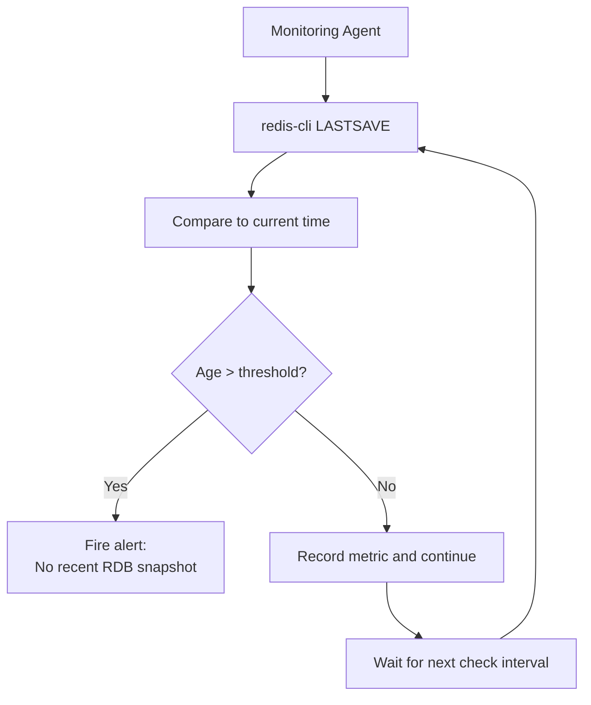

# How to Use LASTSAVE in Redis to Check Last Successful Save

Author: [nawazdhandala](https://www.github.com/nawazdhandala)

Tags: Redis, Lastsave, RDB, Persistence, Monitoring

Description: Learn how to use the LASTSAVE command to retrieve the Unix timestamp of the last successful Redis RDB snapshot, and how to use it for monitoring and alerting.

---

## Introduction

`LASTSAVE` returns the Unix timestamp of the last time Redis successfully saved the dataset to disk via an RDB snapshot. It is a lightweight way to verify that persistence is working correctly and to detect if backups have stalled.

## Basic Syntax

```redis
LASTSAVE
```

Returns an integer Unix timestamp (seconds since epoch).

## Examples

### Get the last save timestamp

```redis
LASTSAVE
# (integer) 1711900800
```

### Convert to human-readable time in bash

```bash
TIMESTAMP=$(redis-cli LASTSAVE)
date -d "@$TIMESTAMP"
# Thu Mar 31 12:00:00 UTC 2026
```

### Trigger a save and verify it completes

```redis
BGSAVE
# Background saving started

# Wait a moment, then check
LASTSAVE
# (integer) 1711900810   (updated timestamp)
```

### Compare against current time to detect stale saves

```bash
#!/bin/bash
LAST_SAVE=$(redis-cli LASTSAVE)
NOW=$(date +%s)
AGE=$((NOW - LAST_SAVE))
MAX_AGE=3600   # Alert if no save in the last hour

if [ "$AGE" -gt "$MAX_AGE" ]; then
  echo "ALERT: Last Redis save was $AGE seconds ago (threshold: $MAX_AGE)"
else
  echo "OK: Last save was $AGE seconds ago"
fi
```

## Correlating LASTSAVE with INFO persistence

`LASTSAVE` gives only the timestamp. `INFO persistence` provides richer context:

```redis
INFO persistence
# rdb_last_save_time:1711900810
# rdb_bgsave_in_progress:0
# rdb_last_bgsave_status:ok
# rdb_last_bgsave_time_sec:2
# rdb_changes_since_last_save:45
```

Use `LASTSAVE` in scripts and `INFO persistence` in dashboards for a full picture.

## Monitoring Flow



## LASTSAVE After a Startup with No Saves

On a freshly started Redis instance that has not yet triggered a save, `LASTSAVE` returns the server startup timestamp. This can appear as a recent save even when no actual snapshot has been written.

Always check `rdb_changes_since_last_save` from `INFO persistence` to confirm whether unsaved changes exist:

```redis
INFO persistence
# rdb_changes_since_last_save:1500
# (1500 keys changed since last save - consider triggering BGSAVE)
```

## Use Cases

- Health check scripts in CI/CD pipelines that validate Redis is persisting data
- Alerting when the last successful save is older than a configured threshold
- Confirming a manual `BGSAVE` completed before taking a backup of `dump.rdb`
- Debugging RDB persistence issues in staging environments

## Summary

`LASTSAVE` returns the Unix timestamp of the most recent successful RDB snapshot. Use it in monitoring scripts to detect stale backups and confirm that `BGSAVE` completed successfully. Combine it with `INFO persistence` for a complete view of persistence health, including in-progress saves, failure status, and the number of unsaved changes.
