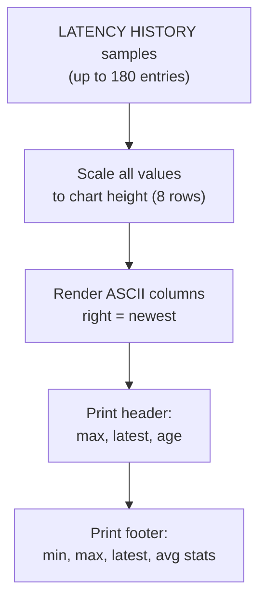
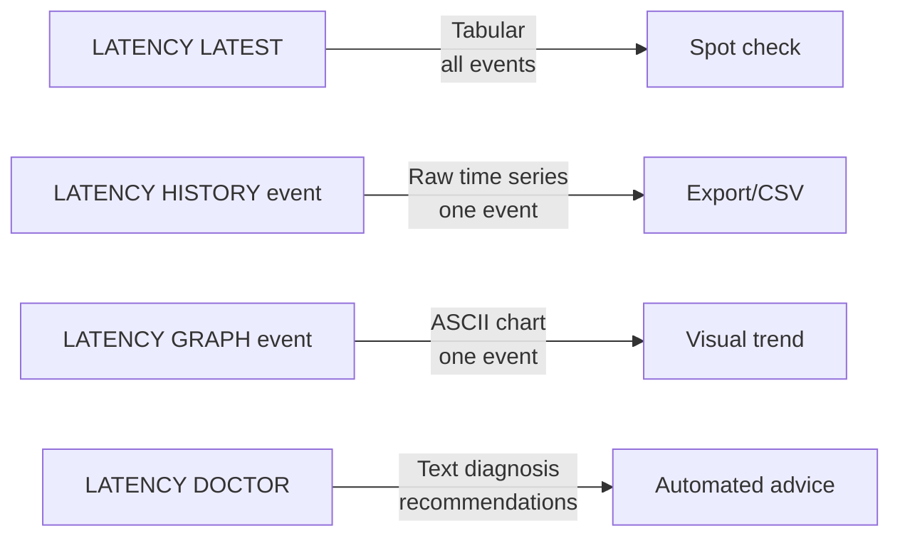

# How to Use LATENCY GRAPH in Redis to Visualize Latency

Author: [nawazdhandala](https://www.github.com/nawazdhandala)

Tags: Redis, Latency, Monitoring, Performance, Visualization

Description: Learn how to use LATENCY GRAPH in Redis to render an ASCII time-series chart of latency spikes directly in your terminal for quick visual diagnostics.

---

## Introduction

`LATENCY GRAPH` renders an ASCII bar chart of the latency history for a named event, directly in the Redis CLI. It is the fastest way to visually assess whether latency spikes are isolated or part of a recurring pattern, without needing an external dashboard.

## Prerequisites

Latency monitoring must be active:

```redis
CONFIG SET latency-monitor-threshold 10
```

At least a few samples must have been recorded. If the history is empty, `LATENCY GRAPH` returns an empty reply.

## Basic Syntax

```redis
LATENCY GRAPH event-name
```

## Example Output

```yaml
127.0.0.1:6379> LATENCY GRAPH command

max latency: 156 ms
latest sample: 42 ms (1 seconds ago)

#
# #
# ##
########

min: 12 ms  |  max: 156 ms  |  latest: 42 ms  |  avg: 58 ms
```

Each column represents one recorded latency spike. The height of the column is proportional to the latency value. The rightmost column is the most recent sample.

## How the Chart Is Constructed



## Reading the Chart

- **Tall columns** on the right side indicate a recent worsening trend.
- **Isolated tall columns** suggest one-off spikes (likely a slow command or snapshot).
- **Uniformly tall columns** indicate a systemic bottleneck (disk, network, or CPU).
- **Gaps** between columns represent periods with no spikes above the threshold.

## Checking AOF Latency

```redis
127.0.0.1:6379> LATENCY GRAPH aof-fsync-always
```

If you see columns growing taller over time, the disk is becoming saturated.

## Checking All Events in a Loop

```bash
#!/bin/bash
# Print graph for each active event
redis-cli LATENCY LATEST | awk 'NR%4==2 {gsub(/"/, "", $0); print $2}' | while read event; do
  echo "=== $event ==="
  redis-cli LATENCY GRAPH "$event"
  echo ""
done
```

## Comparing LATENCY Commands



## Resetting Data Before a New Test

```redis
LATENCY RESET command
```

Then reproduce the issue, and run `LATENCY GRAPH command` again to see only the new samples.

## Summary

`LATENCY GRAPH event-name` produces an instant ASCII visualization of the recorded latency history for a single Redis event. Taller bars indicate higher latency spikes; newer spikes appear on the right. Use it alongside `LATENCY LATEST` for a summary and `LATENCY HISTORY` for raw data export. It requires no external tools - just run it directly in `redis-cli`.
