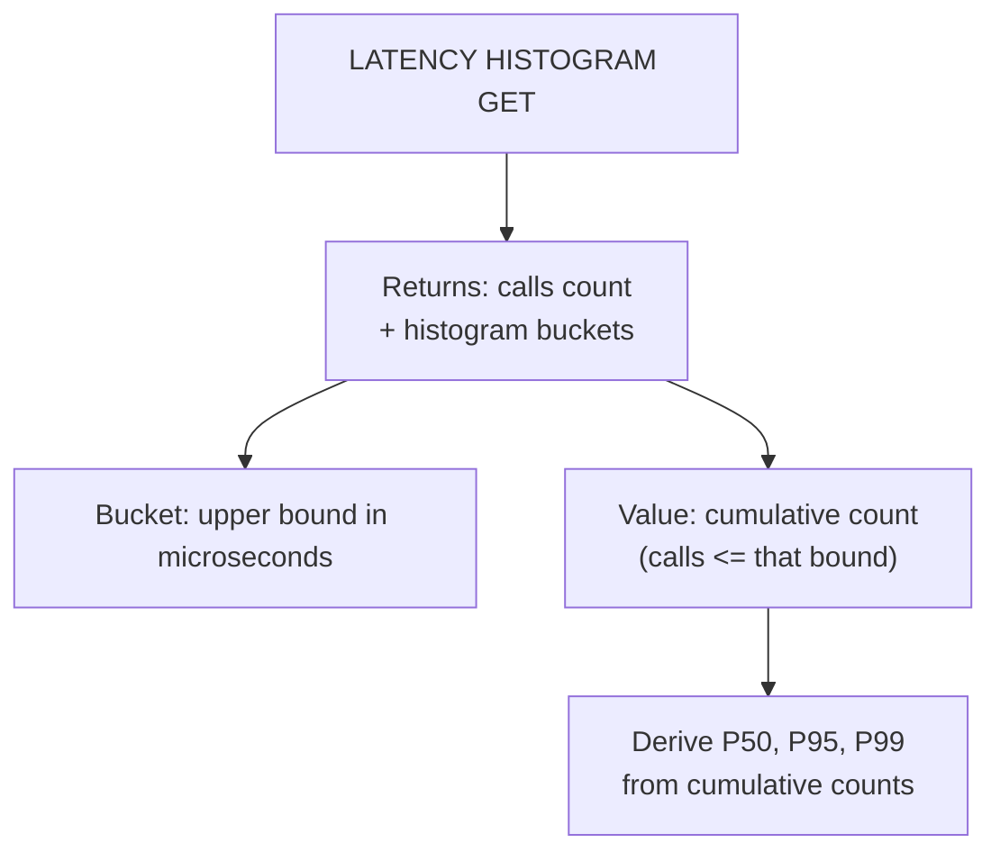
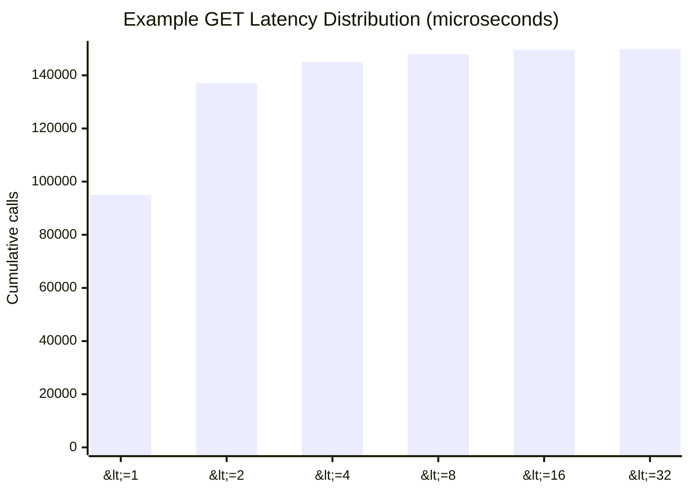

# How to Use LATENCY HISTOGRAM in Redis for Latency Distribution

Author: [nawazdhandala](https://www.github.com/nawazdhandala)

Tags: Redis, Latency, Histogram, Performance, Monitoring

Description: Learn how to use LATENCY HISTOGRAM in Redis to get percentile-based latency distribution for commands, enabling P50, P95, and P99 analysis.

---

## Introduction

`LATENCY HISTOGRAM` (available since Redis 7.0) returns a latency histogram for one or more Redis commands. Unlike `LATENCY HISTORY`, which logs individual spikes above a threshold, `LATENCY HISTOGRAM` captures all command executions in exponential buckets, giving you accurate percentile data (P50, P95, P99, P99.9) across the full distribution.

## Basic Syntax

```redis
LATENCY HISTOGRAM [command [command ...]]
```

- With no arguments: returns histograms for all tracked commands.
- With command names: returns histograms only for those commands.

## Example

```redis
127.0.0.1:6379> LATENCY HISTOGRAM GET SET HSET
1) "GET"
2) 1) "calls"
   2) (integer) 150000
   3) "histogram_usec"
   4) 1) (integer) 1
      2) (integer) 95000
      3) (integer) 2
      4) (integer) 42000
      5) (integer) 4
      6) (integer) 8000
      7) (integer) 8
      8) (integer) 3000
      9) (integer) 16
      10) (integer) 1500
      11) (integer) 32
      12) (integer) 500
```

Each pair is `[upper-bound-microseconds, cumulative-count]`. This is a cumulative histogram.

## Understanding the Histogram Format



## Computing Percentiles from the Histogram

```python
import redis

r = redis.Redis()
result = r.latency_histogram("GET")

# result["GET"] contains {"calls": N, "histogram_usec": {bound: cumulative_count}}
hist = result["GET"]["histogram_usec"]
total = result["GET"]["calls"]

def percentile(hist, total, pct):
    target = total * pct / 100
    for bound in sorted(hist.keys()):
        if hist[bound] >= target:
            return bound
    return max(hist.keys())

p50 = percentile(hist, total, 50)
p95 = percentile(hist, total, 95)
p99 = percentile(hist, total, 99)
print(f"GET P50={p50}us  P95={p95}us  P99={p99}us")
```

## Histogram vs Latency Monitoring

| Feature | LATENCY HISTORY / LATEST | LATENCY HISTOGRAM |
|---|---|---|
| Threshold required | Yes (miss sub-threshold calls) | No (captures all calls) |
| Data type | Time series of spikes | Bucketed distribution |
| Percentile accuracy | Approximate | Statistically accurate |
| Available since | Redis 2.8 | Redis 7.0 |
| Granularity | Milliseconds | Microseconds |

## Checking All Commands

```redis
127.0.0.1:6379> LATENCY HISTOGRAM
```

Returns one histogram per command that has been called at least once since startup or last reset.

## Resetting Histogram Data

```redis
127.0.0.1:6379> LATENCY RESET
```

This resets both the spike-based latency data AND the histogram counters.

## Visualizing Distribution



In this shape, most GET calls complete under 2 microseconds, and a small tail extends to 32 microseconds.

## Practical Usage: Regression Detection in CI

```bash
#!/bin/bash
# After a deploy, check P99 for SET command
HISTOGRAM=$(redis-cli LATENCY HISTOGRAM SET)
# Parse and alert if P99 exceeds 1000 us (1 ms)
echo "$HISTOGRAM"
# Integrate parsing with your preferred monitoring tool
```

## Summary

`LATENCY HISTOGRAM [command ...]` captures the full latency distribution for Redis commands in microsecond-precision exponential buckets. It requires Redis 7.0 or later and does not need a latency threshold - every call is counted. Use it to compute P50, P95, and P99 latencies accurately, detect regressions after deploys, and understand the tail latency behavior of specific commands.
