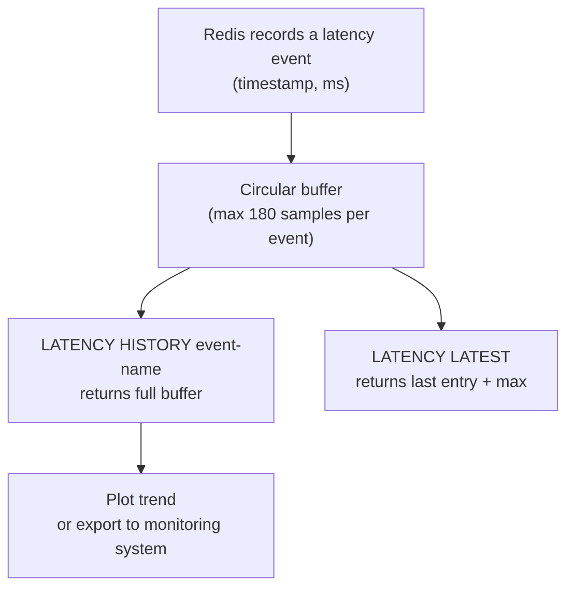
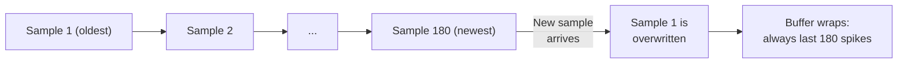

# How to Use LATENCY HISTORY in Redis to View Latency Over Time

Author: [nawazdhandala](https://www.github.com/nawazdhandala)

Tags: Redis, Latency, Monitoring, Performance, Time Series

Description: Learn how to use LATENCY HISTORY in Redis to retrieve the full time-series latency log for a specific event, enabling trend analysis and regression detection.

---

## Introduction

`LATENCY HISTORY` returns the complete time-series log of latency samples for a named event. While `LATENCY LATEST` shows you only the most recent spike, `LATENCY HISTORY` lets you scroll back through all recorded spikes and see when they occurred and how severe each was.

Redis stores up to 180 samples per event in a circular buffer.

## Prerequisites

Enable latency monitoring with a threshold (milliseconds):

```redis
CONFIG SET latency-monitor-threshold 10
```

## Basic Syntax

```redis
LATENCY HISTORY event-name
```

Returns a list of `[timestamp, latency-ms]` pairs in chronological order.

## Example

```redis
127.0.0.1:6379> LATENCY HISTORY command
1) 1) (integer) 1711900600
   2) (integer) 45
2) 1) (integer) 1711900650
   2) (integer) 110
3) 1) (integer) 1711900700
   2) (integer) 33
4) 1) (integer) 1711900800
   2) (integer) 42
```

Each pair is `[UNIX timestamp, milliseconds]`.

## Viewing AOF Latency History

```redis
127.0.0.1:6379> LATENCY HISTORY aof-fsync-always
1) 1) (integer) 1711890000
   2) (integer) 55
2) 1) (integer) 1711890060
   2) (integer) 88
3) 1) (integer) 1711890120
   2) (integer) 200
```

Spikes increasing over time here indicate disk I/O saturation.

## Data Flow Through the Latency Subsystem



## Converting Timestamps to Human-Readable Dates

```bash
#!/bin/bash
# Pretty-print LATENCY HISTORY for 'command' event
redis-cli LATENCY HISTORY command | paste - - | while read ts_label ts_val ms_label ms_val; do
  DATE=$(date -d "@$ts_val" '+%Y-%m-%d %H:%M:%S' 2>/dev/null || date -r "$ts_val" '+%Y-%m-%d %H:%M:%S')
  echo "$DATE  ${ms_val} ms"
done
```

## Exporting to CSV for Graphing

```bash
#!/bin/bash
EVENT="command"
echo "timestamp,ms" > latency_history.csv
redis-cli LATENCY HISTORY "$EVENT" | paste - - | while read _ ts _ ms; do
  echo "$ts,$ms"
done >> latency_history.csv
echo "Written to latency_history.csv"
```

## Supported Event Names

List all events that currently have history:

```redis
LATENCY LATEST
```

Each event name in the output is a valid argument for `LATENCY HISTORY`.

## Circular Buffer Behavior



When 180 samples are full, the oldest entry is dropped. This means very high-frequency spikes may cause data loss. Reduce `latency-monitor-threshold` only if you need finer resolution but accept higher overhead.

## Correlating with Other Events

```bash
#!/bin/bash
for EVENT in command aof-fsync-always rdb-unlink-temp-file expire-cycle; do
  COUNT=$(redis-cli LATENCY HISTORY "$EVENT" | grep -c "integer" | awk '{print $1/2}' 2>/dev/null || echo 0)
  echo "$EVENT: $COUNT recorded spikes"
done
```

## Summary

`LATENCY HISTORY event-name` returns up to 180 time-stamped latency samples for a specific Redis event. Use it alongside `LATENCY LATEST` (for the current worst value) and `LATENCY GRAPH` (for an ASCII chart) to understand whether latency is a transient spike or a persistent regression. Redis stores samples in a circular buffer, so capture history regularly if you need longer retention.
