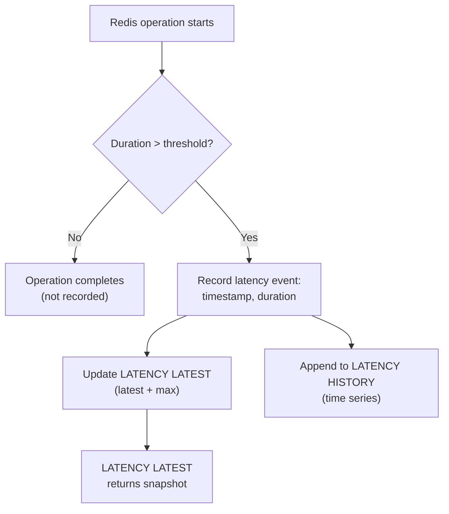
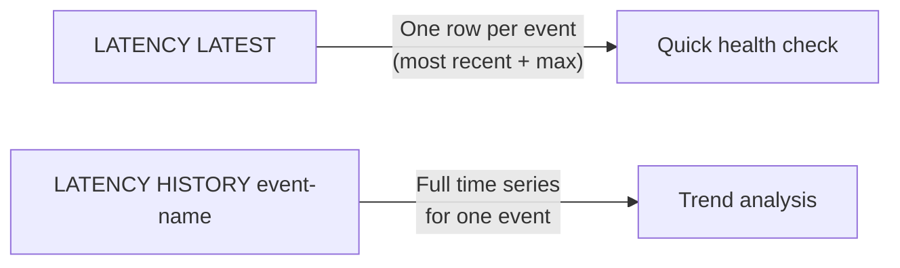

# How to Use LATENCY LATEST in Redis to Check Recent Latency

Author: [nawazdhandala](https://www.github.com/nawazdhandala)

Tags: Redis, Latency, Monitoring, Performance, Observability

Description: Learn how to use LATENCY LATEST in Redis to instantly view the most recent latency sample for each event, helping you detect performance degradation fast.

---

## Introduction

`LATENCY LATEST` reports the most recent latency sample recorded for every event name Redis is currently tracking. It gives you a per-event snapshot: the timestamp of the latest sample, its duration in milliseconds, and the all-time maximum seen since the last reset.

This is the fastest way to check whether Redis is currently experiencing unusual latency in I/O, commands, or persistence operations.

## Prerequisites

Latency monitoring must be enabled. Add this to `redis.conf` or set it at runtime:

```redis
CONFIG SET latency-monitor-threshold 10
```

This tells Redis to record any event that takes longer than 10 milliseconds.

## Basic Syntax

```redis
LATENCY LATEST
```

No arguments. Returns a list of arrays, each containing:

```text
event-name  timestamp  latest-ms  max-ms
```

## Example Output

```redis
127.0.0.1:6379> LATENCY LATEST
1) 1) "command"
   2) (integer) 1711900800
   3) (integer) 42
   4) (integer) 156
2) 1) "fast-command"
   2) (integer) 1711900750
   3) (integer) 1
   4) (integer) 3
3) 1) "aof-fsync-always"
   2) (integer) 1711900700
   3) (integer) 88
   4) (integer) 200
```

Each entry means:
- `command` - slow commands exceeding the threshold
- latest sample was 42 ms, the worst ever was 156 ms
- `aof-fsync-always` - fsync calls for AOF persistence took 88 ms most recently

## How Redis Tracks Latency Events



## Common Latency Events

| Event | What it measures |
|---|---|
| `command` | Slow commands above threshold |
| `fast-command` | Fast command path latency |
| `aof-fsync-always` | fsync duration when `appendfsync always` |
| `aof-write` | AOF write latency |
| `aof-rewrite-diff-write` | AOF rewrite phase |
| `rdb-unlink-temp-file` | RDB temp file deletion |
| `expire-cycle` | Active expiration cycle |
| `eviction-del` | Key eviction latency |

## Checking a Specific Event

`LATENCY LATEST` returns all events at once. To filter by event name, pipe through your shell:

```bash
redis-cli LATENCY LATEST | grep -A 3 "aof"
```

## Automating Latency Checks

```bash
#!/bin/bash
# Alert if any event exceeds 100 ms
redis-cli LATENCY LATEST | awk '
/\(integer\)/ {
  val = $2
  count++
  if (count % 4 == 3 && val+0 > 100) {
    print "ALERT: recent latency " val " ms"
  }
}'
```

## Resetting After Investigation

Once you have resolved the root cause, clear the history so fresh baselines are recorded:

```redis
LATENCY RESET
```

## Difference Between LATENCY LATEST and LATENCY HISTORY



## Summary

`LATENCY LATEST` provides a zero-argument snapshot of all active latency events in Redis. Each row shows the event name, the UNIX timestamp of the last spike, the latest spike duration in milliseconds, and the all-time maximum. Enable it with `CONFIG SET latency-monitor-threshold`, then call `LATENCY LATEST` to immediately see whether Redis is experiencing slow commands, AOF fsync delays, or eviction pressure.
