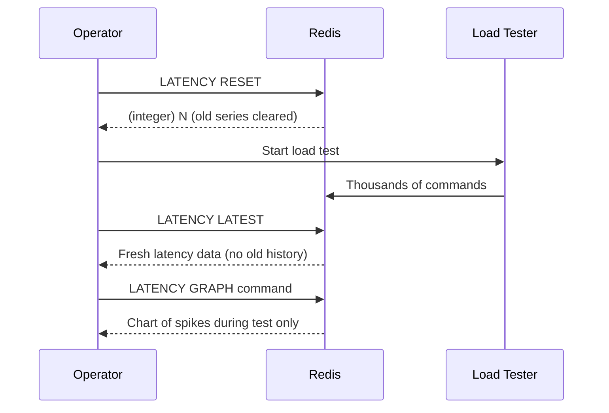
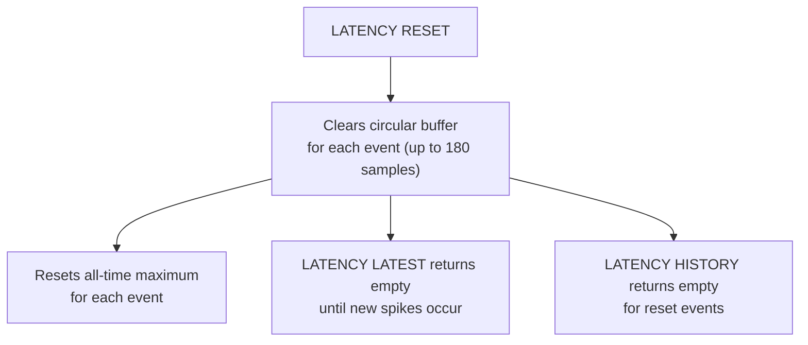

# How to Use LATENCY RESET in Redis to Clear Latency Data

Author: [nawazdhandala](https://www.github.com/nawazdhandala)

Tags: Redis, Latency, Monitoring, Performance, Operations

Description: Learn how to use LATENCY RESET in Redis to clear recorded latency samples for specific events or all events, enabling clean baseline measurements.

---

## Introduction

`LATENCY RESET` clears the latency history recorded by Redis's latency monitoring subsystem. You can reset all events at once or target specific event names. This is useful before a load test, after applying a configuration fix, or when you want to establish a clean baseline.

## Prerequisites

Latency monitoring should be enabled:

```redis
CONFIG SET latency-monitor-threshold 10
```

## Basic Syntax

```redis
LATENCY RESET [event-name [event-name ...]]
```

- With no arguments: resets all events.
- With one or more event names: resets only those events.

Returns the number of event time series that were reset.

## Examples

### Reset all latency data

```redis
127.0.0.1:6379> LATENCY RESET
(integer) 3
```

Three event series were cleared.

### Reset a specific event

```redis
127.0.0.1:6379> LATENCY RESET command
(integer) 1
```

### Reset multiple events

```redis
127.0.0.1:6379> LATENCY RESET command aof-fsync-always aof-write
(integer) 3
```

### Verify the reset

```redis
127.0.0.1:6379> LATENCY LATEST
(empty array)
```

After a full reset, `LATENCY LATEST` returns empty until new spikes are recorded.

## Workflow: Reset Before a Load Test



## Use Cases

- **Before a load test**: clear old data so only test-period spikes appear.
- **After a hardware upgrade**: reset to confirm new baseline is better.
- **After a config change**: compare before vs. after latency without old noise.
- **Routine hygiene**: periodic resets so max values don't reflect ancient spikes.

## Scripting Automated Resets

```bash
#!/bin/bash
# Reset latency data every 24 hours in a monitoring loop
while true; do
  redis-cli LATENCY RESET
  echo "$(date): Latency data reset"
  sleep 86400
done
```

## What Gets Reset



Note: resetting latency data does NOT disable monitoring. New spikes above the threshold will continue to be recorded.

## Disabling Latency Monitoring Entirely

To stop recording latency events completely:

```redis
CONFIG SET latency-monitor-threshold 0
```

Setting the threshold to 0 disables the subsystem without clearing existing data. To both disable and clear:

```redis
CONFIG SET latency-monitor-threshold 0
LATENCY RESET
```

## Summary

`LATENCY RESET [event-name ...]` deletes the stored latency time series from Redis's monitoring subsystem. With no arguments it clears all events; with arguments it targets specific ones. The command returns the count of series removed. Use it before benchmarks or after fixing performance issues to get a clean slate for fresh measurements.
