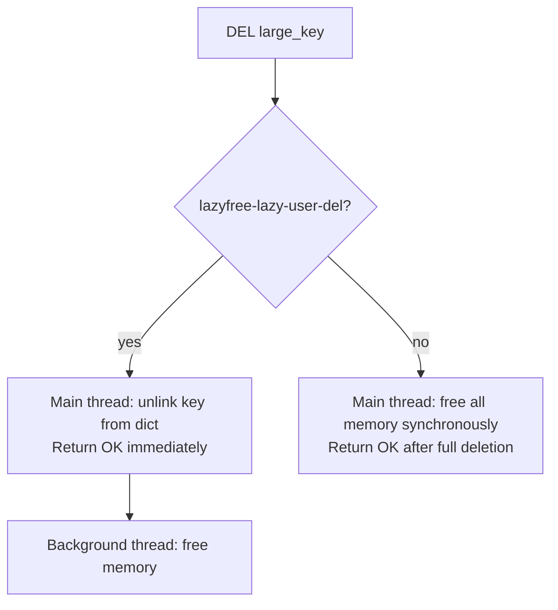
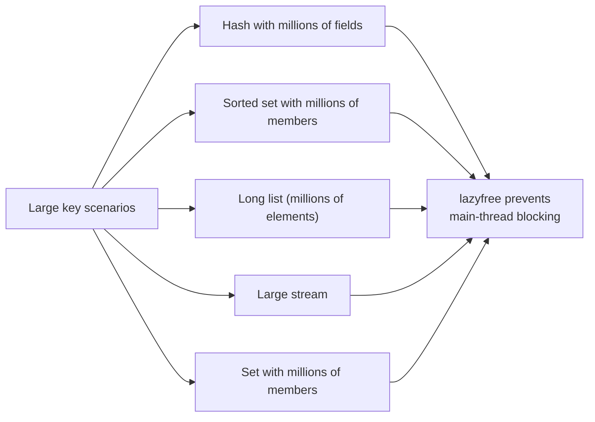

# How to Configure Redis lazyfree for Async Deletion

Author: [nawazdhandala](https://www.github.com/nawazdhandala)

Tags: Redis, Lazyfree, Memory, Performance, Configuration

Description: Learn how to configure Redis lazyfree settings to perform key deletion and memory reclamation asynchronously, reducing latency spikes from large key deletions.

---

## Introduction

Deleting a large Redis key (a hash with millions of fields, a long list, etc.) is not instantaneous. Redis must traverse and free every element, which can block the main event loop for milliseconds. The lazyfree feature (introduced in Redis 4.0) moves these expensive memory reclamations to a background thread, keeping the main thread responsive.

## How Lazyfree Works



With lazyfree enabled, `DEL` behaves like `UNLINK` -- it detaches the key immediately and frees memory in the background.

## Lazyfree Configuration Options

In `redis.conf`:

```redis
# DEL command becomes asynchronous
lazyfree-lazy-user-del no

# FLUSHDB / FLUSHALL become asynchronous by default
lazyfree-lazy-user-flush no

# Eviction is performed asynchronously
lazyfree-lazy-eviction no

# Key expiration is performed asynchronously
lazyfree-lazy-expire no

# Server-internal deletions (e.g., list element replacement) are async
lazyfree-lazy-server-del no

# During replica full sync, existing data is freed asynchronously
replica-lazy-flush no
```

### Enable all lazyfree options (recommended for production)

```redis
lazyfree-lazy-user-del yes
lazyfree-lazy-user-flush yes
lazyfree-lazy-eviction yes
lazyfree-lazy-expire yes
lazyfree-lazy-server-del yes
replica-lazy-flush yes
```

## Runtime Configuration

```redis
CONFIG SET lazyfree-lazy-user-del yes
CONFIG SET lazyfree-lazy-eviction yes
CONFIG SET lazyfree-lazy-expire yes
CONFIG SET lazyfree-lazy-server-del yes
CONFIG GET lazyfree-lazy-user-del
# 1) "lazyfree-lazy-user-del"
# 2) "yes"
```

## Lazyfree vs UNLINK

`UNLINK` is the explicit async delete command. With `lazyfree-lazy-user-del yes`, `DEL` is equivalent to `UNLINK`:

```redis
# Explicit async delete (always async)
UNLINK large_hash_key
# (integer) 1   -- returns immediately

# With lazyfree-lazy-user-del yes, DEL is also async
DEL large_hash_key
# (integer) 1   -- returns immediately, memory freed in background

# Without lazyfree-lazy-user-del, DEL blocks until memory is freed
DEL large_hash_key
# (integer) 1   -- may take milliseconds for large keys
```

## Measuring Latency Impact

Use Redis's built-in latency monitoring to observe the impact of large deletions:

```redis
CONFIG SET latency-monitor-threshold 5
LATENCY LATEST
# event     latest    all-time   avg
# command    2ms       150ms      4ms

# After enabling lazyfree-lazy-user-del yes:
LATENCY LATEST
# command    1ms       3ms        1ms
```

## Background Thread Monitoring

```redis
INFO memory
# lazyfree_pending_objects:0
```

`lazyfree_pending_objects` shows how many objects are waiting to be freed by the background thread. Under normal conditions this should stay near 0.

## When Lazyfree Matters Most



## replica-lazy-flush

During a full resync, the replica must flush its existing dataset before loading the primary's RDB. Setting `replica-lazy-flush yes` makes this flush async, reducing the resync latency:

```redis
replica-lazy-flush yes
```

## Summary

Redis lazyfree settings delegate expensive memory reclamation from large key deletions, expirations, and evictions to a background thread. Enable `lazyfree-lazy-user-del`, `lazyfree-lazy-eviction`, `lazyfree-lazy-expire`, and `lazyfree-lazy-server-del` to prevent latency spikes in production. Monitor `lazyfree_pending_objects` in `INFO memory` to confirm the background thread is keeping up.
