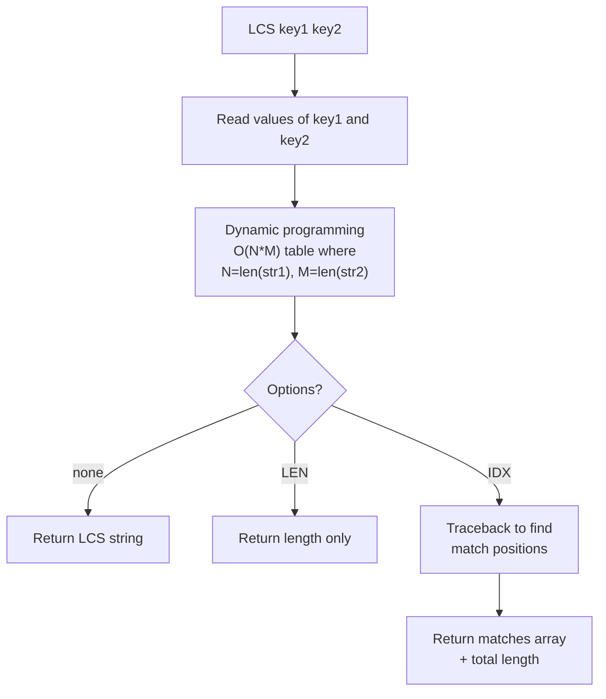

# How to Use LCS in Redis to Find Longest Common Substring

Author: [nawazdhandala](https://www.github.com/nawazdhandala)

Tags: Redis, String, LCS, Algorithm, Command

Description: Learn how to use the LCS command in Redis to find the longest common subsequence between two strings or the values of two keys, with length, index, and match options.

---

## Introduction

`LCS` (Longest Common Subsequence) was introduced in Redis 7.0. It computes the longest common subsequence between two strings - either provided directly as key names whose string values are compared. This is useful for similarity scoring, diff tools, DNA sequence analysis, and plagiarism detection.

Note: LCS computes a common *subsequence* (characters do not need to be contiguous) not a common *substring* (contiguous characters only).

## Basic Syntax

```redis
LCS key1 key2 [LEN] [IDX] [MINMATCHLEN min-len] [WITHMATCHLEN]
```

- `LEN` - return only the length of the LCS
- `IDX` - return the positions (indexes) of the matches in both strings
- `MINMATCHLEN` - filter out match segments shorter than this length
- `WITHMATCHLEN` - include each match segment's length in IDX output

## Setup: Store Two Strings

```redis
SET str1 "ohmytext"
SET str2 "mynewtext"
```

## Basic LCS

```redis
127.0.0.1:6379> LCS str1 str2
"mytext"
```

The longest common subsequence of "ohmytext" and "mynewtext" is "mytext".

## Get Only the Length

```redis
127.0.0.1:6379> LCS str1 str2 LEN
(integer) 6
```

## Get Match Positions

```redis
127.0.0.1:6379> LCS str1 str2 IDX
1) "matches"
2) 1) 1) 1) (integer) 4
            2) (integer) 7
         2) 1) (integer) 5
            2) (integer) 8
   2) 1) 1) (integer) 2
            2) (integer) 3
         2) 1) (integer) 0
            2) (integer) 1
3) "len"
4) (integer) 6
```

Each match entry contains `[[start1, end1], [start2, end2]]` giving the byte ranges in both strings.

## Get Positions with Match Lengths

```redis
127.0.0.1:6379> LCS str1 str2 IDX WITHMATCHLEN
1) "matches"
2) 1) 1) 1) (integer) 4
            2) (integer) 7
         2) 1) (integer) 5
            2) (integer) 8
         3) (integer) 4
   2) 1) 1) (integer) 2
            2) (integer) 3
         2) 1) (integer) 0
            2) (integer) 1
         3) (integer) 2
3) "len"
4) (integer) 6
```

Each match now includes a third element: the length of that match segment.

## Filter Short Matches

```redis
127.0.0.1:6379> LCS str1 str2 IDX MINMATCHLEN 4
1) "matches"
2) 1) 1) 1) (integer) 4
            2) (integer) 7
         2) 1) (integer) 5
            2) (integer) 8
         3) (integer) 4
3) "len"
4) (integer) 6
```

Only match segments of 4 or more characters are returned.

## How LCS Works Internally



## Similarity Score

You can use the LCS length to derive a similarity ratio:

```redis
SET doc1 "the quick brown fox jumps over the lazy dog"
SET doc2 "the fast brown fox leaped over the sleepy dog"

LCS doc1 doc2 LEN
# (integer) 35
```

```python
import redis

r = redis.Redis()
r.set("doc1", "the quick brown fox jumps over the lazy dog")
r.set("doc2", "the fast brown fox leaped over the sleepy dog")

lcs_len = r.lcs("doc1", "doc2", len=True)
len1 = len(r.get("doc1"))
len2 = len(r.get("doc2"))

similarity = (2 * lcs_len) / (len1 + len2)
print(f"Similarity: {similarity:.2%}")
```

## Use Cases

- **Document similarity**: compare two text versions to score how much they share.
- **Version diffing**: find common parts between old and new content.
- **DNA/bioinformatics**: sequence alignment on short strings stored in Redis.
- **Spell checking helpers**: find how close a misspelled word is to a dictionary entry.

## Performance Considerations

LCS is O(N * M) in time and space. For strings beyond a few thousand characters, computation can be slow and memory-intensive. Keep strings short or pre-hash long documents for similarity comparison at scale.

## Summary

`LCS key1 key2` computes the longest common subsequence between the string values of two Redis keys. Use `LEN` for a scalar length, `IDX` for byte-range positions of each matching segment, `MINMATCHLEN` to ignore short matches, and `WITHMATCHLEN` to include each segment's length. It is an O(N*M) operation best suited for short to medium strings.
